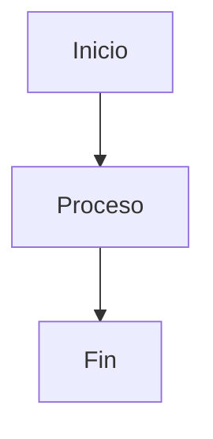

# Guidelines para crear presentaciones Slidev

Este documento define las convenciones y restricciones que Claude debe seguir al crear o modificar presentaciones Slidev en este proyecto, basado en los patrones observados en `clase_1.md` a `clase_4.md`.

---

## 1. Estructura del frontmatter global

Cada archivo de presentación comienza con un bloque YAML de configuración global. Usar siempre esta estructura:

```yaml
---
theme: seriph
background: <URL de imagen>
class: text-center
title: <Título de la presentación>
transition: slide-left
mdc: true
fonts:
  sans: Roboto
  serif: Roboto Slab
  mono: Fira Code
---
```

- **theme**: siempre `seriph`.
- **background**: URL de imagen de alta resolución (Unsplash o similar). Usar `?w=1920&q=80` al final para optimizar.
- **transition**: la transición global es `slide-left`. Las slides individuales pueden sobreescribirla.
- **mdc**: siempre `true` para habilitar MDC syntax.
- **fonts**: siempre Roboto / Roboto Slab / Fira Code.

---

## 2. Slide de portada (cover)

La portada siempre usa un overlay oscuro sobre el fondo y centra el contenido verticalmente:

```html
<div class="absolute inset-0 bg-black/60" />

<div class="relative z-10 flex h-full flex-col items-center justify-center">

# Título principal

## Subtítulo o descripción breve

<div class="pt-10">
  <span @click="$slidev.nav.next" class="px-2 py-1 rounded cursor-pointer" flex="~ justify-center items-center gap-2" hover="bg-white bg-opacity-10">
    Presiona espacio para continuar <div class="i-carbon:arrow-right inline-block"/>
  </span>
</div>

</div>
```

- La opacidad del overlay varía entre `/60` y `/65` según la claridad de la imagen de fondo.
- No agregar más contenido en la portada — solo título, subtítulo y el botón de navegación.

---

## 3. Slide de contenido (índice)

Siempre es la segunda slide y usa el componente `<Toc>`:

```markdown
---
transition: fade-out
---

# Contenido

<Toc maxDepth="1" columns="2" class="text-sm" />
```

---

## 4. Transiciones

### Reglas por tipo de slide

| Tipo de slide | Transición recomendada |
|---|---|
| Portada (global) | `slide-left` |
| Índice / Contenido | `fade-out` |
| Primera slide de sección | `slide-up` |
| Slide de cierre / resumen | `slide-up` |
| Slides intermedias | `slide-down` o sin especificar |
| Slides con imagen a la derecha | `slide-left` o `fade-out` |

### Cómo aplicar transiciones por slide

```markdown
---
transition: slide-up
---
```

La transición se declara en el frontmatter de **cada slide**. No todas las slides necesitan una transición explícita — si se omite, hereda la global (`slide-left`).

### Valores disponibles
`slide-left` | `slide-right` | `slide-up` | `slide-down` | `fade-out`

---

## 5. Layouts disponibles

| Layout | Cuándo usarlo |
|---|---|
| `default` (sin especificar) | La mayoría de las slides de contenido |
| `image-right` | Imagen a la derecha, texto a la izquierda |
| `image-left` | Imagen a la izquierda, texto a la derecha |
| `two-cols` | Para comparaciones side-by-side con `::right::` |
| `center` | Slide de cierre o pregunta dramática standalone |

**Alternar `image-right` e `image-left`** para que la presentación no sea monótona cuando hay varias slides de imagen seguidas.

### Ejemplo `image-right` / `image-left`

```markdown
---
layout: image-right
image: ./images/nombre-imagen.png
backgroundSize: contain
transition: slide-left
---

# Título

Contenido a la izquierda...
```

### Imágenes siempre completas — CRÍTICO

Siempre agregar `backgroundSize: contain` para que la imagen **nunca quede cortada**:

```yaml
backgroundSize: contain
```

Este prop se pasa directamente al helper interno del layout (`handleBackground`) que lo aplica como `background-size` en el CSS del panel de imagen. El valor por defecto es `cover`, que **recorta** la imagen para llenar el panel.

**Anti-patrón:** omitir `backgroundSize` hace que Slidev use `cover` por defecto → la imagen se escala para llenar el panel y queda cortada.

> **Nota:** `imageClass` aplica al div de contenido (texto), **no** al panel de imagen. No usar `imageClass` para controlar el comportamiento de la imagen.

### Ejemplo `two-cols`

```markdown
---
layout: two-cols
layoutClass: gap-16
---

# Título

Columna izquierda...

::right::

Columna derecha...
```

---

## 6. Gestión del espacio vertical — CRÍTICO

El área útil de contenido de cada slide es de aproximadamente **430–470px** de alto (descontando el título `h1` y los márgenes del tema `seriph`). Es el principal riesgo de desbordamiento.

### Reglas de oro

1. **Máximo 5–6 ítems de lista** por slide. Si hay más, dividir en dos slides.
2. **No usar `mt-8` o mayor** dentro del contenido de una slide — preferir `mt-3`, `mt-4` o `mt-6` como máximo.
3. **No usar `h-full` con contenido adicional abajo** — reservar `h-full` solo en slides de pregunta o portada standalone.
4. **Las imágenes dentro de grids deben tener altura fija y pequeña**: `h-20`, `h-24`, `h-25`, `h-30`, `h-36`, `h-40`, `h-44` según la cantidad de elementos.
5. **El texto en cards/grids densos usa `text-xs` o `text-sm`**, nunca `text-base` o mayor.
6. **Evitar `<br>` múltiples** para separar secciones — usar clases de margen (`mt-2`, `mt-3`).
7. **Si una slide tiene título + grid de 3 filas + caja de nota inferior**, el grid no puede tener imágenes altas — limitar a `h-24` o `h-20`.

### Referencia de alturas de imagen según densidad de contenido

| Contexto | Clase de altura |
|---|---|
| Grid 2×3 con texto | `h-24` |
| Grid 2×2 con texto + nota inferior | `h-30` |
| Grid 1×2 (imagen prominente) | `h-36` a `h-44` |
| Imagen única en layout `image-right` | automático (el layout lo controla) |
| Imagen standalone centrada | `h-60` a `h-72` |

### Patrón de nota inferior

Muchas slides terminan con una caja de nota/resumen al final:

```html
<div class="mt-4 p-3 rounded bg-white/5 border border-white/10 text-sm">
  Texto de resumen o nota al pie de la slide.
</div>
```

Cuando existe esta caja, **reducir el `mt` del grid principal** y **reducir la altura de imágenes** para garantizar que quepa.

---

## 7. Sistema de grids

### Grid estándar de cards de color

```html
<div class="grid grid-cols-3 gap-4 mt-4 text-left">

  <div class="p-3 rounded-lg border border-blue-400/40 bg-blue-500/10">
    <div class="font-bold text-sm mb-1">Título</div>
    <div class="text-xs opacity-80">Descripción breve.</div>
  </div>

  <!-- más cards... -->

</div>
```

### Colores disponibles para cards temáticas

| Color | Clases de borde y fondo |
|---|---|
| Azul | `border-blue-400/40 bg-blue-500/10` |
| Verde | `border-green-400/40 bg-green-500/10` |
| Rojo | `border-red-400/40 bg-red-500/10` |
| Amarillo/Amber | `border-yellow-400/40 bg-yellow-500/10` |
| Morado | `border-purple-400/40 bg-purple-500/10` |
| Teal | `border-teal-400/40 bg-teal-500/10` |
| Neutro | `border-white/20 bg-white/5` |

### Grid con columnas asimétricas

Usar `col-span-N` dentro del grid para dar más espacio a ciertas columnas:

```html
<div class="grid grid-cols-4 gap-4 mt-4">
  <div class="p-4 col-span-3 rounded border border-white/20 bg-white/5">
    <!-- contenido principal -->
  </div>
  <div class="p-4 rounded border border-white/20 bg-white/5">
    <!-- contenido secundario o emoji -->
  </div>
</div>
```

---

## 8. Imágenes

### Componente a usar

Siempre usar el componente `<Image>` de Slidev, **no** la etiqueta HTML ``:

```html
<Image src="/images/nombre.png" class="h-36 mx-auto rounded-xl border border-white/20 bg-white/90 p-2 object-contain" />
```

### Rutas de imágenes

- Imágenes locales del proyecto: `/images/nombre.png` o `./images/nombre.png`
- Imágenes de portada: URL externa directa en el frontmatter (`background:`)
- Imágenes dentro de layouts `image-right`: ruta relativa `./images/nombre.png`

### Clases estándar por contexto

| Contexto | Clases CSS |
|---|---|
| Imagen de sensor/hardware (fondo blanco) | `h-36 mx-auto rounded-xl border border-white/20 bg-white/90 p-2 object-contain` |
| Imagen decorativa | `h-30 mx-auto mt-1` |
| Imagen en grid pequeño | `h-20 mx-auto mb-2` |
| Imagen standalone (2 cols) | `h-72 mx-auto rounded-xl border border-white/20 bg-white/90 p-2 object-contain` |

- Usar `bg-white/90 p-2` cuando la imagen tiene fondo transparente o es de hardware (para legibilidad sobre fondos oscuros).
- Usar `object-contain` siempre para preservar proporciones.
- **Nunca usar `w-full` sin limitar la altura** — puede causar overflow vertical.

### Sugerencias de imagen en comentarios

Cuando una imagen sería útil pero no está disponible, agregar un comentario HTML con la sugerencia:

```html
<!-- IMAGE SUGGESTION: ./images/nombre-descriptivo.png — descripción breve del contexto -->
```

---

## 9. Diagramas Mermaid

### Siempre especificar escala

Todo bloque mermaid **debe incluir el parámetro `scale`** para evitar desbordamiento:

````markdown

````

### Referencia de escala según complejidad

| Tipo de diagrama | Scale recomendado |
|---|---|
| Timeline simple (5–6 nodos) | `0.5` |
| Flowchart simple (4–6 nodos) | `0.65` – `0.72` |
| Flowchart con estilos classDef | `0.72` |
| SequenceDiagram simple | `0.8` – `0.9` |
| block-beta (arquitectura) | `0.6` – `0.65` |
| Diagrama en grid (junto a texto/imágenes) | `0.5` – `0.6` |

### Diagrama centrado (slide dedicada)

Cuando el diagrama es el contenido principal, centrarlo con un wrapper:

```html
<div class="text-center mt-6">

```mermaid {scale: 0.65}
...
```

</div>
```

### Diagrama en grid (junto a código o imágenes)

```html
<div class="grid grid-cols-2 gap-6 mt-4">
  <div class="text-left">
    <!-- código o texto -->
  </div>
  <div class="text-left">
    ```mermaid {scale: 0.72}
    graph TD
        ...
    ```
  </div>
</div>
```

### Estilos en mermaid

Usar `classDef` para colorear nodos con coherencia visual:

```
classDef power fill:#f59e0b,color:#000
classDef gnd fill:#374151,color:#fff
classDef sw fill:#3b82f6,color:#fff
classDef motor fill:#10b981,color:#fff
```

---

## 10. Animaciones y click steps

### v-click en elementos individuales

```html
<div v-click class="p-3 rounded-lg border border-white/20 bg-white/5">
  Contenido que aparece al hacer click
</div>
```

### v-clicks en lista (aparición progresiva)

```markdown
<v-clicks>

- Primer punto
- Segundo punto
- Tercer punto

</v-clicks>
```

### v-click con número de orden

```html
<div v-click="3" class="p-3 rounded bg-blue-500/20 border border-blue-400/40">
  Aparece en el tercer click
</div>
```

### Cuándo usar animaciones

- Usar `v-click` cuando la slide tiene 4 o más cards para revelarlos progresivamente y evitar sobrecarga visual.
- Usar `v-clicks` en listas cuando el punto de discusión es secuencial.
- **No animar slides con mermaid** — los diagramas se renderizan completamente al aparecer.

---

## 11. Cajas de alerta y énfasis

### Advertencia (peligro)

```html
<div class="rounded-2xl border border-red-300/30 bg-red-500/10 px-5 py-4 text-sm">
  <div class="text-xs uppercase tracking-wide opacity-70 mb-2">⚠️ Peligro</div>
  <div class="leading-snug">Texto de advertencia.</div>
</div>
```

### Info / Nota

```html
<div class="p-3 rounded bg-white/5 border border-white/10 text-sm">
  Nota informativa.
</div>
```

### Destacado positivo

```html
<div class="p-3 rounded bg-blue-500/20 border border-blue-400/40">
  Contenido destacado.
</div>
```

### Pregunta dramática (slide completa)

Para slides de pregunta o reflexión que ocupan toda la slide:

```html
<div class="h-full flex items-center justify-center">
  <div class="max-w-4xl mx-auto p-8 rounded-2xl border border-yellow-400/40 bg-yellow-500/10 shadow-lg">
    <div class="flex items-center gap-5">
      <div class="text-6xl leading-none shrink-0">🤔</div>
      <div class="text-3xl font-bold leading-tight text-left">
        ¿La pregunta que genera discusión?
      </div>
    </div>
  </div>
</div>
```

Esta slide **no lleva título `#`** — el div ocupa todo el espacio disponible.

---

## 12. Notas del presentador

Cada slide debe terminar con un bloque de notas en comentario HTML:

```html
<!--
Notas del presentador. Qué decir, qué preguntar, anécdotas relevantes.
Preguntar a mano alzada: ¿quién ya usó X?
Mencionar el contexto histórico de Y.
-->
```

- Las notas son para el presentador, no para el alumno.
- Incluir preguntas para la audiencia, analogías, y referencias a imágenes físicas del aula.

---

## 13. Tablas

Las tablas dentro de slides siempre van envueltas en un contenedor con borde y fondo de color, y usan `text-xs`:

```html
<div class="mt-2 p-2 rounded border border-purple-400/30 bg-purple-500/10 text-xs">
  <div class="font-semibold text-purple-300 mb-1">Subtítulo de la tabla</div>

| Columna A | Columna B |
|---|---|
| Valor 1 | Valor 2 |

</div>
```

Para tablas de comparación técnica (ej. ARM vs x86) sin wrapper de color, usar `class="mt-2 text-sm"` en el div contenedor.

---

## 14. Bloques de código

### Código con highlighting de líneas

````markdown
```cpp {1-3|5|7-9}
// El highlight se mueve con cada click
void setup() {
  Serial.begin(115200);
}
```
````

### Código en grid (junto a explicación)

```html
<div class="grid grid-cols-2 gap-6 mt-3">
  <div class="flex flex-col gap-3">
    <!-- imagen + boxes de contexto -->
  </div>
  <div class="text-left">
    ```cpp
    // código
    ```
  </div>
</div>
```

---

## 15. Estilo del `h1` con gradiente

Para slides de sección con énfasis visual en el título, agregar al final de la slide:

```html
<style>
h1 {
  background-color: #2B90B6;
  background-image: linear-gradient(45deg, #4EC5D4 10%, #146b8c 20%);
  background-size: 100%;
  -webkit-background-clip: text;
  -moz-background-clip: text;
  -webkit-text-fill-color: transparent;
  -moz-text-fill-color: transparent;
}
</style>
```

Usar con moderación — no en todas las slides, solo en las primeras slides de sección importante.

---

## 16. Lista de verificación antes de finalizar una slide

Antes de dar por terminado el contenido de una slide, verificar:

- [ ] ¿El contenido cabe en ~450px de alto? (Regla mental: máximo 5–6 elementos verticales significativos)
- [ ] ¿Las imágenes tienen altura fija (`h-XX`)? ¿Es proporcional a la cantidad de contenido?
- [ ] ¿Los diagramas mermaid tienen `{scale: X.XX}`?
- [ ] ¿El texto en grids densos usa `text-xs` o `text-sm`?
- [ ] ¿La slide tiene nota del presentador en comentario HTML?
- [ ] ¿La transición está declarada en el frontmatter de la slide?
- [ ] ¿Las rutas de imágenes usan `/images/...` (absolutas desde `public/`)?
- [ ] ¿La caja de nota inferior (si existe) tiene márgenes reducidos arriba (`mt-3` o `mt-4`)?

---

## 17. Anti-patrones a evitar

| Anti-patrón | Por qué evitarlo | Alternativa |
|---|---|---|
| Lista de 10+ ítems en una slide | Desbordamiento vertical garantizado | Dividir en 2 slides o usar grid de cards |
| `mt-20` dentro del contenido | Empuja contenido fuera de la slide | Usar `mt-4` a `mt-8` como máximo |
| Mermaid sin `{scale}` | El diagrama puede crecer sin control | Siempre especificar `{scale: 0.X}` |
| `` HTML nativo | No se integra con el sistema de assets | Usar `<Image src="..." />` de Slidev |
| `w-full` en imágenes sin `h-XX` | La imagen toma altura proporcional y desborda | Definir siempre altura fija |
| Texto `text-base` o `text-lg` en grids | Ocupa demasiado espacio vertical | Usar `text-sm` o `text-xs` en grids |
| `h-full` con contenido adicional | Ocupa toda la slide y oculta el resto | Reservar `h-full` solo para slides de pregunta |
| Múltiples `<br>` para espaciar | Espaciado frágil y difícil de controlar | Usar clases de margen (`mt-2`, `mt-4`) |
