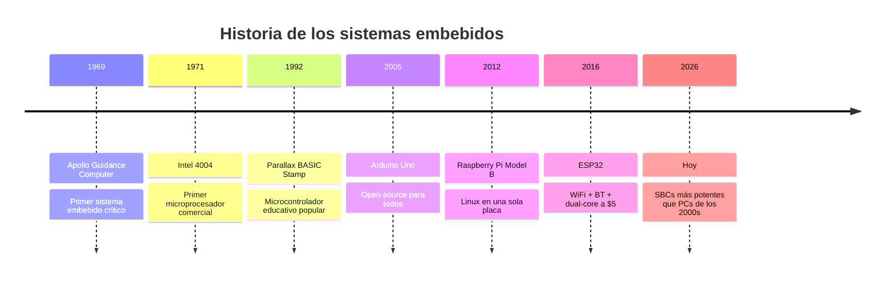
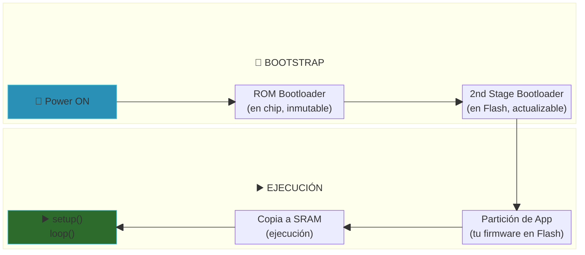
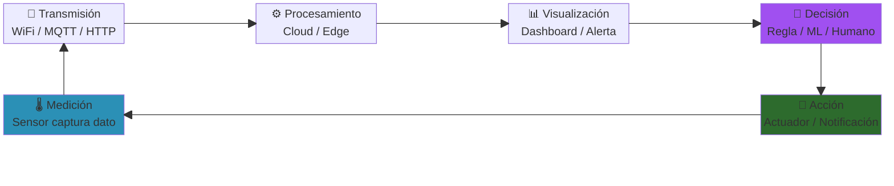

# Sistemas Embebidos - SBC - IoT

Introducción microcontroladores, Linux embebido y sistemas IoT

  
    Presiona espacio para continuar 

  

  <button @click="$slidev.nav.openInEditor()" title="Open in Editor" class="text-xl slidev-icon-btn opacity-50 !border-none !hover:text-white">
    

  </button>

<!--
Bienvenida al módulo de Sistemas Embebidos. Presentarte brevemente y mencionar qué van a ver hoy: desde qué es un microcontrolador hasta el ecosistema IoT con ESP32. Preguntar a mano alzada quién ya programó alguna vez un Arduino o Raspberry Pi.
-->

---
layout: default
transition: fade-out
---

# Contenido

<Toc maxDepth="1" columns="2" class="text-sm"></Toc>

<!--
Recorrer brevemente el índice para que los estudiantes sepan hacia dónde vamos. Mencionar que hay anécdotas históricas, comparaciones prácticas y que al final van a entender por qué el ESP32 es tan popular en IoT.
-->

---
transition: slide-up
---

# ¿Qué es un sistema embebido?

  

  **Situación:** Tengo una estufa y me gustaría que se prenda y apague sola.

  - El Mecánico: Le ponemos un reloj para que la apague
  - El Eléctrico: Diseño un circuito, que la apague
  - El Programador... <v-click> **¿Y si le ponemos un computador?** </v-click>

  

  

    
👩‍🔧

  

  

    <Image src="/images/Pie-de-metro-digital.png" class="h-25 mx-auto mt-1" />
  

  

    <Image src="/images/Unidad de control de motor.jpg" class="h-25 mx-auto mt-1" />
  

  

    <Image src="/images/horno_digital.png" class="h-25 mx-auto mt-1" />
  

  

    <Image src="/images/termometrodigital.jpg" class="h-25 mx-auto mt-1" />
  

  

    <v-click> <strong>"Es un computador pequeño que va integrado para controlar cualquier producto"</strong> </v-click>
  

---
transition: slide-down
---

# Línea de tiempo de los sistemas embebidos

<Image src="/images/Apolo_Guidance_computer.png" class="h-40 mx-auto mt-1" />

<Image src="/images/Intel_C4004.jpg" class="h-40 mx-auto mt-1" />

<Image src="/images/Sintonizador de radio aereo.jpg" class="h-40 mx-auto mt-1" />

<!-- IMAGE SUGGESTION: Colocar ./images/Apolo_Guidance_computer.png junto al timeline, referencia visual al primer sistema embebido. Ver también: https://hackaday.com/2018/11/12/an-apollo-guidance-computer-laid-bare/ -->

<!--
Contextualizar: llevamos más de 50 años haciendo sistemas embebidos. El Apollo Guidance Computer navegó a la Luna con menos poder de cómputo que una calculadora moderna. Preguntar: ¿cuántos sistemas embebidos creen que tienen en su casa?
-->

---
transition: fade-out
---

# Propósitos: ¿para qué sirven?

🤖 Hobby

<Image src="/images/Robot Hobby talleres Microcontrolador 1_.png" class="h-30 mx-auto mt-1" />

Robots, juegos, proyectos creativos de taller

🎓 Educación

<Image src="/images/Microbit education microcontroller.png" class="h-30 mx-auto mt-1" />

Micro:bit, kits escolares, aprendizaje visual

🌡️ Control

<Image src="/images/Generadores helocos ejemplo control.png" class="h-30 mx-auto mt-1" />

Estaciones meteorológicas, automatización industrial

🛒 Productos comerciales

<Image src="/images/Mechanical Keyboard Example Product.jpg" class="h-30 mx-auto mt-1" />

Teclados mecánicos, controles de videojuegos, electrodomésticos

<!-- IMAGE SUGGESTION: Agregar también ./images/mechaniocal keyboard example 1 product.png -->
<!-- REFERENCIA: https://hackaday.com/2017/11/10/an-awesome-open-mechanical-keyboard/ -->

<!--
Mostrar cada caso con v-click progresivo. En "Hobby" mencionar los robots que hicieron en los talleres (hay fotos de eso). En "Productos comerciales" preguntar: ¿cuántos usan un teclado mecánico? Adivinen qué microcontrolador tiene adentro.
-->

---
layout: image-right
image: ./images/arduino uno r3.png
transition: slide-left
---

# Microcontroladores

- ⚡ <b>Bajo consumo</b>: vive en baterías o sensores remotos y despierta solo cuando lo necesitas.
- 🧠 <b>Procesador completo</b>: tiene CPU, memoria y periféricos integrados en un chip del tamaño de una uña.
- 🔌 <b>Multiples interfaces</b>: UART, SPI, I²C, ADC, PWM, USB, WiFi/BT, radiofrecuencias, GPS, etc., para hablar con sensores, memorias y redes.
- 🛠️ <b>Diseñado para una tarea</b>: controla motores, luces, sensores o protocolos de radio sin tener que cargar un sistema operativo completo.

<!--
-->

---
layout: image-right
image: ./images/Arduino team history.jpg
transition: slide-up
---

# Arduino

**Ivrea, Italia — 2005**

El proyecto nació en el **Interaction Design Institute Ivrea (IDII)** con una motivación muy práctica:

- Los estudiantes trabajaban con **BASIC Stamp** (~$50 USD)
- Demasiado caro para un contexto educativo
- La idea: *hagamos algo más barato y fácil para diseñadores, no solo ingenieros*
- Massimo Banzi lidera el proyecto junto a David Cuartielles, Tom Igoe, Gianluca Martino y David Mellis

<!-- IMAGE SUGGESTION: Agregar ./images/basic stamp board parallax.jpg como imagen secundaria o en comentario visual para el BASIC Stamp -->

<!--
Hacer pausa dramática en "el nombre no viene de un lab...". Dejar que la audiencia especule. Luego pasar a la siguiente diapositiva para el reveal. Esta es la slide de setup de la anécdota.
-->

---
layout: image-right
image: ./images/Bar di re arduino.png
transition: fade-out
---

# Bautizado en un bar 🍺

El **Bar di Re Arduino** era el café donde se juntaba el equipo en Ivrea.

<v-clicks>

- El bar lleva el nombre del **Rey Arduin de Ivrea** (rey de Italia 1002–1014)
- Banzi le puso "Arduino" al proyecto en honor al bar
- *Un proyecto que cambió el mundo maker... bautizado por el bar de la esquina*

</v-clicks>

 

🔀 Arduino técnicamente fue un **fork** del proyecto **Wiring** (también desarrollado en el IDII).

<!-- IMAGE SUGGESTION: Agregar ./images/Arduino team history.jpg en una segunda columna o debajo para mostrar al equipo fundador -->

<!--
El "giro de taller" es para generar debate: ¿es Arduino realmente original? La respuesta es sí, porque lo que hicieron fue mucho más que copiar — mejoraron el hardware, la IDE, la comunidad y la documentación. Wiring existe aún hoy pero Arduino ganó por comunidad y ecosistema.
-->

---
layout: image-right
image: ./images/Raspberry Pi Model B 2012.png
transition: slide-left
---

# Single Board Computers (SBC)

**Una computadora completa en una sola placa**

<v-clicks>

- 2012: Raspberry Pi Foundation lanza el **Model B** con 256MB de RAM
- Objetivo original: enseñar programación a niños en el Reino Unido
- Precio: **$35 USD** — Linux completo en formato de tarjeta de crédito
- La comunidad explotó: servidores, media centers, robots, IoT...

</v-clicks>

 

<!--
Preguntar: ¿quién tiene una Raspberry Pi en casa? ¿para qué la usan? Mencionar que la RPi cambió la idea de low-cost computing — no solo para niños, sino para makers, industria y educación. Destacar el rol de la Foundation sin fines de lucro.
-->

---
layout: image-right
image: ./images/Raspberry pi zero on a magazine.jpg
transition: fade-out
---

# El boom y la crisis de chips

**2015:** Raspberry Pi Zero — **$5 USD**, el SBC más barato de la historia

<v-clicks>

- Se publicó en la revista MagPi y venía **incluida en la tapa**
- La comunidad de SBCs creció exponencialmente
- **2020–2022:** Pandemia + escasez global de semiconductores

</v-clicks>

⚠️ Una Raspberry Pi que costaba $35 llegó a venderse por **$100–$150** en el mercado secundario

<!-- IMAGE SUGGESTION: ./images/chip shortage ilustration with cats.png como slide adicional o imagen decorativa -->

<!--
La imagen de la revista MagPi con la RPi Zero pegada en la tapa es icónica. Mostrarla. La crisis de chips fue real: se paralizaron fábricas de autos, consolas y electrónica en general. Esto creó una oportunidad de mercado que aprovecharon fabricantes chinos, lo que democratizó aún más el acceso.
-->

---
transition: slide-up
---

# El ecosistema SBC hoy

<Image src="/images/Raspberry Pi Model B 2012.png" class="h-20 mx-auto mb-2" />
<strong>Raspberry Pi</strong>

La original. Mayor comunidad.

<Image src="/images/Banana Pi.png" class="h-20 mx-auto mb-2" />
<strong>Banana Pi</strong>

Compatible con ecosistema RPi

<Image src="/images/orange-pi-cm5.jpg" class="h-20 mx-auto mb-2" />
<strong>Orange Pi</strong>

Rockchip, muy costo-eficiente

<Image src="/images/raxda board.png" class="h-20 mx-auto mb-2" />
<strong>Radxa / Rock Pi</strong>

Rockchip, NVMe, M.2

<Image src="/images/jetson-nano-board.jpg" class="h-20 mx-auto mb-2" />
<strong>NVIDIA Jetson</strong>

GPU integrada para ML/IA

<Image src="/images/Arduino uno Q SBC.png" class="h-20 mx-auto mb-2" />
<strong>Arduino (Qualcomm)</strong>

Linux en Arduino — nueva era

🍎

<strong>Apple Silicon</strong>

M1/M2/M3 — ARM en desktop

<!-- IMAGE SUGGESTION: Agregar imagen de Apple M1/M2 chip die o MacBook -->

+ más

<strong>Los demás...</strong>

Rock Pi, Khadas, BeagleBone...

<!--
La competencia es buena para el precio y la innovación. Mencionar que Qualcomm compró Arduino y lanzó el Arduino Portenta X8 con Linux. Apple es el ejemplo más mainstream de ARM llegando al desktop/laptop — el M1 fue un punto de inflexión.
-->

---
layout: image-right
image: ./images/arm cortex processor diagram.jpg
transition: slide-left
---

# ARM vs x86

| | **ARM** | **x86** |
|---|---|---|
| Diseño | RISC | CISC |
| Instrucciones | Simples y fijas | Complejas y variables |
| Consumo | Bajo (mW–W) | Alto (W–TDP) |
| Licenciamiento | Arm Holdings (royalties) | Intel / AMD (fabricantes) |
| Ejemplos | Cortex-M, Apple M2, Snapdragon | Intel Core, AMD Ryzen |

🤔 Tanto microcontroladores como SBCs usan mayoritariamente **ARM**... pero no todos.
ESP32-C3/C6 también usan **RISC-V**, y algunas placas usan **MIPS** o **x86** (Intel NUC).

<!-- IMAGE SUGGESTION: ./images/arm cortex m0 block diagram processor.png para una vista más detallada del núcleo Cortex-M0 -->
<!-- IMAGE SUGGESTION: ./images/arm cortex m0 xr die.jpg para mostrar el die real del chip -->

<!--
No profundizar demasiado en arquitecturas — el objetivo es que entiendan que no todo corre en la misma arquitectura y que compilar para ARM no es lo mismo que compilar para x86. Esto es especialmente relevante cuando quieran correr Docker o binarios en una RPi. El ejemplo de Apple M1 es útil: incluso macOS migró a ARM en 2020.
-->

---
transition: slide-up
---

# ¿Cuándo conviene uno u otro?

### Microcontrolador (bare-metal) vs SBC (Linux)

  
💰 Costo

  

    
Microcontrolador

    
●●●●● ~$1–15 USD

  

  

    
SBC

    
●●●○○ ~$15–80 USD

  

  
⚡ Consumo

  

    
●●●●● μW – mW (deep sleep)

  

  

    
●●○○○ 2–10 W constantes

  

  
⏱️ Arranque

  

    
●●●●● Milisegundos

  

  

    
●●○○○ 10–60 segundos (Linux)

  

  
🌐 Conectividad

  

    
●●●○○ WiFi/BT básico (ESP32)

  

  

    
●●●●● Ethernet, WiFi, USB, etc.

  

  
💪 Potencia 

  

    
●●●○○ Baja frecuencia y ➖ memoria

  

  

    
●●●●● Alta frecuencia y ➕ memoria

  

<!--
Hacer analogía con videojuego: cada plataforma tiene sus stats. Un microcontrolador es como un guerrero especializado — rápido, eficiente, pero limitado en habilidades. Un SBC es el mago con todo el arsenal pero necesita tiempo para prepararse. Casos reales: termostato industrial → micro; servidor domótico → SBC.
-->

---
layout: image-right
image: ./images/arduino ide.png
transition: fade-out
---

# Arduino: filosofía y comunidad

- **Open-source hardware y software** desde el primer día
- IDE simplificada: `setup()` + `loop()` — sin conocer sistemas operativos
- **Shields**: módulos apilables para agregar funciones sin soldar
- Comunidad masiva: foros, tutoriales, librerías para todo
- Más de **10 millones** de placas vendidas al 2015

<!-- IMAGE SUGGESTION: ./images/Arduino community magazine.png para mostrar la revista -->
<!-- IMAGE SUGGESTION: ./images/arduino older boards.jpg para mostrar la evolución de placas -->

<!--
Destacar que la filosofía "no solo para ingenieros" fue lo que lo diferenció. Un diseñador gráfico podía hacer un prototipo interactivo sin saber C++ profundo. Esto democratizó la electrónica. Mencionar que Arduino tiene IDEs, librerías y ejemplos incluidos — la curva de aprendizaje es mucho más suave que STM32 o ESP-IDF.
-->

---
layout: center
transition: slide-left
---

# Espressif: la alternativa

  
🌍

  
Democratizar el acceso a la tecnología

  
Shanghai, China — fundada en 2008

  
🔓

  
Open Source

  
Todo el SDK (ESP-IDF) es open-source en GitHub

  
📐

  
Open Hardware

  
Diseños de referencia públicos para fabricantes

  
💸

  
Accesibilidad

  
WiFi + BT a $2–5 USD — antes era impensable

<!--
Contrastar con STM (corporación francesa-italiana), Qualcomm (empresa estadounidense que compró ARM Cortex ecosystem) y otros. Espressif es inusual: una empresa china que adoptó open-source y open-hardware como filosofía central, no como estrategia de marketing. Esto les ganó la confianza de la comunidad maker global.
-->

---
layout: image-right
image: ./images/esp8266 board.jpg
transition: fade-out
---

# ESP8266: el origen de todo

**2014: WiFi por menos de $1 USD**

<v-clicks>

- Espressif lanza el **ESP8266** 
- Llegó sin documentación en inglés
- La comunidad lo descifró — reverse engineering masivo
- Primero se usaba como módulo AT-command desde Arduino (era más fácil)
- Luego se destapó que **el ESP8266 es en sí mismo es un microcontrolador**

</v-clicks>

🔥 En 2014 WiFi para makers costaba $30+ USD con shields. El ESP8266 lo llevó a **$1**. Fue una revolución.

<!--
La historia del ESP8266 es un clásico de cultura hacker: nadie esperaba que eso pasara. La comunidad de Hackaday lo documentó, le hizo ingeniería inversa y encontró cómo programarlo directamente. Esto obligó a Espressif a publicar documentación en inglés y abrazar a la comunidad maker. El ESP32 fue la respuesta "oficial" a ese amor de la comunidad.
-->

---
layout: image-right
image: ./images/esp32 s3.jpg
backgroundSize: contain
transition: slide-up
---

# Línea de tiempo del ESP32

  
2016

  
<b>ESP32</b> — Dual-core Xtensa LX6, WiFi + BT 4.2, 520KB SRAM

  
2019

  
<b>ESP32-S2</b> — Single-core, USB nativo, mayor seguridad

  
2020

  
<b>ESP32-C3</b> — RISC-V, ultra low-cost, WiFi 4 + BLE 5

  
2021

  
<b>ESP32-S3</b> — Dual-core, acelerador ML/AI, USB OTG

  
2022

  
<b>ESP32-C6</b> — WiFi 6 (802.11ax), Thread, Zigbee, RISC-V

  
2023+

  
<b>ESP32-P4</b> — Dual-core 400MHz, sin radio, procesamiento intensivo

<!--
Notar la tendencia: cada generación agrega capacidad de procesamiento, más protocolos de conectividad y mejora la eficiencia energética. El ESP32-C3 fue especialmente importante porque usó RISC-V — Espressif apostando por una arquitectura open-source para no pagar royalties a ARM.
-->

---
transition: fade-out
---

# ESP32: ecosistema de herramientas

  <Image src="/images/arduino ide logo.png" class="h-14 mx-auto mb-2" />
  
Arduino IDE

  

    El más accesible. Soporte oficial de Espressif. Ideal para principiantes.
  

  

    ✅ Para empezar rápido
  

  <Image src="/images/micropython logo.png" class="h-14 mx-auto mb-2" />
  
MicroPython

  

    Python en el microcontrolador. REPL interactivo. Excelente para prototipar.
  

  

    ✅ Para prototipado rápido
  

  <Image src="/images/esp-idf logo.png" class="h-14 mx-auto mb-2" />
  
ESP-IDF

  

    Framework oficial de Espressif. C/C++. Control total. Usado en producción.
  

  

    ✅ Para proyectos serios
  

También existe **PlatformIO** (IDE unificado), **CircuitPython** (Adafruit), y **Rust** embebido 🦀

<!--
De menor a mayor complejidad: Arduino IDE → MicroPython → ESP-IDF. Para el taller usaremos principalmente Arduino IDE o MicroPython por accesibilidad. ESP-IDF es lo que corren los productos comerciales — es el framework que usa el firmware del ESP32 en millones de dispositivos IoT reales.
-->

---
layout: image-right
image: ./images/esp32 processor block diagram.jpg
backgroundSize: contain
transition: slide-left
---

# Arquitectura del ESP32

**Visión general del hardware*
- **CPU**: Dual-core Xtensa LX6 @ 240 MHz (o RISC-V en variantes C/H)
- **Memoria**: 520 KB SRAM interna + Flash externa (tipicamente 4MB)
- **GPIO**: 34 pines configurables (entrada/salida digital, ADC, PWM, touch)
- **ADC**: 12-bit, hasta 18 canales
- **Comunicación**: I2C, SPI, UART, I2S, CAN, Ethernet MAC
- **PWM**: LEDC (16 canales) + MCPWM para motores

<!-- IMAGE SUGGESTION: ./images/IOT esp32 architecture diagram.png como referencia adicional de arquitectura completa -->

<!--
Comparar con Arduino Uno: ATmega328 es 8-bit, 16MHz, 2KB RAM. El ESP32 es 32-bit, 240MHz, 520KB RAM, con WiFi y BT incluidos. No es competencia — es otra liga. Hacer el ejercicio mental: ¿cuántos Arduino Uno necesitarías para igualar un ESP32?
-->

---
transition: fade-out
---

# ¿Cómo se ejecuta un programa en el ESP32?

  
💾

  
Flash

  
Almacenamiento no volátil. Persiste sin energía. Aquí vive tu código.

  
🧠

  
SRAM

  
Memoria rápida volátil. Aquí se ejecuta el código. Se borra al apagar.

  
🔧

  
Bootloader

  
Primer código que corre. Inicializa hardware y carga tu firmware.

  
📦

  
Firmware

  
Tu programa compilado. El "sistema operativo" del dispositivo.

<!--
Analogía con PC: ROM Bootloader = BIOS/UEFI (inmutable). 2nd Stage Bootloader = GRUB o Windows Boot Manager. Flash = disco duro (SSD). SRAM = RAM. El concepto de "flashear" un dispositivo viene exactamente de esto: grabar el firmware en la memoria Flash. Cuando hacen "upload" desde Arduino IDE, están flasheando.
-->

---
layout: image-right
image: ./images/ESP32 Dev Kit.png
transition: slide-up
---

# Radio 2.4 GHz y energía

**WiFi + Bluetooth en el mismo chip**

**Casos de uso por conectividad:**
- **WiFi 802.11** b/g/n (2.4 GHz): hogar inteligente, datos en tiempo real
- **BLE 4.2/5.0**: wearables, proximidad, bajo consumo
- **ZigBee/Thread**: redes malladas, IoT industrial
- Otros: LoRa, NB-IoT/GSM (celular), Ethernet, GPS...

🔋 En **Deep Sleep** (~10 μA) una batería de 1000 mAh puede durar **más de 1 año** con lecturas periódicas. **Activo** (~240 mA) podría llegar a durar unas **~4 horas**.

<!--
El Deep Sleep es revolucionario para sensores IoT con batería. Ejemplo real: sensor de temperatura que despierta cada 10 minutos, lee temperatura, transmite por WiFi y vuelve a dormir. El tiempo activo (<1 segundo) vs dormido (9 minutos 59 segundos) hace que la batería dure meses. Mencionar consideraciones de antena: la radio puede interferir con el ADC en algunos pins.
-->

---
layout: image-right
image: ./images/IoT devices on the streets.jpg
transition: slide-left
---

# ¿Qué es IoT?

**Internet of Things — Internet de las Cosas**

<v-clicks>

- **Dispositivos** físicos con capacidad de sensar y actuar
- **Conectividad** para transmitir datos (WiFi, BLE, LoRa, 4G)
- **Datos** procesados localmente o en la nube
- **Acción** automatizada basada en la información

</v-clicks>

🌐 Hoy hay más de **15 mil millones** de dispositivos IoT conectados globalmente.
Para 2030 se proyectan más de **29 mil millones**.

<!-- IMAGE SUGGESTION: ./images/Smart home iot devices.png como slide complementaria o imagen adicional -->

<!--
Preguntar: ¿cuántos dispositivos IoT tienen en su casa ahora mismo? (TV smart, celular, router, cámara de seguridad, asistente de voz, etc.) La respuesta suele sorprender. IoT no es ciencia ficción — ya está en todas partes, la mayoría de las veces invisible.
-->

---
transition: fade-out
---

# Componentes de un sistema IoT

  
🌡️

  
Sensores

  

    Capturan datos del mundo físico: temperatura, humedad, presión, luz, movimiento, gas...
  

  
DHT22, BME280, PIR, LDR...

  
⚙️

  
Actuadores

  

    Producen un efecto en el mundo físico: motores, relés, LEDs, buzzer, servo, display...
  

  
SG90, OLED, Relay module...

  
🧠

  
Microcontrolador / SBC

  

    El cerebro: lee sensores, toma decisiones, controla actuadores, gestiona conectividad.
  

  
ESP32, Arduino, RPi...

  
📡

  
Conectividad

  

    Canal de comunicación: WiFi, Bluetooth, LoRa, Zigbee, 4G/5G, Ethernet.
  

  
MQTT, HTTP, WebSocket...

  
☁️

  
Nube / Servidor

  

    Almacena, procesa y visualiza datos. Lógica de negocio y dashboards.
  

  
AWS IoT, Home Assistant, Node-RED...

  
📱

  
Interfaz / App

  

    El humano en el loop: apps móviles, dashboards web, alertas, automatizaciones.
  

  
Grafana, Blynk, Home Assistant UI...

<!--
Para cada componente dar un ejemplo concreto y tangible. Hacer la pregunta: "¿qué pasa si falla la conectividad? ¿el sensor deja de funcionar?" — respuesta: no, depende de si hay lógica local. Eso lleva a hablar de edge computing. Este modelo de 6 componentes es el framework conceptual de todo el módulo de IoT.
-->

---
transition: slide-up
---

# Flujo típico de un sistema IoT

**Ejemplo concreto:** Estación meteorológica con ESP32
`DHT22` → mide temperatura → `WiFi/MQTT` → `Home Assistant` → dashboard → si T > 28°C → `relay` enciende ventilador

<!-- IMAGE SUGGESTION: ./images/IOT esp32 architecture diagram.png como imagen complementaria del flujo -->
<!-- IMAGE SUGGESTION: ./images/iot device architecture diagram.png para arquitectura general -->

<!--
Este flujo es el mapa del tesoro de todo el módulo. Todo lo que vamos a construir en los talleres sigue este patrón. Pedir que identifiquen cada componente del ejemplo de la estación meteorológica con los nodos del diagrama. Mencionar que el "feedback loop" es lo que convierte un sistema de monitoreo en un sistema de control automático.
-->

---
layout: center
class: text-center
transition: fade-out
---

# Resumen del módulo

  
🔬

  
Sistemas Embebidos

  
Propósito específico, bare-metal, eficiencia

  
💻

  
SBC

  
Embedded Linux, más potente, más consumo

  
⚡

  
Microcontrolador

  
Bajo consumo, interfaces, tiempo real

  
🔵

  
Arduino

  
Filosofía open, comunidad, shields

  
🔴

  
Raspberry Pi

  
Educación, Linux completo, periféricos avanzados

  
🟦

  
ESP32

  
WiFi+BT, open-source, IoT ideal

**Siguiente:** Primeros pasos con ESP32 🚀

<!--
Cierre del módulo. Recapitular los puntos clave en 2 minutos. Abrir espacio para preguntas. Si hay tiempo, hacer una demo en vivo: flashear un ESP32 con un "Hola Mundo" (blink LED) desde Arduino IDE para que vean el flujo completo en tiempo real.
-->

---
layout: center
class: text-center
---
# ¡Gracias por su atención!

Preguntas...

<Image src="/images/question_cat.jpg" class="h-40 mx-auto mt-4" />

---
layout: center
class: text-center
---

# Referencias y recursos

  
🚀 Apollo Guidance Computer

  <a href="https://hackaday.com/2018/11/12/an-apollo-guidance-computer-laid-bare/" class="text-blue-400 text-sm">hackaday.com — An Apollo Guidance Computer Laid Bare</a>

  
⌨️ Teclado mecánico open-source

  <a href="https://hackaday.com/2017/11/10/an-awesome-open-mechanical-keyboard/" class="text-blue-400 text-sm">hackaday.com — An Awesome Open Mechanical Keyboard</a>

  
📚 Documentación ESP-IDF

  <a href="https://docs.espressif.com/projects/esp-idf/en/latest/" class="text-blue-400 text-sm">docs.espressif.com</a>

  
🍓 Raspberry Pi Foundation

  <a href="https://www.raspberrypi.org" class="text-blue-400 text-sm">raspberrypi.org</a>

Presentación creada con [Slidev](https://sli.dev) · Imágenes propias del taller y de dominio público

<!--
Dejar estas referencias disponibles para que los estudiantes profundicen por su cuenta. Hackaday es especialmente valioso — tiene artículos técnicos accesibles sobre hardware real. La documentación de ESP-IDF es la fuente de verdad para el ESP32.
-->

