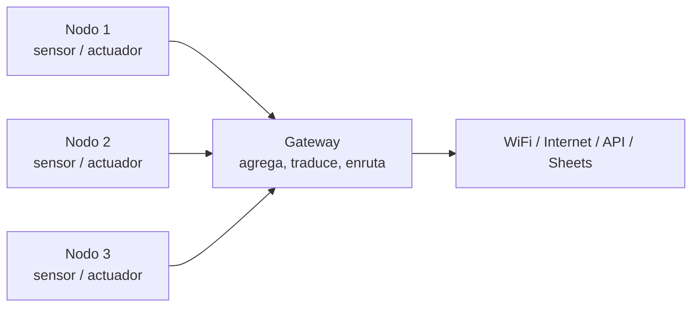

<div class="absolute inset-0 bg-black/60" />

<div class="relative z-10 flex h-full flex-col items-center justify-center">

# Laboratorio 1

## ESP32 con Arduino IDE

Del montaje seguro a la primera comunicación entre nodos

<div class="pt-10">
  <span @click="$slidev.nav.next" class="px-2 py-1 rounded cursor-pointer" flex="~ justify-center items-center gap-2" hover="bg-white bg-opacity-10">
    Presiona espacio para continuar <div class="i-carbon:arrow-right inline-block"/>
  </span>
</div>

</div>

<!--
Abrir con el contexto del laboratorio. La idea es aterrizar expectativas: hoy no buscamos un sistema perfecto, buscamos un flujo de trabajo correcto, seguro y reproducible.

Laboratorio en contexto:
- Objetivo: construir una base sólida para trabajar con ESP32 de forma segura.
- Resultado esperado: cada equipo deja un nodo funcionando, leyendo algo y comunicando algo.
- Entrega 1: evidencia técnica mínima, código, fotos del montaje y breve explicación del diseño.
- Restricción real: el hardware no perdona errores de voltaje ni cableado improvisado.

Preguntas para abrir la sesión:
- ¿Quién ya programó Arduino o ESP32?
- ¿Qué parte les pone más nerviosos: cableado, código o fuentes de poder?
- ¿Qué creen que es más probable que falle primero?
-->

---
transition: fade-out
---

# Contenido

<Toc maxDepth="1" columns="2" class="text-sm" />

---
transition: slide-up
---

# Antes de empezar

- Trabajo a realizar en equipos de **4 integrantes**.
- 4 desafíos - los 2 primeros serán guiados.
- Pueden preguntar sobre cualquier parte del proceso
- Está permitido el uso de IA pero se les evaluará la comprensión del circuito y el código generado.
- Es solo una introducción - no se espera un sistema perfecto, sino un flujo de trabajo correcto y seguro.

<div class="grid grid-cols-3 gap-4 mt-4">
  <div class="p-4 rounded-lg border border-blue-400/40 bg-blue-500/10">
    <div class="font-bold mb-2">Roles sugeridos</div>
    <div class="text-sm text-left">
      Integración de hardware<br>
      Firmware y pruebas<br>
      Datos y comunicación<br>
      Registro y documentación
    </div>
  </div>
  <div class="p-4 rounded-lg border border-green-400/40 bg-green-500/10">
    <div class="font-bold mb-2">Durante el trabajo</div>
    <div class="text-sm text-left">
      Revisar pinout<br>
      Validar voltajes<br>
      Montar por etapas<br>
      Probar siempre por separado
    </div>
  </div>
  <div class="p-4 rounded-lg border border-purple-400/40 bg-purple-500/10">
    <div class="font-bold mb-2">Entrega mínima</div>
    <div class="text-sm text-left">
      Código fuente<br>
      Foto del circuito<br>
      Video o evidencia de ejecución<br>
      Informe: Descripción del sistema
    </div>
  </div>
</div>

<div class="mt-6 p-3 rounded bg-white/5 border border-white/10 text-sm">
  Este laboratorio es para guiarlos con su primera entrega, algunas cosas pueden fallar, lo importante es entender por qué y cómo solucionarlo.
</div>

---
transition: slide-left
---

# Materiales del laboratorio

<div grid="~ cols-3 gap-4" class="mt-3">

<div class="p-3 rounded-lg border border-white/20 bg-white/5">
<div class="font-bold text-sm mb-1">ESP32-S3-WROOM-1 x2</div>
<Image src="/images/esp32 s3.jpg" class="h-24 mx-auto mt-1" />
<div class="text-sm mt-2">Microcontrolador principal con WiFi, Bluetooth y soporte ESP-NOW. Incluye LED RGB WS2812 integrado.</div>
</div>

<div class="p-3 rounded-lg border border-white/20 bg-white/5">
<div class="font-bold text-sm mb-1">Sensor DHT11 x1</div>
<Image src="/images/clase 2/dht11_sensor.jpg" class="h-24 mx-auto mt-1" />
<div class="text-sm mt-2">Sensor digital de temperatura y humedad relativa. Rango típico: 0–50 °C y 20–90 % HR.</div>
</div>

<div class="p-3 rounded-lg border border-white/20 bg-white/5">
<div class="font-bold text-sm mb-1">Radar HLK-LD2420 x1</div>
<Image src="/images/clase 2/ld2420.jpg" class="h-24 mx-auto mt-1" />
<div class="text-sm mt-2">Radar de presencia y movimiento por UART a 3.3 V. Permite detectar presencia y distancia del objetivo.</div>
</div>

<div class="p-3 rounded-lg border border-white/20 bg-white/5">
<div class="font-bold text-sm mb-1">Protoboard x1</div>
<Image src="/images/clase 2/protoboard.jpg" class="h-24 mx-auto mt-1" />
<div class="text-sm mt-2">Placa de prototipado sin soldadura para montar y probar el circuito antes de una versión final.</div>
</div>

<div class="p-3 rounded-lg border border-white/20 bg-white/5">
<div class="font-bold text-sm mb-1">Jumpers macho-macho</div>
<Image src="/images/clase 2/jumper_cables.jpg" class="h-24 mx-auto mt-1" />
<div class="text-sm mt-2">Cables de conexión para unir la protoboard, el ESP32 y los sensores durante el montaje.</div>
</div>

<div class="p-3 rounded-lg border border-white/20 bg-white/5">
<div class="font-bold text-sm mb-1">Notebook + Arduino IDE</div>
<div class="h-24 mx-auto mt-1 rounded flex items-center justify-center bg-blue-500/15 border border-blue-400/30 text-5xl">💻</div>
<div class="text-sm mt-2">Entorno mínimo para programar, cargar firmware, abrir el monitor serial y documentar pruebas.</div>
</div>

</div>

---
transition: fade-out
---

# Nodo y Gateway en IoT



<div class="grid grid-cols-2 gap-4 mt-5 text-sm">
  <div class="p-3 rounded border border-blue-400/40 bg-blue-500/10">
    <strong>Nodo:</strong> dispositivo de borde que mide, actúa o transmite. Normalmente tiene sensores, un microcontrolador y consumo limitado.
  </div>
  <div class="p-3 rounded border border-green-400/40 bg-green-500/10">
    <strong>Gateway:</strong> dispositivo puente que recibe datos de nodos y los lleva a otra red, servicio o plataforma.
  </div>
</div>

---
transition: slide-up
---

# Protocolos que veremos

<div grid="~ cols-3 gap-4" class="mt-4">

<div class="p-4 rounded-lg border border-blue-400/40 bg-blue-500/10">
  <div class="font-bold text-lg mb-2">UART</div>
  <div class="text-sm text-left">
    Comunicación serial asíncrona punto a punto usando líneas <code>TX</code> y <code>RX</code>. Es la forma más directa de hablar con el monitor serial, sensores UART y módulos externos.
  </div>
</div>

<div class="p-4 rounded-lg border border-green-400/40 bg-green-500/10">
  <div class="font-bold text-lg mb-2">ESP-NOW</div>
  <div class="text-sm text-left">
    Protocolo propietario de Espressif para intercambio directo entre ESP32 sobre la radio WiFi. Permite baja latencia, poco overhead y comunicación sin depender de router.
  </div>
</div>

<div class="p-4 rounded-lg border border-purple-400/40 bg-purple-500/10">
  <div class="font-bold text-lg mb-2">HTTP</div>
  <div class="text-sm text-left">
    Protocolo de aplicación sobre TCP/IP ideal para enviar datos a APIs, dashboards o servicios como Google Sheets. Es simple de integrar, pero depende de una red WiFi operativa.
  </div>
</div>

</div>

<div class="mt-5 p-4 rounded-lg border border-orange-400/40 bg-orange-500/10">
  <div class="grid grid-cols-[1fr_2fr] gap-4 items-center">
    <div>
      <Image src="/images/clase 2/WS2812.jpg" class="h-24 mx-auto" />
    </div>
    <div class="text-left">
  <div class="font-bold text-lg mb-2">WS2812</div>
      <div class="text-sm">
        No es I2C. El LED direccionable está controlado por un chip integrado que recibe una trama serial de <code>24 bits</code>, normalmente <code>8 bits</code> para rojo, verde y azul, para definir color e intensidad por canal. La actualización ocurre sobre una sola línea de datos con temporización precisa.
      </div>
    </div>
  </div>
</div>

<div class="mt-4 p-3 rounded bg-yellow-500/10 border border-yellow-400/30 text-sm">
En el ESP32-S3 del laboratorio ya tienen un WS2812 integrado en la placa, así que pueden controlarlo sin armar un circuito LED externo.
</div>

---
layout: image-right
image: ./images/clase 2/arduino_IDE_2_X.png
backgroundSize: contain
transition: slide-left
---

# Setup de Arduino IDE

1. Instalar Arduino IDE 2.x.
2. Ir a `File > Preferences`.
3. Agregar esta URL en `Additional Boards Manager URLs`:

```text
https://raw.githubusercontent.com/espressif/arduino-esp32/gh-pages/package_esp32_index.json
```

4. Abrir `Boards Manager`.
5. Instalar `esp32 by Espressif Systems`.
6. Seleccionar `ESP32 Dev Module`.
7. Elegir el puerto correcto.

<div class="mt-4 p-3 rounded bg-blue-500/10 border border-blue-400/30 text-sm">
Si no aparece el puerto, revisar cable USB de datos y drivers CH340 o CP210x.
</div>

---
transition: slide-up
---

# Programar en Arduino IDE

<div class="grid grid-cols-2 gap-6 mt-4">
  <div>

```cpp
void setup() {
  Serial.begin(115200);
}

void loop() {
  int estado = digitalRead(10);
  digitalWrite(48, estado);
  Serial.println("Hola");
  delay(1000);
}
```

  </div>
  <div class="text-sm text-left">
    <div class="mb-3"><strong><code>setup()</code></strong>: corre una sola vez al encender o reiniciar la placa.</div>
    <div class="mb-3"><strong><code>loop()</code></strong>: corre infinitamente mientras la placa está encendida.</div>
    <div class="mb-3"><strong><code>Serial.print</code> / <code>Serial.println</code></strong>: envían texto al monitor serial para depurar.</div>
    <div class="p-3 rounded bg-yellow-500/10 border border-yellow-400/30">
      En Arduino casi siempre se programa como: inicializar en <code>setup()</code> y repetir lógica en <code>loop()</code>.
    </div>
  </div>
</div>

<div class="grid grid-cols-2 gap-6 mt-4">
  <div>

```cpp
int contador = 0;
float temp = 23.5;
bool encendido = true;
const int LED_PIN = 48;
char letra = 'A';
```
<div class="text-sm text-left mt-3">
    <strong><code>digitalRead(pin)</code></strong> lee un pin digital y
    <strong><code>digitalWrite(pin, valor)</code></strong> escribe un estado <code>HIGH</code> o <code>LOW</code> en una salida.
  </div>

  </div>
  <div class="text-sm text-left">
    <div class="mb-2"><strong><code>int</code></strong>: números enteros.</div>
    <div class="mb-2"><strong><code>float</code></strong>: números decimales.</div>
    <div class="mb-2"><strong><code>bool</code></strong>: verdadero o falso.</div>
    <div class="mb-2"><strong><code>char</code></strong>: un carácter.</div>
    <div class="mb-2"><strong><code>const</code></strong>: valor fijo que no debería cambiar.</div>
    <div class="p-3 rounded bg-blue-500/10 border border-blue-400/30 mt-3">
      En laboratorio conviene usar <code>const</code> para pines, nombres claros para variables y tipos simples al comienzo.
    </div>
  </div>
</div>

---
transition: fade-out
---

# Protoboard: cómo trabajar bien

<div class="grid grid-cols-2 gap-6 mt-4">
  <div class="p-4 rounded-lg border border-white/20 bg-white/5">
    <div class="font-bold text-sm mb-3">Mapa interno de la protoboard</div>
    <Image src="/images/clase 2/protoboard_diagram.png" class="h-72 mx-auto" />
  </div>
  <div class="p-4 rounded-lg border border-white/20 bg-white/5">
    <div class="font-bold text-sm mb-3">ESP32-S3 Dev Kit</div>
    <Image src="/images/clase 2/ESP32s3 Dev Kit.png" class="h-72 mx-auto" />
  </div>
</div>

---
transition: slide-up
---

# Fuentes de alimentación para ESP32

<div class="grid grid-cols-2 gap-6 mt-4 items-start">
  <div class="text-sm">
    <div class="font-bold mb-3">Reglas</div>
    <ul class="space-y-2">
      <li>La lógica del ESP32 es de <code>3.3V</code>.</li>
      <li>No alimentar GPIO con <code>5V</code>.</li>
      <li>Cargas como tiras LED, relés o motores suelen requerir fuente separada.</li>
      <li>Si hay fuente externa, compartir <code>GND</code> entre los módulos.</li>
      <li>Vin al conectar usb, entrega <code>5V</code>, se recomienda <strong>nunca usar VIN</strong> como una fuente de alimentación principal.</li>
    </ul>
  </div>

  <div class="p-4 rounded-lg border border-white/20 bg-white/5">
    <div class="font-bold text-sm mb-3">Referencia de consumo</div>
    <Image src="/images/clase 2/ESP32-Power-Requirement.jpg" class="h-48 mx-auto" />
  </div>
</div>

<div class="grid grid-cols-3 gap-4 mt-4">
  <div class="p-4 rounded-lg border border-green-400/40 bg-green-500/10">
    <div class="font-bold mb-2">USB</div>
    <div class="text-sm">Puerto de alimentación y programación. Normalmente 5V.</div>
  </div>
  <div class="p-4 rounded-lg border border-blue-400/40 bg-blue-500/10">
    <div class="font-bold mb-2">Fuente externa regulada 5V</div>
    <div class="text-sm">Útil si la placa entra por VIN o USB. Revisar corriente disponible.</div>
  </div>
  <div class="p-4 rounded-lg border border-yellow-400/40 bg-yellow-500/10">
    <div class="font-bold mb-2">Batería / power bank</div>
    <div class="text-sm">Ojo en bajo consumo un power bank suele cortar la alimentación cada 10 segundos</div>
  </div>
</div>

---
transition: fade-out
---

# Pinout Esp32s3

<div class="mt-4 p-4 rounded-lg border border-white/20 bg-white/5">
  <Image src="/images/clase 2/esp32s3_pinout.png" class="h-100 mx-auto" />
</div>

---
transition: slide-left
---

# Seguridad: qué hacer y qué no hacer

<div class="grid grid-cols-2 gap-4 mt-4">
  <div class="p-4 rounded-lg border border-green-400/50 bg-green-500/10">
    <div class="font-bold mb-3">Qué hacer</div>
    <ul class="text-sm space-y-1">
      <li>Revisar pinout.</li>
      <li>Revisar límites de voltaje.</li>
      <li>Armar el circuito por etapas.</li>
      <li>Programar firmware simple primero.</li>
      <li>Probar alimentación antes de conectar sensores.</li>
      <li>Usar resistencias y conversión de nivel cuando corresponda.</li>
    </ul>
    <Image src="/images/clase 2/do.jpg" class="h-36 mx-auto mt-4 rounded" />
  </div>
  <div class="p-4 rounded-lg border border-red-400/50 bg-red-500/10">
    <div class="font-bold mb-3">Qué no hacer</div>
    <ul class="text-sm space-y-1">
      <li>Armar todo el circuito de una vez.</li>
      <li>Programar a ciegas sin revisar pines.</li>
      <li>Energizar primero y pensar después.</li>
      <li>Alimentar GPIOS con 5V.</li>
      <li>Ignorar consumo de corriente.</li>
      <li>Asumir que un módulo "debería funcionar" sin datasheet.</li>
      <li>Esperar a que salga humo para revisar el diseño.</li>
    </ul>
    <Image src="/images/clase 2/dont_do.png" class="h-36 mx-auto mt-4 rounded" />
  </div>
</div>

---
transition: fade-out
---

<div class="h-full flex flex-col items-center justify-center text-center">
  <div class="text-2xl mb-8">Comencemos</div>
  <Image src="/images/clase 2/start.jpg" class="h-53 mx-auto rounded-lg" />
</div>

---
transition: slide-left
---

# Desafío 1: encender un LED

<div class="grid grid-cols-2 gap-6 mt-4">
<div>

**Instalar librería**

1. Abrir Arduino IDE.
2. Ir al panel lateral izquierdo.
3. Hacer click en el ícono `Library Manager`.
4. Buscar `Adafruit NeoPixel`.
5. Instalar `Adafruit NeoPixel by Adafruit`.

</div>

<div>

**Qué probar**

- Abrir `Tools > Serial Monitor`.
- Configurar `115200 baud`.
- Verificar que aparezcan mensajes con `Serial.print` y `Serial.println`.
- Confirmar que el LED integrado cambie de color.

**Criterio de entrega**

- El LED RGB enciende en al menos tres colores distintos.

</div>
</div>

<div class="mt-4 p-3 rounded bg-yellow-500/10 border border-yellow-400/30 text-sm">
Si no enciende, revisar primero el pin del WS2812 integrado en la placa antes de cambiar el código.
</div>

---
transition: fade-out
---

# Desafío 1: código

<div class="grid grid-cols-2 gap-5 mt-2">
<div>

```cpp
#include <Adafruit_NeoPixel.h>

const int RGB_PIN = 48;   // revisar pinout de su ESP32-S3
const int NUM_PIXELS = 1;

Adafruit_NeoPixel pixel(NUM_PIXELS, RGB_PIN, NEO_GRB + NEO_KHZ800);

void mostrarColor(uint8_t r, uint8_t g, uint8_t b, const char* nombre) {
  pixel.setPixelColor(0, pixel.Color(r, g, b));
  pixel.show();
  Serial.print("Color actual: ");
  Serial.println(nombre);
  delay(1000);
}
```

</div>

<div>

```cpp
void setup() {
  Serial.begin(115200);
  pixel.begin();
  pixel.clear();
  pixel.show();
  Serial.println("Monitor serial listo");
}

void loop() {
  mostrarColor(255, 0, 0, "rojo");
  mostrarColor(0, 255, 0, "verde");
  mostrarColor(0, 0, 255, "azul");
}
```

</div>
</div>

---
transition: slide-up
---

# Desafío 2: ESP-NOW entre Nodo y Gateway

<div class="grid grid-cols-2 gap-6 mt-4">
  <div class="text-sm text-left">
    <div class="font-bold mb-2">Cómo funciona</div>
    <ul class="space-y-2">
      <li>El <strong>Gateway</strong> debe imprimir primero su dirección MAC.</li>
      <li>El <strong>Nodo</strong> copia esa MAC en su firmware para registrar al Gateway como <code>peer</code>.</li>
      <li>Luego el Nodo empaqueta la distancia del radar y la envía por <code>ESP-NOW</code>.</li>
      <li>El Gateway recibe el dato y actualiza el LED RGB según la cercanía detectada.</li>
    </ul>
  </div>
  <div class="text-sm text-left">
    <div class="font-bold mb-2">Orden recomendado</div>
    <ol class="space-y-2">
      <li>Cargar un sketch temporal en el Gateway para imprimir su MAC.</li>
      <li>Anotar la MAC que aparece en el monitor serial.</li>
      <li>Pegar esa MAC en el firmware del Nodo.</li>
      <li>Inicializar <code>WiFi.mode(WIFI_STA)</code> y <code>esp_now_init()</code>.</li>
      <li>Registrar el peer y recién después enviar datos.</li>
    </ol>
  </div>
</div>

<div class="mt-4 p-3 rounded bg-yellow-500/10 border border-yellow-400/30 text-sm">
Si ambos ESP32 van a enviarse datos entre sí, cada uno debe conocer la MAC del otro. Para este desafío basta con que el Nodo conozca primero la MAC del Gateway.
</div>

---
transition: fade-out
---

# Desafío 2: código base ESP-NOW

<div class="grid grid-cols-2 gap-5 mt-2">
<div>

```cpp
// Gateway: imprimir MAC
#include <WiFi.h>

void setup() {
  Serial.begin(115200);
  WiFi.mode(WIFI_STA);
  Serial.print("MAC Gateway: ");
  Serial.println(WiFi.macAddress());
}

void loop() {}
```

</div>

<div>

```cpp
// Nodo: registrar MAC del Gateway
#include <WiFi.h>
#include <esp_now.h>

uint8_t peer[] = {0x24, 0x6F, 0x28, 0xAA, 0xBB, 0xCC};

typedef struct {
  int radar;
  int contador;
} Payload;

Payload data = {0, 0};

void setup() {
  Serial.begin(115200);
  WiFi.mode(WIFI_STA);
  esp_now_init();

  esp_now_peer_info_t info = {};
  memcpy(info.peer_addr, peer, 6);
  esp_now_add_peer(&info);
}
```

</div>
</div>

---
transition: slide-left
---

# Desafío 2: envío base por ESP-NOW

```cpp
typedef struct {
  int radar;
  int contador;
} Payload;

Payload data = {0, 0};

void loop() {
  data.radar = random(0, 2);
  data.contador++;
  esp_now_send(peer, (uint8_t *)&data, sizeof(data));
  delay(1000);
}
```

---
transition: slide-left
---

# Desafío 2: radar HLK-LD2420

<div class="grid grid-cols-2 gap-6 mt-3">
<div>

**Cómo interactuar con el radar**

| HLK-LD2420 | ESP32-S3 |
|---|---|
| `VCC` | `3V3` |
| `GND` | `GND` |
| `TX` | `GPIO RX` a definir |
| `RX` | `GPIO TX` a definir |

<div class="mt-4 text-sm p-3 rounded bg-orange-500/15 border border-orange-400/40">
El radar habla por <code>UART</code>. Conviene usar un puerto serial distinto al monitor USB para no mezclar la lectura del sensor con la depuración por <code>Serial</code>.
</div>

</div>

<div class="text-sm text-left">

**Instalar librería ZIP**

1. Descargar el repositorio de la librería.
2. En Arduino IDE ir a `Sketch > Include Library > Add .ZIP Library...`
3. Seleccionar el archivo `.zip`.
4. Verificar con un sketch que `#include "LD2420.h"` compile.

**Idea general**

- La librería encapsula el protocolo serial del radar.
- Se inicializa sobre un puerto serial dedicado al radar.
- Luego se actualiza el estado del sensor y se captura la distancia detectada.
- Esa distancia se empaqueta y se envía al Gateway por `ESP-NOW`.

</div>
</div>

---
transition: fade-out
---

# Desafío 2: código base del radar

<div class="grid grid-cols-2 gap-5 mt-2">
<div>

```cpp
#include <SoftwareSerial.h>
#include "LD2420.h"

SoftwareSerial sensorSerial(8, 9); // RX, TX
LD2420 radar;

void onObjectDetected(int distance) {
  Serial.print("Object at ");
  Serial.print(distance);
  Serial.println(" cm");
}
```

</div>

<div>

```cpp
void setup() {
  Serial.begin(115200);
  sensorSerial.begin(115200);

  if (radar.begin(sensorSerial)) {
    Serial.println("Radar initialized!");
    radar.onDetection(onObjectDetected);
  }
}

void loop() {
  radar.update();
  delay(10);
}
```

</div>
</div>

---
transition: slide-up
---

# Desafío 3: configurar WiFi

```cpp
#include <WiFi.h>

const char* SSID = "NombreDeRed";
const char* PASS = "ClaveDeRed";

void setup() {
  Serial.begin(115200);
  WiFi.setAutoReconnect(true);
  WiFi.persistent(false);
  WiFi.mode(WIFI_STA);
  WiFi.setTxPower(WIFI_POWER_17dBm);
  WiFi.begin(SSID, PASS);

  while (WiFi.status() != WL_CONNECTED) {
    delay(500);
    Serial.print(".");
  }

  Serial.println();
  Serial.print("IP: ");
  Serial.println(WiFi.localIP());
}

void loop() {}
```

<div class="mt-4 text-sm">
Si WiFi no conecta, revisar SSID, clave, banda de `2.4 GHz` y distancia al AP.
</div>

---
transition: fade-out
---

# Desafío 3: registrar datos en Google Sheets

<div class="grid grid-cols-2 gap-6 mt-3">
<div>

**Arquitectura simple**

1. Google Apps Script publica un endpoint web.
2. ESP32 envía un `HTTP POST`.
3. El script agrega una fila a la planilla.

```js
function doPost(e) {
  const sheet = SpreadsheetApp.getActiveSheet();
  const data = JSON.parse(e.postData.contents);
  sheet.appendRow([new Date(), data.nodo, data.valor]);
  return ContentService.createTextOutput("ok");
}
```

</div>

<div>

```cpp
#include <WiFi.h>
#include <HTTPClient.h>

void enviarDato(float valor) {
  HTTPClient http;
  http.begin("https://script.google.com/macros/s/TU_ID/exec");
  http.addHeader("Content-Type", "application/json");
  String body = "{\"nodo\":\"esp32-01\",\"valor\":" + String(valor, 2) + "}";
  int code = http.POST(body);
  Serial.println(code);
  http.end();
}
```

</div>
</div>

<div class="mt-4 p-3 rounded bg-blue-500/10 border border-blue-400/30 text-sm">
Para producción esto no es ideal, pero para casos simples sirve muy bien para registrar mediciones y evidencias rápidas.
</div>

---
transition: slide-left
---

# Entrega del laboratorio

<div class="grid grid-cols-2 gap-6 mt-4">
<div class="text-sm text-left">

**Formato y plazo**

- Entrega solo por `Canvas`.
- Fecha límite: **29 de marzo de 2026, 23:59 hrs**.
- Entregas fuera de plazo no se evalúan salvo autorización previa del equipo docente.
- Subir un único archivo comprimido `.zip`.

</div>

<div class="text-sm text-left">

**El `.zip` debe incluir**

1. Informe en `PDF`.
2. Códigos fuente de ambos `ESP32` (`.ino`).
3. Link público a `Google Sheets` y también en `README.txt`.
4. Fotografías del sistema en funcionamiento.

</div>
</div>

<div class="mt-4 p-3 rounded bg-yellow-500/10 border border-yellow-400/30 text-sm">
Mínimo esperado en fotos: circuito montado y captura de Google Sheets con datos.
</div>

---
transition: fade-out
---

# Informe y evaluación

<div class="grid grid-cols-2 gap-6 mt-4">
<div class="text-sm text-left">

**Estructura del informe**

1. Portada con equipo, integrantes, roles y fecha.
2. Materiales y justificación de pines.
3. Tabla completa de conexiones.
4. Protocolos de comunicación del sistema.
5. Arquitectura final y flujo de datos.
6. Observaciones, errores y soluciones.

</div>

<div class="text-sm text-left">

**Indicaciones del curso**

- Comentar las funciones relevantes del código.
- Explicar por qué eligieron esos GPIOs.
- Mostrar el flujo completo: radar → ESP-NOW → WiFi/HTTP → Sheets.
- Documentar incidentes reales, no solo el resultado final.
- Hay `1,0` punto base por entregar dentro de plazo.

</div>
</div>

<div class="mt-4 p-3 rounded bg-blue-500/10 border border-blue-400/30 text-sm">
Mientras más trazable sea la entrega, más fácil es evaluar su trabajo: conexiones claras, código comentado, evidencia visual y datos registrados.
</div>

---
transition: fade-out
---

<div class="h-full flex flex-col items-center justify-center text-center">
  <div class="text-2xl mb-8">Gracias por la atención</div>
  <Image src="/images/clase 2/fin.png" class="h-72 mx-auto rounded-lg" />
</div>

<style>
h1 {
  background-color: #2B90B6;
  background-image: linear-gradient(45deg, #7dd3fc 10%, #0f766e 45%, #f59e0b 90%);
  background-size: 100%;
  -webkit-background-clip: text;
  -moz-background-clip: text;
  -webkit-text-fill-color: transparent;
  -moz-text-fill-color: transparent;
}
</style>
