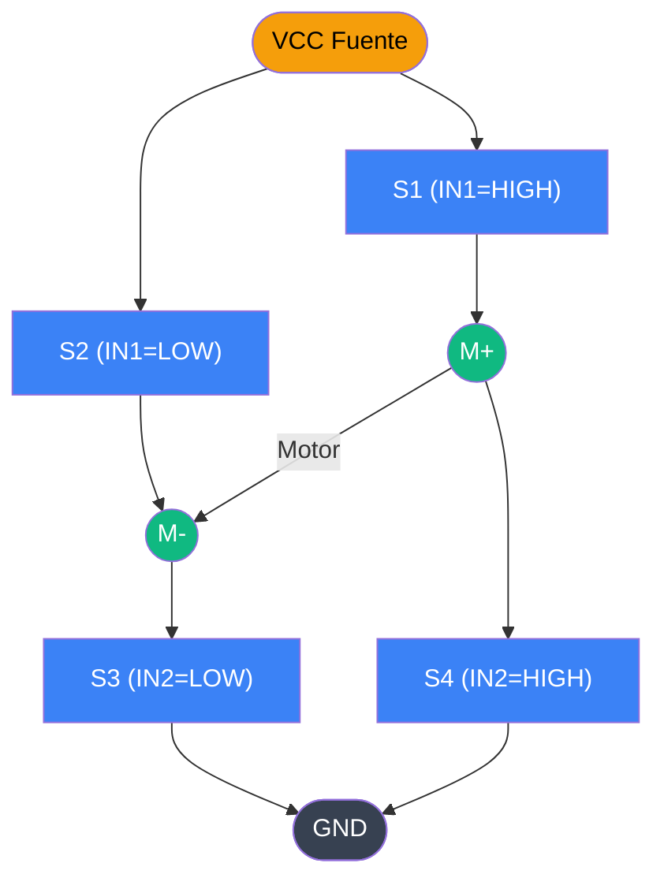

<div class="absolute inset-0 bg-black/65" />

<div class="relative z-10 flex h-full flex-col items-center justify-center">

# Sensores, Actuadores y Drivers

## Clase 4 — Segunda entrega, materiales, sensores y actuadores

<div class="pt-10">
  <span @click="$slidev.nav.next" class="px-2 py-1 rounded cursor-pointer" flex="~ justify-center items-center gap-2" hover="bg-white bg-opacity-10">
    Presiona espacio para continuar <div class="i-carbon:arrow-right inline-block"/>
  </span>
</div>

</div>

---
transition: fade-out
---

# Contenido

<Toc maxDepth="1" columns="2" class="text-sm" />

---
transition: slide-up
---

# Materiales de esta clase

<div class="grid grid-cols-3 gap-4 mt-4 text-left">

  <div class="p-3 rounded-lg border border-blue-400/40 bg-blue-500/10">
    <div class="font-bold text-sm mb-1">ESP32-S3 DevKit</div>
    <div class="text-xs opacity-80">Microcontrolador principal, 45 gpios, ADC 12 bits, WiFi + BLE</div>
  </div>

  <div class="p-3 rounded-lg border border-purple-400/40 bg-purple-500/10">
    <div class="font-bold text-sm mb-1">ESP32-C3 + OLED</div>
    <div class="text-xs opacity-80">Microcontrolador RISC-V con pantalla I2C integrada</div>
  </div>

  <div class="p-3 rounded-lg border border-green-400/40 bg-green-500/10">
    <div class="font-bold text-sm mb-1">pH Blue Probe 0–14</div>
    <div class="text-xs opacity-80">Sensor electroquímico analógico, necesita módulo acondicionador</div>
  </div>

  <div class="p-3 rounded-lg border border-red-400/40 bg-red-500/10">
    <div class="font-bold text-sm mb-1">DS18B20 waterproof</div>
    <div class="text-xs opacity-80">Temperatura digital 1-Wire, resistente al agua</div>
  </div>

  <div class="p-3 rounded-lg border border-yellow-400/40 bg-yellow-500/10">
    <div class="font-bold text-sm mb-1">ENS160 + AHT21</div>
    <div class="text-xs opacity-80">CO₂, TVOC, humedad y temperatura por I2C</div>
  </div>

  <div class="p-3 rounded-lg border border-teal-400/40 bg-teal-500/10">
    <div class="font-bold text-sm mb-1">DS3231 RTC</div>
    <div class="text-xs opacity-80">Reloj en tiempo real de alta precisión, batería CR2032</div>
  </div>

</div>

<div class="mt-5 p-3 rounded bg-white/5 border border-white/10 text-sm">
  Cada sensor representa un tipo distinto de señal, protocolo y nivel de acondicionamiento. Entender esas diferencias es la clave para integrarlo correctamente.
</div>

---

# ESP32-C3 con pantalla OLED

<div class="grid grid-cols-2 gap-6 mt-4">
  <div>
    <Image src="/images/clase_4/esp32c3_oled.jpg" class="h-36 mx-auto rounded-xl border border-white/20 bg-white/90 p-2 object-contain" />
    <div class="mt-2 p-3 rounded border border-purple-400/30 bg-purple-500/10 text-xs text-left">
      <strong>OLED SSD1306:</strong> pantalla de 0.42" monocromática 72×40 px, comunicación I2C (SDA/SCL). Consumo ~20 mA a plena carga.
    </div>
    <div class="mt-2 p-3 rounded-lg border border-white/20 bg-white/5 text-sm">
      <div class="font-bold mb-1">ESP32-C3 — arquitectura RISC-V</div>
      <ul class="leading-relaxed text-xs">
        <li>Single-core 160 MHz — más económico que el S3</li>
        <li>WiFi 2.4 GHz + BLE 5, ideal para nodos IoT simples</li>
        <li>22 GPIOs, ADC 12-bit, USB Serial/JTAG nativo</li>
        <li>Consume menos energía en modo light sleep (~130 µA)</li>
      </ul>
    </div>
  </div>
  <div class="text-left">

```cpp
#include <Arduino.h>
#include <U8g2lib.h>
#include <Wire.h>

#define SDA_PIN 5
#define SCL_PIN 6

U8G2_SSD1306_72X40_ER_F_HW_I2C u8g2(U8G2_R0, U8X8_PIN_NONE, SDA_PIN, SCL_PIN);

void setup() {
  u8g2.begin();
  u8g2.clearBuffer();
  u8g2.setFont(u8g2_font_ncenB08_tr);
  u8g2.drawStr(0, 15, "Hola IoT!");
  u8g2.sendBuffer();
}
void loop() {}
```

  </div>
</div>

---

# Sensor de pH — Blue Probe 0–14

<div class="grid grid-cols-2 gap-6 mt-3">
  <div>
    <Image src="/images/clase_4/ph_sensor_blue.jpg" class="h-36 mx-auto rounded-xl border border-white/20 bg-white/90 p-2 object-contain" />
    <div class="mt-2 p-2 rounded border border-purple-400/30 bg-purple-500/10 text-xs">
      <div class="font-semibold text-purple-300 mb-1">Sensor analógico — especificaciones del driver</div>

| Parámetro | Valor |
|---|---|
| Alimentación (VCC) | **5 V** (obligatorio) |
| Salida analógica (PO) | 0 – 4 V |
| Voltaje a pH 7 | ~2 V |
| Sensibilidad | ~0.286 V/pH |
| Rango de medición | pH 0 – 14 |

</div>
    <div class="mt-2 p-2 rounded border border-green-400/30 bg-green-500/10 text-xs">
      <div class="font-semibold mb-1">Conexiones ESP32 (LS = Level Shifter)</div>

| Driver / LS | ESP32 |
|---|---|
| Driver VCC | 5V (VIN) |
| Driver GND | GND |
| Driver PO | LS entrada HV |
| LS salida LV | GPIO34 |
| LS HV | 5V |
| LS LV | 3.3V |
| LS GND | GND |

</div>
  </div>
  <div class="flex flex-col gap-3">
    <Image src="/images/clase_4/level_shifter.jpg" class="h-40 mx-auto rounded-xl border border-white/20 bg-white/90 p-2 object-contain" />
    <div class="p-3 rounded border border-amber-400/30 bg-amber-500/10 text-xs">
      <strong>¿Por qué level shifter?</strong> La salida del driver puede llegar a <strong>4 V</strong>, superando el límite de 3.3 V del ADC del ESP32. El level shifter escala la señal al rango seguro y protege el pin.
    </div>
    <div class="p-2 rounded border border-red-400/30 bg-red-500/10 text-xs">
      <strong>⚠ El driver DEBE alimentarse a 5 V.</strong> Con 3.3 V la linealidad se degrada y las lecturas son incorrectas.
    </div>
    <div class="p-2 rounded border border-orange-400/40 bg-orange-500/10 text-xs">
      <strong>⚠ Solo para líquidos.</strong> La sonda de vidrio está diseñada exclusivamente para sumergirse en soluciones acuosas. Introducirla en sólidos, pastas densas o superficies abrasivas puede <strong>romper la membrana de vidrio</strong> o dañar el gel interno, inutilizando el sensor de forma permanente.
    </div>
  </div>
</div>

---

# Driver del Sensor de pH — Código y Fórmula

<div class="grid grid-cols-2 gap-6 mt-3">
  <div class="flex flex-col gap-3">
    <Image src="/images/clase_4/ph_sensor_driver.jpg" class="h-44 mx-auto rounded-xl border border-white/20 bg-white/90 p-2 object-contain" />
    <div class="p-3 rounded border border-green-400/30 bg-green-500/10 text-xs">
      <strong>Principio:</strong> La sonda genera un potencial proporcional a la concentración de iones H⁺. El driver amplifica y escala: 0 V = pH 0, 4 V = pH 14 (pendiente 0.286 V/pH, 2 V en neutro).
    </div>
    <div class="p-3 rounded border border-blue-400/30 bg-blue-500/10 text-xs text-center">

**Conversión con level shifter (4 V → 3.3 V):**

$V_{sensor} = V_{ADC} \times \dfrac{4}{3.3}$

$pH = V_{sensor} \times 3.5 = V_{ADC} \times \dfrac{4 \times 3.5}{3.3} \approx V_{ADC} \times 4.24$

</div>
  </div>
  <div class="text-left">

```cpp
// Level shifter 4V → 3.3V entre driver pH y ESP32
// V_sensor(max)=4V → V_adc(max)=3.3V  ✓ seguro para ESP32
// V_sensor = V_adc × (4 / 3.3)
// pH       = V_sensor × 3.5 = V_adc × 4.2424…

const int   PH_PIN    = 34; // debe ir conectado a PO
const float PH_FACTOR = 4.2424f; // (4/3.3) × 3.5

void setup() { Serial.begin(115200); }

void loop() {
  int   raw = analogRead(PH_PIN);
  float v   = raw * (3.3f / 4095.0f); // de ADC a V
  float ph  = v * PH_FACTOR;
  Serial.printf("pH: %.2f\n", ph);
  delay(1000);
}
```

  </div>
</div>

---

# Qué entendemos por pH?

<div class="grid grid-cols-2 gap-6 mt-3">
  <div class="text-left">
    <div class="p-4 rounded-lg border border-green-400/40 bg-green-500/10 mb-3">
      <div class="font-bold mb-2">Potencial de Hidrógeno (<em>potentia hydrogenii</em>)</div>
      <div class="text-sm leading-relaxed">
        El pH mide el grado de <strong>acidez o alcalinidad</strong> de una solución acuosa, indicando la concentración de iones de hidrógeno H⁺ presentes. Usa una <strong>escala logarítmica de 0 a 14</strong>.
      </div>
    </div>
    <div class="p-3 rounded-lg border border-white/20 bg-white/5 text-sm">
      <div class="font-bold mb-2">Funcionamiento</div>
      <div class="text-xs leading-relaxed">
        Cuanto mayor es la concentración de iones H⁺, más ácida es la solución y más bajo es el número de pH. Al ser logarítmica, un cambio de 1 unidad representa una diferencia de <strong>10 veces</strong> en la concentración.
      </div>
    </div>
    <div class="mt-3 p-2 rounded bg-white/5 border border-white/10 text-xs">
      En IoT, medir pH es clave en <strong>hidroponía, acuicultura, tratamiento de agua</strong> y control de procesos industriales.
    </div>
  </div>

  <div class="flex flex-col gap-3">
    <Image src="/images/clase_4/ph_scale.svg" class="w-full rounded-xl border border-white/10" />
    <div class="space-y-1 text-xs">
      <div class="flex items-center gap-2">
        <div class="w-10 text-right font-bold text-red-400">0–2</div>
        <div class="flex-1 h-5 rounded bg-red-500/70 flex items-center px-2">Muy ácido — ácido estomacal</div>
      </div>
      <div class="flex items-center gap-2">
        <div class="w-10 text-right font-bold text-orange-400">3–4</div>
        <div class="flex-1 h-5 rounded bg-orange-500/60 flex items-center px-2">Ácido — vinagre, jugo de limón</div>
      </div>
      <div class="flex items-center gap-2">
        <div class="w-10 text-right font-bold text-green-400">7</div>
        <div class="flex-1 h-5 rounded bg-green-500/60 flex items-center px-2">Neutro — agua pura</div>
      </div>
      <div class="flex items-center gap-2">
        <div class="w-10 text-right font-bold text-blue-400">10–12</div>
        <div class="flex-1 h-5 rounded bg-blue-500/60 flex items-center px-2">Básico — bicarbonato, jabón</div>
      </div>
      <div class="flex items-center gap-2">
        <div class="w-10 text-right font-bold text-purple-400">13–14</div>
        <div class="flex-1 h-5 rounded bg-purple-500/70 flex items-center px-2">Muy alcalino — lejía</div>
      </div>
    </div>
  </div>
</div>

<div class="mt-3 p-3 rounded border border-yellow-400/30 bg-yellow-500/10 text-xs">
  <strong>Calibración del driver:</strong> ajustar el potenciómetro del módulo acercando el sensor a una sustancia de pH conocido y girando hasta que la lectura coincida. Sustancias fáciles de conseguir:
  <div class="grid grid-cols-5 gap-2 mt-2 text-center">
    <div class="p-1 rounded bg-red-500/20 border border-red-400/30"><div class="font-bold text-red-300">pH ~2</div>jugo de limón</div>
    <div class="p-1 rounded bg-orange-500/20 border border-orange-400/30"><div class="font-bold text-orange-300">pH ~3</div>vinagre blanco</div>
    <div class="p-1 rounded bg-yellow-500/20 border border-yellow-400/30"><div class="font-bold text-yellow-300">pH ~5</div>café negro</div>
    <div class="p-1 rounded bg-green-500/20 border border-green-400/30"><div class="font-bold text-green-300">pH ~7</div>agua destilada</div>
    <div class="p-1 rounded bg-blue-500/20 border border-blue-400/30"><div class="font-bold text-blue-300">pH ~8.3</div>bicarbonato diluido</div>
  </div>
</div>

---

# Precauciones al usar el Sensor de pH

<div class="grid grid-cols-2 gap-6 mt-3">
  <ul class="text-sm space-y-2 list-none">
    <li>🚰 <strong>Solo en medios líquidos</strong> — la sonda de vidrio debe estar sumergida; si se seca, la membrana se deteriora irreversiblemente.</li>
    <li>🚫 <strong>No enterrar en masas ni sustancias viscosas</strong> — suelos, arcilla, lodo denso o gelatina obstruyen la unión de referencia y arruinan la calibración.</li>
    <li>💧 <strong>Mantener húmedo en almacenamiento</strong> — guardar con tapa y solución KCl 3 M. <strong>Nunca dejarla secar</strong> ni en agua destilada pura por tiempo prolongado.</li>
    <li>🧼 <strong>Enjuagar entre mediciones</strong> — lavar la punta con agua destilada y secar suavemente para evitar contaminación cruzada.</li>
    <li>🌡️ <strong>Temperatura estable</strong> — la respuesta varía con la temperatura (Nernst). Medir a temperatura constante o usar compensación ATC.</li>
  </ul>
  <div class="flex flex-col items-center justify-end gap-2">
    <Image src="/images/clase_4/pH sensor washing.jpg" class="h-40 mx-auto rounded-xl border border-white/20 object-contain" />
    <Image src="/images/clase 2/do.jpg" class="h-28 rounded-xl object-contain" />
  </div>
</div>

---

# Sensor DS18B20 — Temperatura digital waterproof

<div class="grid grid-cols-2 gap-6 mt-3">
  <div>
    <Image src="/images/clase_4/ds18b20_waterproof.jpg" class="h-36 mx-auto rounded-xl border border-white/20 bg-white/90 p-2 object-contain" />
    <div class="mt-2 px-2 py-1 rounded border border-blue-400/30 bg-blue-500/10 text-xs text-center">
      <span class="text-blue-300 font-semibold">Sensor digital</span> — protocolo 1-Wire, sin ADC externo requerido
    </div>
    <div class="mt-2 p-3 rounded border border-green-400/30 bg-green-500/10 text-xs">
      <strong>¿Cómo funciona?</strong> Internamente tiene dos osciladores: uno estable (referencia) y otro cuya frecuencia <em>varía con la temperatura</em>. Un contador compara ambas frecuencias y calcula el valor digital con hasta <strong>12 bits (0.0625 °C)</strong>. El resultado se transmite por 1-Wire — no hay señal analógica que leer.
    </div>
    <div class="mt-2 p-3 rounded border border-purple-400/30 bg-purple-500/10 text-xs">
      <strong>Diferencia vs termistor NTC:</strong> un NTC es analógico — su resistencia varía con la temperatura y hay que leer voltaje con el ADC. El DS18B20 hace esa conversión internamente y entrega directamente bytes por el bus.
    </div>
  </div>
  <div class="text-left">
    <div class="p-2 rounded border border-white/20 bg-white/5 text-xs mb-2">

| Parámetro | Valor |
|---|---|
| Rango | −55 °C a +125 °C |
| Resolución | 9–12 bits (configurable) |
| Precisión | ±0.5 °C (−10 a +85 °C) |
| Protocolo | 1-Wire (1 pin datos) |
| Alimentación | 3.0 – 5.5 V |
| Pull-up datos | 4.7 kΩ a VCC |
| Sensores/bus | Múltiples (ID único 64 bits) |

</div>
    <div class="mt-2 p-2 rounded border border-green-400/30 bg-green-500/10 text-xs">
      <strong>¿Necesita driver?</strong> No — solo resistencia pull-up de 4.7 kΩ entre datos y VCC. Sin ella el bus 1-Wire no funciona.
    </div>
  </div>
</div>

---

# DS18B20 — Código

```cpp
#include <OneWire.h>
#include <DallasTemperature.h>

OneWire  bus(4);               // GPIO4 — datos + pull-up 4.7kΩ
DallasTemperature sensor(&bus);

void setup() {
  Serial.begin(115200);
  sensor.begin();
}

void loop() {
  sensor.requestTemperatures();  // inicia conversión interna
  float t = sensor.getTempCByIndex(0);
  Serial.printf("Temp: %.2f °C\n", t);
  delay(1000);
}
```

---

# Sensor ENS160 + AHT21 — CO₂ y Humedad

<div class="grid grid-cols-2 gap-6 mt-4">
  <div>
    <Image src="/images/clase_4/ens160_aht21.jpg" class="h-44 mx-auto rounded-xl border border-white/20 bg-white/90 p-2 object-contain" />
    <div class="mt-2 px-2 py-1 rounded border border-blue-400/30 bg-blue-500/10 text-xs text-center">
      <span class="text-blue-300 font-semibold">Ambos digitales</span> — comunicación <strong>I2C</strong> (SDA/SCL), sin ADC externo
    </div>
    <div class="mt-2 grid grid-cols-1 gap-2 text-xs">
      <div class="p-2 rounded border border-yellow-400/30 bg-yellow-500/10">
        <strong>ENS160</strong> <span class="text-yellow-300">(I2C 0x52 / 0x53)</span><br/>
        Sensor de óxido metálico (MOX) — la resistencia interna de un material semiconductor varía al absorber gases. Mide CO₂ equivalente (eCO₂), TVOC y calidad del aire (AQI). Requiere calentamiento previo (~3 min).
      </div>
      <div class="p-2 rounded border border-blue-400/30 bg-blue-500/10">
        <strong>AHT21</strong> <span class="text-blue-300">(I2C 0x38)</span><br/>
        Sensor capacitivo — la humedad cambia la permitividad de un polímero higroscópico, alterando la capacitancia medida. Entrega humedad relativa (0–100% HR) y temperatura. Comparte el bus I2C con el ENS160.
      </div>
    </div>
  </div>
  <div class="text-left">

```cpp
#include <ScioSense_ENS160.h>
#include <Adafruit_AHTX0.h>

ScioSense_ENS160 ens160(ENS160_I2CADDR_1);
Adafruit_AHTX0 aht;

void setup() {
  Serial.begin(115200);
  Wire.begin();
  ens160.begin();
  ens160.setMode(ENS160_OPMODE_STD);
  aht.begin();
}

void loop() {
  sensors_event_t hum, temp;
  aht.getEvent(&hum, &temp);
  ens160.set_envdata(temp.temperature, hum.relative_humidity);
  ens160.measure(true);
  Serial.printf("eCO2: %d ppm | TVOC: %d ppb | T: %.1f | H: %.1f%%\n",
    ens160.geteCO2(), ens160.getTVOC(),
    temp.temperature, hum.relative_humidity);
  delay(1000);
}
```

  </div>
</div>

---

# DS3231 — Real Time Clock (RTC)

<div class="grid grid-cols-2 gap-6 mt-4">
  <div>
    <Image src="/images/clase_4/ds3231_rtc.png" class="h-36 mx-auto rounded-xl border border-white/20 bg-white/90 p-2 object-contain" />
    <div class="mt-2 px-2 py-1 rounded border border-blue-400/30 bg-blue-500/10 text-xs text-center">
      <span class="text-blue-300 font-semibold">Sensor digital</span> — comunicación <strong>I2C</strong> (dirección fija 0x68)
    </div>
    <div class="mt-2 p-3 rounded border border-teal-400/30 bg-teal-500/10 text-xs text-left">
      <strong>Principio:</strong> Oscilador de cristal de 32.768 kHz con <em>compensación de temperatura integrada</em> (TCXO). Drift típico: ±2 ppm (~1 min/año). Alimentado por batería CR2032 cuando el sistema está apagado.
    </div>
    <div class="mt-2 p-3 rounded border border-white/20 bg-white/5 text-xs">

| Parámetro | Valor |
|---|---|
| Protocolo | I2C |
| Dirección | 0x68 (fija) |
| Alimentación | 2.3 – 5.5 V |
| Batería backup | CR2032 |
| Precisión | ±2 ppm (~1 min/año) |
| Alarmas | 2 (pin INT/SQW) |

</div>
  </div>
  <div class="text-left">
    <div class="p-2 rounded border border-white/20 bg-white/5 text-xs mb-3">
      <strong>¿Necesita driver?</strong> No — se conecta directo por I2C (SDA/SCL). La librería RTClib abstrae la comunicación. Tiene un pin de alarma configurable (INT/SQW).
    </div>

```cpp
#include <RTClib.h>

RTC_DS3231 rtc;

void setup() {
  Serial.begin(115200);
  Wire.begin();
  rtc.begin();
  // Ajustar fecha/hora solo una vez:
  // rtc.adjust(DateTime(F(__DATE__), F(__TIME__)));
}

void loop() {
  DateTime now = rtc.now();
  Serial.printf("%04d/%02d/%02d %02d:%02d:%02d\n",
    now.year(), now.month(), now.day(),
    now.hour(), now.minute(), now.second());
  delay(1000);
}
```

  </div>
</div>

---

# Protocolo I2C — Inter-Integrated Circuit

<div class="grid grid-cols-2 gap-6 mt-3">
  <div class="text-left flex flex-col gap-3">
    <div class="p-3 rounded border border-blue-400/30 bg-blue-500/10 text-xs">
      <strong>¿Qué es I2C?</strong> Bus de comunicación digital síncrono que usa solo <strong>2 cables</strong>:
      <ul class="mt-1 ml-3 list-disc">
        <li><strong>SDA</strong> — datos bidireccional</li>
        <li><strong>SCL</strong> — reloj generado por el maestro</li>
      </ul>
      Un maestro (ESP32) puede controlar múltiples esclavos (sensores) en el mismo par de cables. Cada esclavo tiene una <strong>dirección única de 7 bits</strong>.
    </div>
    <div class="p-3 rounded border border-green-400/30 bg-green-500/10 text-xs">
      <strong>Dirección de escritura vs lectura:</strong> la dirección de 7 bits se desplaza 1 bit a la izquierda; el bit menos significativo indica la operación (<code>0</code> = escribir, <code>1</code> = leer). Las librerías de Arduino manejan esto automáticamente — solo se necesita la dirección de 7 bits.
      <div class="mt-2 font-mono bg-black/30 rounded p-2 text-xs leading-5">
        write_addr = (addr &lt;&lt; 1) | 0x00<br/>
        read_addr &nbsp;= (addr &lt;&lt; 1) | 0x01
      </div>
    </div>
    <div class="p-2 rounded border border-white/20 bg-white/5 text-xs">
      <strong>ESP32:</strong> SDA = GPIO21, SCL = GPIO22 por defecto. Velocidades: 100 kHz (estándar) o 400 kHz (rápido).
    </div>
  </div>
  <div>
    <div class="p-3 rounded border border-white/20 bg-white/5 text-xs">
      <strong>Tabla de direcciones — sensores de esta clase:</strong>

| Dispositivo | Dir. 7 bits | Escritura (8b) | Lectura (8b) |
|---|---|---|---|
| DS3231 RTC | 0x68 | 0xD0 | 0xD1 |
| AHT21 | 0x38 | 0x70 | 0x71 |
| ENS160 (ADDR=0) | 0x52 | 0xA4 | 0xA5 |
| ENS160 (ADDR=1) | 0x53 | 0xA6 | 0xA7 |

</div>
    <div class="mt-3 p-3 rounded border border-amber-400/30 bg-amber-500/10 text-xs">
      <strong>¿Por qué importa la dirección?</strong> Si dos dispositivos comparten la misma dirección en el bus, habrá colisión y la comunicación falla. Algunos módulos tienen un pin <code>ADDR</code> para cambiar la dirección y poder usar dos del mismo tipo.
    </div>
  </div>
</div>

---
layout: section
---

# Actuadores

---

# ¿Qué es un actuador?

<div class="grid grid-cols-2 gap-6 mt-4">
  <div class="text-left">
    <div class="p-4 rounded-lg border border-blue-400/40 bg-blue-500/10 mb-4">
      <div class="font-bold text-lg mb-2">Definición</div>
      <div class="text-sm leading-relaxed">
        Un <strong>actuador</strong> es cualquier dispositivo que <em>convierte una señal eléctrica en una acción física</em>: movimiento, fuerza, calor, luz o sonido. Es el extremo de salida del sistema IoT — el punto donde el sistema interactúa con el mundo físico.
      </div>
    </div>
    <div class="grid grid-cols-2 gap-3 text-xs">
      <div class="p-3 rounded border border-green-400/30 bg-green-500/10">
        <strong>Electromecánicos</strong><br/>Motores DC, servo, stepper
      </div>
      <div class="p-3 rounded border border-yellow-400/30 bg-yellow-500/10">
        <strong>Hidráulicos/Neumáticos</strong><br/>Válvulas solenoides
      </div>
      <div class="p-3 rounded border border-red-400/30 bg-red-500/10">
        <strong>Térmicos</strong><br/>Resistencias, Peltier
      </div>
      <div class="p-3 rounded border border-purple-400/30 bg-purple-500/10">
        <strong>Luminosos / Sonoros</strong><br/>LEDs, buzzers, pantallas
      </div>
    </div>
  </div>
  <div class="text-left text-sm">
    <div class="p-4 rounded-lg border border-white/20 bg-white/5">
      <div class="font-bold mb-3">Sensor vs Actuador</div>
      <div class="flex items-start gap-3 mb-3">
        <div class="text-2xl shrink-0">🌡️</div>
        <div>El <strong>sensor</strong> mide el mundo y genera una señal eléctrica para que el microcontrolador pueda leerla.</div>
      </div>
      <div class="flex items-start gap-3">
        <div class="text-2xl shrink-0">⚙️</div>
        <div>El <strong>actuador</strong> recibe una señal del microcontrolador y produce un efecto físico en el entorno.</div>
      </div>
    </div>
    <div class="mt-3 p-3 rounded bg-white/5 border border-white/10 text-xs">
      En un sistema IoT completo el flujo es: <strong>Medir → Procesar → Actuar</strong>. Los actuadores son quienes cierran ese ciclo.
    </div>
  </div>
</div>

---

# Motor DC — el problema del consumo

<div class="grid grid-cols-2 gap-6 mt-4">
  <div>
    <Image src="/images/clase_4/dc_motor_encoder.png" class="h-44 mx-auto rounded-xl border border-white/20 bg-white/90 p-2 object-contain" />
    <div class="mt-3 p-3 rounded border border-red-400/30 bg-red-500/10 text-sm text-left">
      Un motor DC típico consume entre <strong>200 mA y varios amperios</strong> bajo carga. Un GPIO del ESP32 solo puede entregar <strong>~40 mA máximo</strong>.
    </div>
  </div>
  <div class="text-left text-sm">
    <div class="p-3 rounded-lg border border-amber-400/30 bg-amber-500/10 mb-3">
      <div class="font-bold mb-2">¿Por qué no puedo conectarlo directo?</div>
      <ul class="leading-relaxed text-xs">
        <li>El motor demanda más corriente de la que el pin puede dar.</li>
        <li>Al arrancar, la corriente de inrush puede ser 5–10× la nominal.</li>
        <li>Las bobinas del motor generan picos de voltaje inverso (<em>back-EMF</em>) que dañan el microcontrolador.</li>
        <li>Si el motor frena bruscamente o se atasca, puede destruir el pin.</li>
      </ul>
    </div>
    <div class="p-3 rounded-lg border border-green-400/30 bg-green-500/10 text-xs">
      <div class="font-bold mb-2">Solución</div>
      Usar un <strong>driver de motor</strong> que amplifica la señal de control del microcontrolador y alimenta al motor desde una fuente externa de mayor capacidad. El GPIO solo envía lógica (3.3 V, mA), el driver mueve la potencia real.
    </div>
  </div>
</div>

<div class="mt-4 p-3 rounded bg-white/5 border border-white/10 text-sm">
  Principio clave: <strong>separar el circuito de control del circuito de potencia</strong>. El microcontrolador controla, la fuente externa potencia.
</div>

---

# El Puente H (H-Bridge)

<div class="grid grid-cols-2 gap-6 mt-2">
  <div class="text-left text-sm">
    <div class="p-3 rounded-lg border border-blue-400/30 bg-blue-500/10 mb-3">
      Un <strong>puente H</strong> es un circuito de 4 interruptores que permite invertir la dirección de la corriente a través del motor, logrando girar en ambas direcciones.
    </div>

```
    VCC
     |
  [S1]  [S2]
   |      |
  M+  --- M-
   |      |
  [S3]  [S4]
     |
    GND
```

<div class="text-xs mt-2 space-y-1">
  <div class="p-2 rounded bg-green-500/10 border border-green-400/30">S1+S4 cerrados → corriente M+→M- → gira hacia adelante</div>
  <div class="p-2 rounded bg-blue-500/10 border border-blue-400/30">S2+S3 cerrados → corriente M-→M+ → gira hacia atrás</div>
  <div class="p-2 rounded bg-red-500/10 border border-red-400/30">S1+S3 o S2+S4 simultáneos → cortocircuito (nunca hacer esto)</div>
</div>
  </div>

  <div class="text-left">



  </div>
</div>

---

# Servomotores

<div class="grid grid-cols-2 gap-6 mt-4">
  <div>
    <Image src="/images/clase_4/servo_motor.jpg" class="h-44 mx-auto rounded-xl border border-white/20 bg-white/90 p-2 object-contain" />
    <div class="mt-3 p-3 rounded border border-purple-400/30 bg-purple-500/10 text-xs text-left">
      Un servo combina un <strong>motor DC + reductor de engranajes + potenciómetro + controlador interno</strong>. El potenciómetro mide la posición actual y el controlador corrige el error continuamente.
    </div>
  </div>
  <div class="text-left text-sm">
    <div class="p-3 rounded-lg border border-white/20 bg-white/5 mb-3 text-xs">
      <div class="font-bold mb-2">Control por PWM</div>
      Se controla con una señal PWM a 50 Hz. El ancho del pulso define el ángulo:
      <ul class="mt-1 leading-relaxed">
        <li>~0.5 ms → 0°</li>
        <li>~1.5 ms → 90°</li>
        <li>~2.5 ms → 180°</li>
      </ul>
    </div>

```cpp
#include <ESP32Servo.h>

Servo miServo;

void setup() {
  miServo.attach(18);  // pin de señal
}

void loop() {
  miServo.write(0);    // 0 grados
  delay(1000);
  miServo.write(90);   // 90 grados
  delay(1000);
  miServo.write(180);  // 180 grados
  delay(1000);
}
```

  </div>
</div>

---

# Encoder — Como referencio el movimiento

<div class="grid grid-cols-2 gap-6 mt-4">
  <div class="text-left">
    <div class="p-4 rounded-lg border border-blue-400/40 bg-blue-500/10 mb-4">
      <div class="font-bold text-lg mb-2">¿Qué es un encoder?</div>
      <div class="text-sm leading-relaxed">
        Un encoder es un sensor que mide la <strong>posición o velocidad</strong> de un eje giratorio. Convierte el movimiento rotacional en pulsos eléctricos que el microcontrolador puede contar.
      </div>
    </div>
    <div class="p-3 rounded-lg border border-white/20 bg-white/5 text-sm">
      <div class="font-bold mb-2">Tipos comunes</div>
      <ul class="text-xs leading-relaxed">
        <li><strong>Incremental:</strong> genera pulsos con cada incremento angular. Señales A y B en cuadratura para detectar dirección.</li>
        <li><strong>Absoluto:</strong> entrega la posición exacta incluso tras apagado.</li>
        <li><strong>Óptico:</strong> disco con ranuras que interrumpe un haz de luz.</li>
        <li><strong>Magnético:</strong> imanes y sensor Hall, más robusto.</li>
      </ul>
    </div>
  </div>
  <div class="text-left">
    <div class="p-3 rounded-lg border border-green-400/30 bg-green-500/10 text-xs mb-3">
      Con un encoder podemos saber cuántas vueltas giró el motor, a qué velocidad va y en qué dirección. Esto permite implementar <strong>control PID</strong> para posicionamiento preciso.
    </div>

```cpp
volatile long pulsos = 0;
const int ENC_A = 34, ENC_B = 35;

void IRAM_ATTR onPulso() {
  // dirección por estado de B al flanco de A
  if (digitalRead(ENC_B) == HIGH) pulsos++;
  else pulsos--;
}

void setup() {
  Serial.begin(115200);
  pinMode(ENC_A, INPUT_PULLUP);
  pinMode(ENC_B, INPUT_PULLUP);
  attachInterrupt(ENC_A, onPulso, RISING);
}

void loop() {
  Serial.printf("Pulsos: %ld\n", pulsos);
  delay(200);
}
```

  </div>
</div>

---

# MOSFET — el interruptor de potencia

<div class="grid grid-cols-2 gap-6 mt-3">
  <div>
    <Image src="/images/clase_4/mosfet.jpg" class="h-32 mx-auto rounded-xl border border-white/20 bg-white/90 p-2 object-contain" />
    <div class="mt-2 p-2 rounded border border-orange-400/30 bg-orange-500/10 text-xs">
      <strong>MOSFET</strong> = Metal-Oxide-Semiconductor Field-Effect Transistor. Controla una corriente grande en <em>Drain–Source</em> aplicando un voltaje en <em>Gate</em>. A diferencia del BJT, el Gate <strong>no consume corriente</strong> — ideal para GPIOs de microcontroladores.
    </div>
    <div class="mt-2 grid grid-cols-3 gap-1 text-xs text-center">
      <div class="p-1 rounded bg-blue-600/70 border border-blue-400/80"><strong class="text-white">G — Gate</strong><br/><span class="text-blue-100">señal de control</span></div>
      <div class="p-1 rounded bg-yellow-600/70 border border-yellow-400/80"><strong class="text-white">D — Drain</strong><br/><span class="text-yellow-100">lado de la carga</span></div>
      <div class="p-1 rounded bg-green-600/70 border border-green-400/80"><strong class="text-white">S — Source</strong><br/><span class="text-green-100">referencia (GND/VCC)</span></div>
    </div>
    <div class="mt-2 p-2 rounded border border-red-400/70 bg-red-700/50 text-xs text-white">
      Con ESP32 usar MOSFETs <strong>logic-level</strong> (Vgs(th) ≤ 2 V) para conmutar completamente con 3.3 V. Agregar <strong>diodo flyback</strong> en cargas inductivas (motores, relays).
    </div>
  </div>
  <div class="flex flex-col gap-2 text-xs">
    <div class="p-3 rounded border border-blue-400/70 bg-blue-700/50">
      <div class="font-semibold text-white mb-1">Canal N (N-MOSFET)</div>
      <div class="text-blue-100 mb-1">Se activa con Gate en <strong>HIGH</strong> (Vgs > Vth). Source va a <strong>GND</strong>. Corriente fluye D → S.</div>
      <div class="text-blue-200 mb-1">Conmutación por el <strong>lado bajo</strong> (low-side) — el más común en IoT.</div>
      <ul class="ml-3 list-disc space-y-0.5 text-blue-100">
        <li>Motores DC y ventiladores (PWM)</li>
        <li>Tiras LED, resistencias calefactoras</li>
        <li>Carga entre VCC y Drain; Source a GND</li>
      </ul>
      <div class="mt-1 text-green-300 text-xs">Ejemplos: IRLZ44N, 2N7002, IRF540N</div>
    </div>
    <div class="p-3 rounded border border-purple-400/70 bg-purple-700/50">
      <div class="font-semibold text-white mb-1">Canal P (P-MOSFET)</div>
      <div class="text-purple-100 mb-1">Se activa con Gate en <strong>LOW</strong> (Vgs &lt; −Vth). Source va a <strong>VCC</strong>. Corriente fluye S → D.</div>
      <div class="text-purple-200 mb-1">Conmutación por el <strong>lado alto</strong> (high-side) — corta la alimentación positiva.</div>
      <ul class="ml-3 list-disc space-y-0.5 text-purple-100">
        <li>Desconexión de batería / power switch</li>
        <li>Protección contra polaridad inversa</li>
        <li>Carga entre Drain y GND; Source a VCC</li>
      </ul>
      <div class="mt-1 text-purple-200 text-xs">Ejemplos: IRF9540N, BS250, AO3401</div>
    </div>
  </div>
</div>

---
transition: fade-out
---

<div class="h-full flex flex-col items-center justify-center text-center">
  <div class="text-2xl mb-8">Preguntas?</div>
  <Image src="/images/question_cat.jpg" class="h-72 mx-auto rounded-lg" />
</div>

<style>
h1 {
  background-color: #2B90B6;
  background-image: linear-gradient(45deg, #7dd3fc 10%, #0f766e 45%, #f59e0b 90%);
  background-size: 100%;
  -webkit-background-clip: text;
  -moz-background-clip: text;
  -webkit-text-fill-color: transparent;
  -moz-text-fill-color: transparent;
}
</style>
