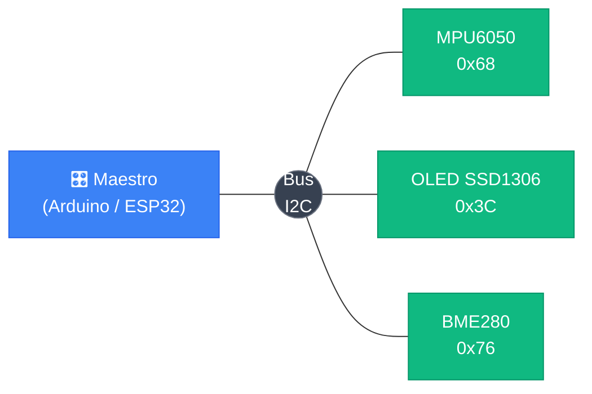

<div class="absolute inset-0 bg-black/60" />

<div class="relative z-10 flex h-full flex-col items-center justify-center">

# Circuitos de Alimentación y Niveles Lógicos

## Clase 5 — I2C · SPI · Reguladores · Compatibilidad lógica

<div class="pt-10">
  <span @click="$slidev.nav.next" class="px-2 py-1 rounded cursor-pointer" flex="~ justify-center items-center gap-2" hover="bg-white bg-opacity-10">
    Presiona espacio para continuar <div class="i-carbon:arrow-right inline-block"/>
  </span>
</div>

</div>

<!--
Bienvenidos a la clase 5. Antes de entrar a los circuitos de alimentación, cerramos dos temas pendientes de la clase 4: I2C y SPI. Los usamos con el ENS160+AHT21, el DS3231 y la OLED, así que conviene entenderlos bien antes de seguir.
-->

---
transition: fade-out
---

# Contenido

<Toc maxDepth="1" columns="2" class="text-sm" />

<!--
Mostrar la estructura. Primera parte: protocolos de comunicación (pendientes de clase 4). Segunda parte: circuitos de alimentación y niveles lógicos.
-->

---
transition: slide-up
---

# Niveles Lógicos

<div class="grid grid-cols-3 gap-6 mt-8 items-center">

  <div class="p-6 rounded-xl border border-green-400/40 bg-green-500/10 text-center">
    <div class="font-mono text-5xl font-bold text-green-300 mb-3">1</div>
    <div class="font-bold text-lg mb-1">Lógico HIGH</div>
    <div class="text-sm opacity-80">Voltaje cercano a VCC</div>
    <div class="font-mono text-green-300 mt-2 text-sm">≈ 3.3V en ESP32</div>
  </div>

  <Image src="/images/clase_5/cat_math.jpg" class="h-44 mx-auto rounded-xl object-contain" />

  <div class="p-6 rounded-xl border border-red-400/40 bg-red-500/10 text-center">
    <div class="font-mono text-5xl font-bold text-red-300 mb-3">0</div>
    <div class="font-bold text-lg mb-1">Lógico LOW</div>
    <div class="text-sm opacity-80">Voltaje cercano a GND</div>
    <div class="font-mono text-red-300 mt-2 text-sm">≈ 0V en ESP32</div>
  </div>

</div>

<div class="mt-6 p-3 rounded bg-white/5 border border-white/10 text-sm text-center">
  Los microcontroladores no hablan en 1s y 0s abstractos — hablan en <strong>voltajes</strong>. Entender los rangos es crítico para integrar sensores y módulos correctamente.
</div>

<style>
h1 {
  background-color: #2B90B6;
  background-image: linear-gradient(45deg, #4EC5D4 10%, #146b8c 20%);
  background-size: 100%;
  -webkit-background-clip: text;
  -moz-background-clip: text;
  -webkit-text-fill-color: transparent;
  -moz-text-fill-color: transparent;
}
</style>

<!--
Preguntar: ¿qué voltaje tiene el "1" en un sistema de 5V? Cualquier valor cercano a 5V. ¿Y en un sistema de 3.3V? Cercano a 3.3V. El concepto HIGH/LOW es relativo al voltaje de alimentación.

Anécdota: el ESP32 opera a 3.3V. Si conectan un sensor de 5V directamente, pueden dañarlo. Esto lo profundizamos en esta sección.
-->

---
transition: slide-down
---

# Umbrales de Voltaje — La Zona Indeterminada

<div class="flex items-stretch gap-6 mt-4">

  <div class="flex flex-col text-xs font-mono w-32 shrink-0 text-center rounded border border-white/20 overflow-hidden">
    <div class="bg-green-100/30 border-b border-green-400/40 py-5 text-green-800 font-bold leading-tight">
      HIGH<br><span class="opacity-70 font-normal">≥ 2.0V</span>
    </div>
    <div class="bg-yellow-200/20 border-b border-yellow-400/30 py-6 text-yellow-700 leading-tight">
      ⚠ ZONA<br>GRIS<br><span class="opacity-70 font-normal">0.8–2.0V</span>
    </div>
    <div class="bg-red-200/30 py-5 text-red-700 font-bold leading-tight">
      LOW<br><span class="opacity-70 font-normal">≤ 0.8V</span>
    </div>
  </div>

  <div class="flex flex-col gap-3 flex-1">
    <div class="p-3 rounded-lg border border-green-400/40 bg-green-500/10 text-xs">
      <div class="font-bold mb-1">HIGH (lógico 1)</div>
      <div class="opacity-80">El ESP32 interpreta como 1 cualquier voltaje <strong>por encima de 2.0V</strong>. El margen garantiza que el ruido no cause errores en este rango.</div>
    </div>
    <div class="p-3 rounded-lg border border-yellow-400/40 bg-yellow-500/10 text-xs">
      <div class="font-bold mb-1">⚠ Zona Indeterminada (0.8V – 2.0V)</div>
      <div class="opacity-80">El pin puede leer 0 o 1 <strong>aleatoriamente</strong>. Un pin flotante sin conexión definida cae exactamente aquí — comportamiento impredecible garantizado.</div>
    </div>
    <div class="p-3 rounded-lg border border-red-400/40 bg-red-500/10 text-xs">
      <div class="font-bold mb-1">LOW (lógico 0)</div>
      <div class="opacity-80">El ESP32 interpreta como 0 cualquier voltaje <strong>por debajo de 0.8V</strong>. Voltaje cercano a GND, estado bien definido.</div>
    </div>
  </div>

</div>

<div class="mt-3 p-2 rounded bg-white/5 border border-white/10 text-xs">
  No es blanco o negro — hay <strong>rangos tolerados</strong>. Esto se llama <em>noise margin</em> (margen de ruido). Todo el diseño de pull-ups y level shifters apunta a mantener las líneas fuera de la zona gris.
</div>

<!--
Estos umbrales son específicos del ESP32 / familia CMOS 3.3V. Un sistema de 5V TTL tiene umbrales diferentes (HIGH ≥ 2.4V, LOW ≤ 0.4V). Por eso mezclar tecnologías requiere análisis cuidadoso.

Dibujar en pizarrón: una recta vertical de 0V a 3.3V con las tres zonas coloreadas. Señalar que "flotante" cae en el medio.
-->

---
transition: slide-down
---

# El Pin Flotante

<div class="grid grid-cols-2 gap-6 mt-4">

  <div class="flex flex-col gap-3">
    <div class="p-3 rounded-lg border border-red-400/40 bg-red-500/10 text-xs">
      <div class="font-bold mb-2">¿Qué es un pin flotante?</div>
      <p class="opacity-80">Un pin <strong>no conectado a ningún nivel definido</strong> — ni a VCC ni a GND. Su voltaje queda a merced del entorno:</p>
      <ul class="mt-2 space-y-1 opacity-70 list-disc list-inside">
        <li>Ruido electromagnético del ambiente</li>
        <li>Campos eléctricos de cables cercanos</li>
        <li>El roce de un dedo puede cambiar su voltaje</li>
      </ul>
    </div>
    <div class="p-3 rounded-lg border border-yellow-400/40 bg-yellow-500/10 text-xs">
      <div class="font-bold mb-1">¿Dónde cae su voltaje?</div>
      <p class="opacity-80">En la <strong>zona indeterminada</strong> (0.8V–2.0V). En I2C: tramas corruptas, dispositivos que no responden, comunicaciones erráticas.</p>
    </div>
  </div>

  <div class="flex flex-col gap-3">
    <div class="p-3 rounded-lg border border-blue-400/40 bg-blue-500/10 text-xs">
      <div class="font-bold mb-2">Solución: forzar un nivel definido por defecto</div>
      <div class="grid grid-cols-2 gap-2 mt-1">
        <div class="p-2 rounded bg-green-500/10 border border-green-400/30 text-center">
          <div class="font-bold text-green-300 mb-1">Pull-Up</div>
          <div class="opacity-70">Resistencia a VCC<br>→ defecto <strong>HIGH</strong></div>
        </div>
        <div class="p-2 rounded bg-red-500/10 border border-red-400/30 text-center">
          <div class="font-bold text-red-300 mb-1">Pull-Down</div>
          <div class="opacity-70">Resistencia a GND<br>→ defecto <strong>LOW</strong></div>
        </div>
      </div>
    </div>
    <div class="p-3 rounded-lg border border-purple-400/40 bg-purple-500/10 text-xs">
      <div class="font-bold mb-1">¿Cuándo usar cada una?</div>
      <ul class="opacity-80 space-y-1">
        <li><strong>Pull-up:</strong> I2C, botones activos en LOW, UART en reposo</li>
        <li><strong>Pull-down:</strong> botones activos en HIGH, señales de enable</li>
      </ul>
    </div>
  </div>

</div>

<!--
Demostración en el aula: conectar un cable a un pin GPIO sin pull-up y leerlo por Serial. Ver cómo cambia aleatoriamente. Agregar una resistencia pull-up y ver cómo se estabiliza en HIGH.

La línea SDA de I2C sin pull-up es exactamente este escenario.
-->

---
transition: slide-down
---

# Valores de Pull-Up, Internos y Compatibilidad 3.3V/5V

<div class="grid grid-cols-2 gap-4 mt-3">

  <div class="flex flex-col gap-3">
    <div class="p-3 rounded-lg border border-white/20 bg-white/5 text-xs">
      <div class="font-bold mb-2">Elección del valor</div>

| Valor | Resultado |
|---|---|
| `100 kΩ` | Flancos lentos → bits corruptos |
| **`4.7 kΩ`** ✓ | Ideal — Standard 100 kHz |
| **`2.2 kΩ`** ✓ | Fast mode 400 kHz o cables largos |
| `100 Ω` | Corriente excesiva → daño |

<div class="mt-2 opacity-60">Más velocidad o más metros → resistencia más baja</div>
    </div>
    <div class="p-3 rounded-lg border border-purple-400/40 bg-purple-500/10 text-xs">
      <div class="font-bold mb-1">Pull-Ups Internos del ESP32</div>
      <div class="opacity-80">~<strong>45 kΩ</strong> — activables con <code>INPUT_PULLUP</code> o vía Wire automáticamente</div>
      <div class="text-yellow-300 mt-1">⚠ Demasiado alto para I2C en producción. OK para botones o prototipado muy simple.</div>
    </div>
  </div>

  <div class="flex flex-col gap-3">
    <div class="p-3 rounded-lg border border-yellow-400/40 bg-yellow-500/10 text-xs">
      <div class="font-bold mb-2">⚡ Compatibilidad 3.3V vs 5V</div>
      <p class="opacity-80 mb-2">El ESP32 es un sistema de <strong>3.3V</strong>. Algunos módulos I2C de Arduino operan a <strong>5V</strong>.</p>
      <div class="p-2 rounded bg-red-500/20 border border-red-400/30 mb-2">
        <strong>Peligro:</strong> 5V directo al ESP32 supera el límite ~3.6V de sus pines → daño permanente.
      </div>
      <div class="opacity-80"><strong>Solución:</strong> Level Shifter Bidireccional (BSS138) — convierte entre 3.3V y 5V en ambas direcciones.</div>
    </div>
    <div class="p-2 rounded bg-white/5 border border-white/10 text-xs">
      Módulos modernos (OLED, BME280, MPU6050 breakouts) ya incluyen regulador → compatibles con 3.3V directamente.
    </div>
  </div>

</div>

<!--
Error común: conectar un shield de 5V de Arduino directamente al ESP32 sin level shifter. Los primeros ESP8266 eran más tolerantes, pero el ESP32 NO.

Regla de oro: si un módulo dice "5V" en VCC, investigar si sus pines de señal también son de 5V o si ya tienen un regulador que los baja a 3.3V.
-->

---
layout: image-right
image: ./images/clase_5/i2c_master_slave.svg
backgroundSize: contain
transition: slide-left
---

# I2C — El Bus Físico

<v-clicks>

- **SDA** (Serial Data) — datos en ambas direcciones
- **SCL** (Serial Clock) — reloj, siempre lo genera el maestro
- Solo **2 cables** para todos los dispositivos

</v-clicks>

<div v-click class="mt-4 p-3 rounded-lg border border-yellow-400/40 bg-yellow-500/10 text-sm">
  <strong>Bus open-drain — pull-ups obligatorios</strong><br>
  SDA y SCL son <em>open-drain</em>: los dispositivos solo pueden poner la línea en LOW. La resistencia pull-up es el único mecanismo para volver a HIGH — sin ella el bus no funciona.
</div>

<div v-click class="mt-3 grid grid-cols-2 gap-3">
  <div class="p-3 rounded border border-green-400/30 bg-green-500/10 text-xs">
    <div class="font-bold mb-1">Conexión en ESP32</div>
    <div class="font-mono opacity-80 mt-1">SDA → GPIO + 4.7 kΩ → 3.3V<br>SCL → GPIO + 4.7 kΩ → 3.3V</div>
    <div class="opacity-60 mt-1">Una resistencia por línea, para todos los dispositivos del bus</div>
  </div>
  <div class="p-3 rounded border border-blue-400/30 bg-blue-500/10 text-xs">
    <div class="font-bold mb-1">Pines I2C en ESP32-S3</div>
    <div class="opacity-80 mt-1">SDA: GPIO 8 · SCL: GPIO 9</div>
    <div class="opacity-60 mt-1">Configurables: <code>Wire.begin(SDA_PIN, SCL_PIN)</code></div>
  </div>
</div>

<!--
Analogía: open-drain es como un interruptor que solo puede conectar a GND. La resistencia pull-up es el resorte que vuelve la línea a HIGH. Sin el resorte, la línea queda flotando.

Preguntar: ¿si tengo muchos dispositivos necesito más resistencias? No — sigue siendo una sola resistencia por línea, pero su valor puede bajar (más corriente disponible).
-->
---
transition: slide-down
---

# Open-Drain — Por Qué I2C Necesita Pull-Ups

<div class="grid grid-cols-2 gap-6 mt-3">

  <div class="flex flex-col gap-2">
    <Image src="/images/clase_5/i2c_bus_topology.svg" class="h-44 mx-auto rounded-xl border border-white/20 bg-white/90 p-2 object-contain" />
    <div class="p-2 rounded bg-white/5 border border-white/10 text-xs">
      <strong>Open-drain:</strong> cada dispositivo tiene un transistor que <em>solo</em> puede conectar la línea a GND. Nadie puede empujar activamente a HIGH.
    </div>
  </div>

  <div class="flex flex-col gap-3">
    <div class="p-3 rounded-lg border border-red-400/40 bg-red-500/10 text-xs">
      <div class="font-bold mb-1">Sin pull-up → imposible</div>
      <div class="opacity-80">La línea puede bajar a LOW, pero <strong>nunca vuelve a HIGH</strong> — nadie la empuja hacia arriba. Comunicación completamente imposible.</div>
    </div>
    <div class="p-3 rounded-lg border border-green-400/40 bg-green-500/10 text-xs">
      <div class="font-bold mb-1">Con pull-up → funciona</div>
      <div class="opacity-80">La resistencia devuelve la línea a HIGH cuando ningún dispositivo la jala. Transmitir 0: jalar a GND. Transmitir 1: soltar (la resistencia sube).</div>
    </div>
    <div class="p-3 rounded-lg border border-blue-400/40 bg-blue-500/10 text-xs">
      <div class="font-bold mb-1">Ventaja: bus compartido sin conflicto</div>
      <div class="opacity-80">Si dos dispositivos jalaran a la vez (ambos transmiten 0), no hay cortocircuito — ambos drenan a GND sin pelear.</div>
    </div>
  </div>

</div>

<!--
Dibujar en pizarrón el transistor open-drain: colector conectado a la línea, emisor a GND. El transistor solo puede cerrar el circuito a GND, no puede empujar a VCC.

Comparar con push-pull (SPI): el driver tiene dos transistores — uno a VCC y uno a GND. Puede empujar en ambas direcciones. Por eso SPI no necesita pull-ups.
-->
---
transition: slide-down
---

# I2C — Arquitectura Maestro/Esclavo

<div class="text-center mt-2">



</div>

<div class="grid grid-cols-2 gap-4 mt-3">
  <div class="p-3 rounded-lg border border-blue-400/40 bg-blue-500/10 text-xs">
    <div class="font-bold mb-2">Maestro</div>
    <ul class="space-y-1 opacity-80">
      <li>Siempre inicia la comunicación</li>
      <li>Genera el reloj (SCL)</li>
      <li>"Llama" al esclavo por su dirección</li>
    </ul>
  </div>
  <div class="p-3 rounded-lg border border-green-400/40 bg-green-500/10 text-xs">
    <div class="font-bold mb-2">Esclavo</div>
    <ul class="space-y-1 opacity-80">
      <li>Solo responde cuando se lo llama</li>
      <li>Tiene una dirección única en el bus</li>
      <li>Confirma que escuchó con un bit ACK</li>
    </ul>
  </div>
</div>

<!--
Analogía: el maestro es como el profesor que llama lista. Dice un nombre (dirección) y solo ese alumno responde. Los demás están quietos. El maestro controla cuándo se habla (el reloj).

Existe "multi-master" pero es raro en IoT — agrega complejidad de arbitraje. En prácticamente todos nuestros proyectos hay un solo maestro.
-->

---
transition: slide-down
---

# I2C — Las Direcciones de 7+1 Bits

<div class="flex items-center justify-center gap-px font-mono text-xs mt-4 mb-4">
  <div class="px-3 py-2 bg-blue-500/20 border border-blue-400/40 rounded-l text-center">A6</div>
  <div class="px-3 py-2 bg-blue-500/20 border-t border-b border-blue-400/40 text-center">A5</div>
  <div class="px-3 py-2 bg-blue-500/20 border-t border-b border-blue-400/40 text-center">A4</div>
  <div class="px-3 py-2 bg-blue-500/20 border-t border-b border-blue-400/40 text-center">A3</div>
  <div class="px-3 py-2 bg-blue-500/20 border-t border-b border-blue-400/40 text-center">A2</div>
  <div class="px-3 py-2 bg-blue-500/20 border-t border-b border-blue-400/40 text-center">A1</div>
  <div class="px-3 py-2 bg-blue-500/20 border border-r-0 border-blue-400/40 text-center">A0</div>
  <div class="px-3 py-2 bg-red-500/20 border border-red-400/40 rounded-r text-center min-w-10">R/W</div>
  <div class="ml-4 opacity-50">← 8 bits en el bus físico</div>
</div>

<div class="grid grid-cols-2 gap-3">
  <div class="p-3 rounded-lg border border-blue-400/40 bg-blue-500/10 text-xs">
    <div class="font-bold text-sm mb-2">Dirección (7 bits)</div>
    <ul class="space-y-1 opacity-80">
      <li>2⁷ = <strong>128</strong> posibles (0x00–0x7F)</li>
      <li>~16 reservadas → <strong>~112 disponibles</strong></li>
      <li>Por convención: expresadas en <strong>hex</strong></li>
      <li>Ejemplos: <code>0x68</code>, <code>0x3C</code>, <code>0x76</code></li>
    </ul>
  </div>
  <div class="p-3 rounded-lg border border-red-400/40 bg-red-500/10 text-xs">
    <div class="font-bold text-sm mb-2">Bit R/W — La Confusión</div>
    <ul class="space-y-1 opacity-80">
      <li><strong>0</strong> = Escribir al esclavo</li>
      <li><strong>1</strong> = Leer del esclavo</li>
      <li class="text-yellow-300">⚠ Algunos datasheets muestran la dirección como 8 bits (con R/W incluido)</li>
      <li>MPU6050: datasheet dice <code>0xD0</code> → Wire usa <code>0x68</code></li>
    </ul>
  </div>
</div>

<div class="mt-3 p-2 rounded bg-white/5 border border-white/10 text-xs">
  <strong>Regla:</strong> en Wire siempre se usa la dirección de <strong>7 bits</strong>. Si el datasheet dice <code>0xD0</code>, dividilo entre 2 → <code>0x68</code>.
</div>

<!--
Dibujar en pizarrón: 0x68 en binario = 1101 000. Agregar el bit R/W=0 (escribir) → 1101 0000 = 0xD0. Eso es lo que viaja físicamente por el bus. Wire.h hace ese shift automáticamente.

Preguntar: ¿direcciones reservadas? Sí — 0x00 es broadcast (hablan todos), 0x01–0x07 y 0x78–0x7F están reservadas para usos especiales.
-->

---
transition: slide-down
---

# I2C — Dirección Configurable y Conflictos

<div class="grid grid-cols-2 gap-4 mt-3">
  <div class="flex flex-col gap-3">
    <div class="p-3 rounded-lg border border-green-400/40 bg-green-500/10 text-xs">
      <div class="font-bold text-sm mb-2">Configuración por Hardware</div>
      <p class="opacity-80 mb-2">Muchos módulos tienen pines <code>AD0</code>, <code>AD1</code> o <code>ADDR</code> que permiten cambiar 1–2 bits de la dirección con un jumper o conectando a VCC/GND.</p>
      <div class="space-y-1 font-mono mt-2">
        <div class="px-2 py-1 bg-black/20 rounded">AD0 = GND → <strong>0x68</strong></div>
        <div class="px-2 py-1 bg-black/20 rounded">AD0 = 3.3V → <strong>0x69</strong></div>
      </div>
      <p class="opacity-60 mt-2">→ 2 MPU6050 en el mismo bus</p>
    </div>
    <div class="p-3 rounded-lg border border-yellow-400/40 bg-yellow-500/10 text-xs">
      <div class="font-bold mb-1">⚠ Conflicto de Dirección</div>
      <p class="opacity-80">Si dos dispositivos tienen la misma dirección fija sin pin de configuración, no pueden coexistir.</p>
      <p class="opacity-80 mt-1"><strong>Solución:</strong> multiplexor I2C <code>TCA9548A</code> — crea 8 sub-buses independientes, cada uno con su propio set de dispositivos.</p>
    </div>
  </div>
  <div class="flex flex-col gap-3">
    <div class="p-3 rounded-lg border border-purple-400/40 bg-purple-500/10 text-xs">
      <div class="font-bold text-sm mb-1">🔍 I2C Scanner</div>
      <p class="opacity-70">Sketch que recorre todas las direcciones e imprime cuáles responden — indispensable para depurar.</p>
    </div>

```cpp
#include <Wire.h>
void setup() {
  Wire.begin();
  Serial.begin(115200);
  for (byte addr = 1; addr < 127; addr++) {
    Wire.beginTransmission(addr);
    byte err = Wire.endTransmission();
    if (err == 0) {
      Serial.print("Dispositivo en 0x");
      Serial.println(addr, HEX);
    }
  }
}
void loop() {}
```

  </div>
</div>

<!--
El TCA9548A se conecta en el bus principal (dirección 0x70–0x77). Puedes seleccionar un canal con Wire.write(1 << canal). Útil para tener 8 displays OLED SSD1306 (todos con dirección 0x3C).

El I2C scanner es lo primero que correr cuando un sensor no responde. Rápidamente dice si el problema es de dirección, conexión o código.
-->

---
transition: slide-down
---

# I2C — Librería Wire de Arduino

<div class="grid grid-cols-2 gap-4 mt-3">
  <div class="flex flex-col gap-2">
    <div class="p-3 rounded border border-blue-400/30 bg-blue-500/10 text-xs">
      <div class="font-bold mb-2">Funciones clave</div>

| Función | Acción |
|---|---|
| `Wire.begin()` | Inicia como maestro |
| `Wire.beginTransmission(addr)` | Abre sesión |
| `Wire.write(byte)` | Envía un byte |
| `Wire.endTransmission()` | Cierra + STOP |
| `Wire.requestFrom(addr, n)` | Solicita n bytes |
| `Wire.read()` | Lee un byte |

</div>
    <div class="p-2 rounded border border-white/10 bg-white/5 text-xs">
      <strong>Velocidades:</strong> Standard <code>100 kHz</code> (defecto) · Fast <code>400 kHz</code><br>
      <code>Wire.setClock(400000);</code> — antes de Wire.begin()
    </div>
  </div>
  <div class="text-left">

```cpp
#include <Wire.h>
#define MPU_ADDR 0x68

void setup() {
  Wire.begin();
  Serial.begin(115200);
  // Despertar el MPU6050
  Wire.beginTransmission(MPU_ADDR);
  Wire.write(0x6B); // PWR_MGMT_1
  Wire.write(0x00); // Quitar sleep
  Wire.endTransmission();
}

void loop() {
  // Leer acelerómetro eje X
  Wire.beginTransmission(MPU_ADDR);
  Wire.write(0x3B);
  Wire.endTransmission(false); // Repeated START
  Wire.requestFrom(MPU_ADDR, 2);
  int16_t ax = (Wire.read() << 8) | Wire.read();
  Serial.println(ax);
  delay(100);
}
```

  </div>
</div>

<!--
endTransmission(false) genera un Repeated START en lugar de STOP — esencial para leer registros en la mayoría de los sensores. Con true (o sin argumento) se envía STOP y el sensor puede resetear su puntero de registro interno.

La velocidad 400 kHz (Fast mode) funciona con la mayoría de módulos modernos. Algunos soportan Fast+ a 1 MHz.
-->

---
transition: slide-up
---

# SPI — El Bus de 4 Cables

<div class="mt-2 p-2 rounded border border-white/10 bg-white/5 text-xs mb-3">
  Serial Peripheral Interface — desarrollado por Motorola. Común en pantallas TFT, tarjetas SD, ADCs rápidos y sensores de alta velocidad.
</div>

| Pin | Nombre completo | Dirección | Descripción |
|---|---|---|---|
| **MOSI** | Master Out Slave In | Maestro → Esclavo | Datos que el maestro envía al esclavo |
| **MISO** | Master In Slave Out | Esclavo → Maestro | Datos que el esclavo devuelve al maestro |
| **SCK** | Serial Clock | Maestro → Esclavo | Señal de reloj que sincroniza la transferencia |
| **CS / SS** | Chip Select / Slave Select | Maestro → Esclavo | Activa el esclavo deseado poniéndolo en LOW |

<div class="mt-3 grid grid-cols-2 gap-2 text-xs">
  <div class="p-2 rounded border border-green-400/30 bg-green-500/10">
    <strong>Full-duplex:</strong> MOSI y MISO operan simultáneamente — envío y recepción al mismo tiempo
  </div>
  <div class="p-2 rounded border border-blue-400/30 bg-blue-500/10">
    <strong>Sin direcciones:</strong> CS bajo (LOW) = dispositivo activo. Sin arbitraje ni ACK.
  </div>
</div>

<!--
Preguntar: ¿qué pasa si CS está en HIGH? El esclavo ignora completamente MOSI y SCK — su MISO queda en alta impedancia (tri-state), no interfiere con el bus.

SPI es más simple en protocolo pero usa más pines. Sin handshake, sin ACK: el maestro habla y el esclavo escucha (o responde simultáneamente por MISO).
-->

---
layout: image-right
image: ./images/clase_5/spi_multiple_slaves.svg
backgroundSize: contain
transition: slide-down
---

# SPI — N Dispositivos en el Bus

Cada esclavo tiene su propio pin **CS**. El maestro activa solo uno a la vez poniéndolo en `LOW`.

<div class="mt-4 p-3 rounded border border-blue-400/30 bg-blue-500/10 text-xs mb-3">
  <div class="font-bold mb-2">Pines GPIO necesarios</div>
  <div class="font-mono space-y-1">
    <div class="opacity-80">MOSI + MISO + SCK = <strong>3</strong> fijos</div>
    <div class="opacity-80">+ 1 CS por cada esclavo</div>
  </div>
  <div class="mt-2 font-bold">Para N dispositivos: <strong>3 + N pines</strong></div>
</div>

<div class="p-3 rounded border border-yellow-400/30 bg-yellow-500/10 text-xs mb-3">
  <strong>Comparación con I2C:</strong><br>
  I2C: siempre 2 pines sin importar cuántos dispositivos<br>
  SPI: crece 1 pin por cada esclavo nuevo
</div>

<div class="p-2 rounded border border-white/10 bg-white/5 text-xs">
  <strong>Velocidad:</strong> 1–80 MHz (vs I2C 100–400 kHz) — hasta <strong>800× más rápido</strong>
</div>

<!--
Ejemplo concreto: pantalla TFT 320×240 a 16 bits = 1.2 MB por frame. A 400 kHz (I2C) tardaría 24 segundos por frame. A 40 MHz (SPI) tarda 0.24 ms — eso es 60 fps sin problema.

Existe el modo "daisy chain" donde los esclavos se encadenan en serie y comparten un único CS. Se usa en algunos shift registers (74HC595) y DACs. No es universal.
-->

---
transition: slide-up
---

# SPI vs I2C — Comparativa

<div class="grid grid-cols-2 gap-4 mt-3">

  <div class="p-3 rounded-lg border border-blue-400/40 bg-blue-500/10 text-xs">
    <div class="font-bold text-sm mb-2 text-blue-300">I2C</div>

| Característica | Valor |
|---|---|
| Cables de señal | **2** (SDA + SCL) |
| Pines para N dispositivos | **2** (siempre) |
| Velocidad | 100 – 400 kHz |
| Dúplex | Semi (alternado) |
| Selección de esclavo | Dirección 7 bits |
| Pull-up | **Obligatorio** |
| Distancia máx. | ~1 m |
| Protocolo | ACK · START · STOP |

  </div>

  <div class="p-3 rounded-lg border border-green-400/40 bg-green-500/10 text-xs">
    <div class="font-bold text-sm mb-2 text-green-300">SPI</div>

| Característica | Valor |
|---|---|
| Cables de señal | **4** (MOSI·MISO·SCK·CS) |
| Pines para N dispositivos | **3 + N** |
| Velocidad | 1 – 80 MHz |
| Dúplex | **Completo** (simultáneo) |
| Selección de esclavo | Pin CS dedicado |
| Pull-up | No necesario |
| Distancia máx. | ~30 cm (PCB) |
| Protocolo | Simple (sin ACK) |

  </div>

</div>

<!--
Resumen para los alumnos: I2C = conveniente, pocos cables, velocidad moderada. SPI = rápido, más pines, sin negociación.

En proyectos IoT típicos se usan los dos al mismo tiempo: I2C para los sensores, SPI para la pantalla o el almacenamiento.

¿Preguntas antes de pasar al tema de circuitos de alimentación?
-->

---
layout: center
transition: slide-up
---

# Circuitos de Alimentación

<Image src="/images/clase_5/electrician_dog.webp" class="h-60 mx-auto mt-4 rounded-xl object-contain" />

<style>
h1 {
  background-color: #2B90B6;
  background-image: linear-gradient(45deg, #4EC5D4 10%, #146b8c 20%);
  background-size: 100%;
  -webkit-background-clip: text;
  -moz-background-clip: text;
  -webkit-text-fill-color: transparent;
  -moz-text-fill-color: transparent;
}
</style>

<!--
Transición al segundo bloque de la clase. Pasamos de protocolos de comunicación a entender cómo se alimentan los circuitos y cómo se garantiza la compatibilidad de voltaje entre componentes.
-->

---
transition: slide-up
---

# 3.1 Voltaje, Corriente y Potencia

<div class="grid grid-cols-3 gap-4 mt-4 text-left">

  <div class="p-3 rounded-lg border border-blue-400/40 bg-blue-500/10">
    <div class="font-bold text-sm mb-2 text-blue-300">Voltaje (V)</div>
    <div class="text-xs opacity-90 mb-2">La "presión" que empuja la corriente.</div>
    <div class="text-xs font-mono mb-2 bg-black/30 p-1 rounded">ESP32: 3.3V</div>
    <div class="text-xs opacity-75">⚠️ >3.3V daña el chip</div>
  </div>

  <div class="p-3 rounded-lg border border-green-400/40 bg-green-500/10">
    <div class="font-bold text-sm mb-2 text-green-300">Corriente (A)</div>
    <div class="text-xs opacity-90 mb-2">Cantidad de electricidad que fluye.</div>
    <div class="text-xs font-mono mb-2 bg-black/30 p-1 rounded">Reposo: 30–80mA<br/>WiFi: ~240mA pico</div>
    <div class="text-xs opacity-75">Si baja voltaje → colapso</div>
  </div>

  <div class="p-3 rounded-lg border border-yellow-400/40 bg-yellow-500/10">
    <div class="font-bold text-sm mb-2 text-yellow-300">Potencia (W)</div>
    <div class="text-xs opacity-90 mb-2">P = V × I</div>
    <div class="text-xs font-mono mb-2 bg-black/30 p-1 rounded">3.3V × 100mA<br/>= 0.33W</div>
    <div class="text-xs opacity-75">Estima duración batería</div>
  </div>

</div>

<div class="mt-4 p-3 rounded bg-white/5 border border-white/10 text-xs text-center">
  <Image src="/images/clase 2/ESP32-Power-Requirement.jpg" class="h-36 mx-auto rounded-lg object-contain" />
</div>

<div class="mt-3 p-3 rounded-2xl border border-red-300/30 bg-red-500/10">
  <div class="text-xs uppercase tracking-wide opacity-70 mb-1">⚠️ Crítico</div>
  <div class="text-xs leading-snug">Un voltaje incorrecto o inestable puede reiniciar el ESP32, causar lecturas erróneas de sensores, o dañarlo permanentemente.</div>
</div>

<!--
Enfatizar que todo en electrónica comienza por entender estos tres conceptos. Usar la analogía de agua: voltaje = presión, corriente = flujo, potencia = energía por segundo.

Preguntar: "¿Alguien sabe cuánta corriente consume un WiFi transmitiendo?" Conectar con la experiencia de un proyecto que bajó voltaje cuando se activa el WiFi.
-->

---
transition: slide-down
---

# 3.1 Fuentes de Alimentación Comunes en IoT

<div class="grid grid-cols-2 gap-4 mt-4">

  <div v-click class="p-3 rounded-lg border border-blue-400/40 bg-blue-500/10">
    <div class="font-bold text-sm mb-1 text-blue-300">🔌 USB 5V</div>
    <div class="text-xs opacity-80">Máximo: 500mA (USB 2.0) / 900mA (USB 3.0)</div>
    <div class="text-xs opacity-70 mt-1">✓ Cómoda para prototipado en escritorio</div>
    <div class="text-xs opacity-70">✗ No funciona en campo sin cable</div>
  </div>

  <div v-click class="p-3 rounded-lg border border-green-400/40 bg-green-500/10">
    <div class="font-bold text-sm mb-1 text-green-300">🔋 Li-ion / LiPo</div>
    <div class="text-xs opacity-80">Nominal: 3.7V | Recargable</div>
    <div class="text-xs opacity-70 mt-1">✓ Mejor densidad energética</div>
    <div class="text-xs opacity-70">✓ Estándar en IoT portátil</div>
  </div>

  <div v-click class="p-3 rounded-lg border border-yellow-400/40 bg-yellow-500/10">
    <div class="font-bold text-sm mb-1 text-yellow-300">🪫 Pilas AA</div>
    <div class="text-xs opacity-80">1.5V por celda | 3 en serie = 4.5V</div>
    <div class="text-xs opacity-70 mt-1">✓ Fáciles de conseguir</div>
    <div class="text-xs opacity-70">✗ No recargables, voltaje cae con uso</div>
  </div>

  <div v-click class="p-3 rounded-lg border border-purple-400/40 bg-purple-500/10">
    <div class="font-bold text-sm mb-1 text-purple-300">🔌 Fuente DC Externa</div>
    <div class="text-xs opacity-80">Adaptadores de pared | Variable</div>
    <div class="text-xs opacity-70 mt-1">✓ Para proyectos fijos, alta corriente</div>
    <div class="text-xs opacity-70">✓ Motors, LEDs, relés</div>
  </div>

</div>

<!--
Pregunta abierta: "¿Cuál usarían para un sensor ambiental que vive en el jardín por 6 meses?"

Respuesta esperada: batería LiPo o AA pack. Explicar que USB es conveniente ahora, pero un cable a través del patio toda la temporada no es realista.
-->

---
transition: fade-out
---

# 3.1 Cómo Leer un Datasheet

<div class="grid grid-cols-2 gap-6 mt-4">

  <div class="text-left">
    <div class="font-bold text-sm mb-2 text-blue-300">Secciones clave</div>
    <div class="text-xs space-y-1 opacity-90">
      <div><strong>Operating Voltage:</strong> rango seguro</div>
      <div><strong>Typical Current:</strong> consumo en distintos modos</div>
      <div><strong>Pines de alimentación:</strong> VCC, 3V3, GND, EN</div>
      <div><strong>Absolute Maximum:</strong> límites NUNCA superar</div>
    </div>
    <div class="mt-4 p-2 rounded bg-blue-500/20 border border-blue-400/40 text-xs">
      <strong>Dato:</strong> Leer "Absolute Maximum Ratings" antes de conectar cualquier cosa.
    </div>
  </div>

  <div class="text-left">
    <div class="font-bold text-sm mb-2 text-green-300">ESP32 — Valores típicos</div>
    <div class="text-xs space-y-1 opacity-90 font-mono bg-black/20 p-2 rounded">
      <div>Operating: 3.0V — 3.6V</div>
      <div>Reposo: ~30–80mA</div>
      <div>Activo: ~80–160mA</div>
      <div>WiFi transmit: ~240mA</div>
      <div>Pines: 3V3, GND, EN</div>
    </div>
  </div>

</div>

<div class="mt-6 p-4 rounded-2xl border border-red-300/30 bg-red-500/10">
  <div class="text-xs uppercase tracking-wide opacity-70 mb-2">⚠️ Absolute Maximum Ratings</div>
  <div class="text-xs leading-snug">Estos son los límites NUNCA deben superarse aunque sea por un instante. Superarlos daña el chip de forma permanente. <strong>Es la sección más importante de todo el datasheet.</strong></div>
</div>

<!--
Mostrar un datasheet real de ESP32 en la pantalla (o traerlo impreso). Recorrer estas 4 secciones en vivo.

Pregunta retórica: "¿Qué pasa si conecto 5V directo al pin 3V3 del ESP32?" → Esperamos que digan "¡Lo daña!". Exacto. Por eso leemos el datasheet primero.
-->

---
layout: center
transition: slide-up
---

# 3.2 Regulación de Voltaje

<Image src="/images/clase_4/mosfet.jpg" class="h-48 mx-auto mt-4 rounded-xl object-contain" />

<style>
h1 {
  background-color: #2B90B6;
  background-image: linear-gradient(45deg, #7dd3fc 10%, #0f766e 45%, #f59e0b 90%);
  background-size: 100%;
  -webkit-background-clip: text;
  -moz-background-clip: text;
  -webkit-text-fill-color: transparent;
  -moz-text-fill-color: transparent;
}
</style>

<!--
Las fuentes rara vez entregan exactamente el voltaje que necesita el circuito. Los reguladores resuelven este problema.
-->

---
transition: slide-left
---

# 3.2 LDO (Low-Dropout Regulator)

<div class="grid grid-cols-2 gap-6 mt-4">

  <div class="text-left">
    <div class="text-xs space-y-2 opacity-90">
      <p><strong>Funcionamiento:</strong> actúa como resistencia variable que "quema" el voltaje sobrante como calor.</p>
      <p><strong>Entrada > Salida siempre</strong></p>
      <p><strong>Ejemplo:</strong> 5V USB → 3.3V para ESP32</p>
    </div>

    <div class="mt-3 p-2 rounded border border-yellow-400/40 bg-yellow-500/10 text-xs">
      <strong>Disipación térmica:</strong> (5V − 3.3V) × 100mA = <strong>170mW</strong> desperdiciado como calor
    </div>

    <div class="mt-3 text-xs opacity-85 space-y-1">
      <div><strong>✓ Cuándo usarlo:</strong></div>
      <ul class="ml-3 mt-1 space-y-1">
        <li>Corrientes bajas (&lt;200mA)</li>
        <li>Prototipado rápido</li>
        <li>Diferencia de voltaje pequeña</li>
      </ul>
    </div>

    <div class="mt-3 text-xs opacity-70 font-mono">Ejemplo: AMS1117-3.3 <br/>(presente en casi todos los módulos ESP32)</div>
  </div>

  <div>
    <!-- IMAGE SUGGESTION: ./images/clase_5/ldo_ams1117.jpg — Foto del chip AMS1117 o módulo con regulador LDO integrado -->
    <div class="p-3 rounded border border-white/20 bg-white/5 text-xs text-center opacity-70">
      [Imagen del chip LDO o módulo con regulador]
    </div>
  </div>

</div>

<!--
Pregunta: "¿Cuánto calor genera un LDO si está en una caja cerrada?" → Esperar respuesta "mucho". Explicar que si el regulador quema más de ~500mW, hay que reemplazarlo por un buck o agregar un disipador.

Dato curioso: los módulos ESP32 baratos del mercado casi todos usan AMS1117 porque es barato, pero genera calor si se consume mucha corriente en WiFi.
-->

---
transition: slide-down
---

# 3.2 Buck, Boost, Buck-Boost

<div class="grid grid-cols-3 gap-4 mt-4 text-left">

  <div class="p-3 rounded-lg border border-green-400/40 bg-green-500/10">
    <div class="font-bold text-sm mb-2 text-green-300">📉 Buck (Reductor)</div>
    <div class="text-xs opacity-90 mb-2">Alto voltaje → bajo voltaje</div>
    <div class="text-xs opacity-80 mb-2"><strong>Eficiencia:</strong> 85–95%</div>
    <div class="text-xs opacity-80 mb-2"><strong>Cuando:</strong> 12V → 3.3V + alta corriente</div>
    <div class="text-xs opacity-70">Inductor + conmutación rápida (sin calor)</div>
  </div>

  <div class="p-3 rounded-lg border border-blue-400/40 bg-blue-500/10">
    <div class="font-bold text-sm mb-2 text-blue-300">📈 Boost (Elevador)</div>
    <div class="text-xs opacity-90 mb-2">Bajo voltaje → alto voltaje</div>
    <div class="text-xs opacity-80 mb-2"><strong>Caso típico:</strong> batería descargándose</div>
    <div class="text-xs opacity-80 mb-2"><strong>Ejemplo:</strong> 1 pila AA → 3.3V</div>
    <div class="text-xs opacity-70">Mantiene ESP32 vivo hasta el final</div>
  </div>

  <div class="p-3 rounded-lg border border-purple-400/40 bg-purple-500/10">
    <div class="font-bold text-sm mb-2 text-purple-300">↕️ Buck-Boost</div>
    <div class="text-xs opacity-90 mb-2">Ambos sentidos (ideal para batería)</div>
    <div class="text-xs opacity-80 mb-2"><strong>Caso:</strong> LiPo 4.2V→3.0V → 3.3V fijo</div>
    <div class="text-xs opacity-80 mb-2"><strong>Ventaja:</strong> versátil y robusto</div>
    <div class="text-xs opacity-70">Desventaja: más caro y complejo</div>
  </div>

</div>

<div class="mt-4 p-3 rounded bg-blue-500/20 border border-blue-400/40 text-xs">
  <strong>Regla práctica:</strong> Si el regulador está caliente al tacto después de 30 segundos, hay un problema de eficiencia → reemplazar por buck.
</div>

<!--
Mostrar una foto o diagram de buck converter típico (MP1584, LM2596) si está disponible.

Pregunta: "¿Cuál usarían para un proyecto con batería 12V y motor de 3.3V ESP32?" → Respuesta: Buck. ¿Por qué? Porque la diferencia es grande y la corriente es alta, el LDO se calentaría demasiado.
-->

---
transition: fade-out
---

# 3.2 ¿Cómo Elegir Regulador? — Checklist Mental

<div class="mt-4 text-left space-y-2">

  <div class="text-xs opacity-90">
    <strong>1. ¿Cuánta corriente máxima necesita el sistema?</strong>
    <div class="ml-4 text-xs opacity-75 mt-1">→ El regulador debe soportarla con margen (×1.5)</div>
  </div>

  <div class="text-xs opacity-90">
    <strong>2. ¿Qué tan importante es la duración de batería?</strong>
    <div class="ml-4 text-xs opacity-75 mt-1">→ Si mucho: descartar LDO, usar buck o buck-boost</div>
  </div>

  <div class="text-xs opacity-90">
    <strong>3. ¿Cuánto espacio hay en el circuito?</strong>
    <div class="ml-4 text-xs opacity-75 mt-1">→ LDO es compacto, buck necesita inductor</div>
  </div>

  <div class="text-xs opacity-90">
    <strong>4. ¿Qué tan simple debe ser el diseño?</strong>
    <div class="ml-4 text-xs opacity-75 mt-1">→ LDO gana en simplicidad, buck en eficiencia</div>
  </div>

</div>

<div class="mt-6 p-3 rounded border border-green-400/40 bg-green-500/10 text-xs">
  <strong>📚 Para este curso:</strong>
  <div class="mt-1 opacity-85">
    • Prototipado en escritorio → LDO (AMS1117)<br/>
    • Proyectos con batería en campo → Buck o Buck-Boost
  </div>
</div>

<div class="mt-4 p-3 rounded border border-purple-400/40 bg-purple-500/10">

| Tipo | Eficiencia | Complejidad | Mejor para |
|---|---|---|---|
| **LDO** | ~50–70% | Muy simple | Prototipos, baja corriente |
| **Buck** | 85–95% | Media | Alta corriente, batería |
| **Boost** | 85–90% | Media | Batería descargándose |
| **Buck-Boost** | 80–95% | Alta | Batería variable |

</div>

<!--
Esta slide es un "checkpoint" mental. Los estudiantes pueden no recordar los detalles de cada regulador, pero si pueden responder estas 4 preguntas, sabrán qué elegir.

Preguntar: "Para un collar IoT para perros con sensor GPS, batería LiPo y WiFi, ¿qué regulador?" → Esperamos Buck-Boost, porque la LiPo va a variar de 4.2V a 3V durante semanas.
-->

---
layout: center
transition: slide-up
---

# 3.3 Baterías y Carga: Seguridad

<Image src="/images/clase_5/cat_math.jpg" class="h-48 mx-auto mt-4 rounded-xl object-contain" />

<style>
h1 {
  background-color: #2B90B6;
  background-image: linear-gradient(45deg, #f59e0b 10%, #ef4444 45%, #ec4899 90%);
  background-size: 100%;
  -webkit-background-clip: text;
  -moz-background-clip: text;
  -webkit-text-fill-color: transparent;
  -moz-text-fill-color: transparent;
}
</style>

<!--
Las baterías son el corazón de cualquier proyecto IoT portátil. Pero también son el componente más peligroso si no se usan correctamente.
-->

---
transition: slide-up
---

# 3.3 Li-ion / LiPo — Conceptos Clave

<div class="grid grid-cols-3 gap-4 mt-4">

  <div class="p-3 rounded-lg border border-blue-400/40 bg-blue-500/10">
    <div class="font-bold text-sm mb-2 text-blue-300">3.7V Nominal</div>
    <div class="text-xs opacity-90">Voltaje "promedio" de trabajo</div>
    <div class="text-xs opacity-80 mt-2 font-mono">Usado para cálculos de energía</div>
  </div>

  <div class="p-3 rounded-lg border border-green-400/40 bg-green-500/10">
    <div class="font-bold text-sm mb-2 text-green-300">4.2V Máximo</div>
    <div class="text-xs opacity-90">Límite absoluto de carga</div>
    <div class="text-xs opacity-80 mt-2">Superar → degradación, hinchamiento, incendio</div>
  </div>

  <div class="p-3 rounded-lg border border-red-400/40 bg-red-500/10">
    <div class="font-bold text-sm mb-2 text-red-300">3.0V Mínimo</div>
    <div class="text-xs opacity-90">Corte por descarga</div>
    <div class="text-xs opacity-80 mt-2">Descargar más → daño permanente e irreversible</div>
  </div>

</div>

<div class="mt-6 p-4 rounded-2xl border border-red-300/30 bg-red-500/10">
  <div class="text-xs uppercase tracking-wide opacity-70 mb-2">⚠️ No Negociable</div>
  <div class="text-xs leading-snug"><strong>NUNCA cargar una LiPo que esté hinchada, golpeada o con la envoltura dañada.</strong> Es un peligro de incendio inmediato.</div>
</div>

<div class="mt-3 p-3 rounded bg-white/5 border border-white/10 text-xs">
  <!-- IMAGE SUGGESTION: ./images/clase_5/lipo_battery.jpg — Foto de celda LiPo simple (3.7V nominal) con conector JST -->
  [Foto de batería LiPo single-cell]
</div>

<!--
Mostrar una LiPo real en el aula si es posible. Preguntar: "¿Quién ha visto una batería hinchada?" Si alguien dice que sí, escuchar la historia (generalmente es de sobrecarga).

Aclarar: estos límites (3.7V nominal, 4.2V max, 3.0V min) son específicos para Li-ion/LiPo de una celda. Otros tipos de batería tienen otros números.
-->

---
transition: slide-left
---

# 3.3 Módulos de Carga y BMS

<div class="grid grid-cols-2 gap-6 mt-4">

  <div class="text-left">
    <div class="font-bold text-sm mb-2 text-green-300">TP4056</div>
    <div class="text-xs opacity-90 space-y-1 mb-2">
      <div>Cargador más común y barato para LiPo</div>
      <div><strong>Entrada:</strong> USB 5V</div>
      <div><strong>Corriente:</strong> 1A (típico)</div>
      <div><strong>Salida:</strong> 4.2V (controlado)</div>
    </div>
    <div class="text-xs opacity-75">Versión <strong>con protección</strong> (DW01) integrada es preferible para principiantes</div>

    <div class="mt-4 font-bold text-sm mb-2 text-blue-300">¿Qué hace un BMS?</div>
    <div class="text-xs opacity-90 space-y-1">
      <div>✓ Protege contra <strong>sobrecarga</strong> (corta si >4.2V)</div>
      <div>✓ Protege contra <strong>sobredescarga</strong> (corta si <3.0V)</div>
      <div>✓ Protege contra <strong>cortocircuito</strong> instantáneo</div>
    </div>

    <div class="mt-4 p-3 rounded border border-green-400/40 bg-green-500/10 text-xs">
      <strong>Regla:</strong> Para el curso, siempre usar módulos que <strong>incluyan BMS o protección integrada</strong>. Nunca conectar una LiPo sin protección.
    </div>
  </div>

  <div>
    <!-- IMAGE SUGGESTION: ./images/clase_5/tp4056_module.jpg — Foto del módulo TP4056 típico (azul PCB, USB micro, dos conectores JST) -->
    <div class="p-3 rounded border border-white/20 bg-white/5 text-xs text-center opacity-70">
      [Módulo de carga TP4056 típico]
    </div>
  </div>

</div>

<!--
Aclaración importante: el cargador TP4056 sin protección + celda LiPo sin BMS es una combinación peligrosa para principiantes en un taller. Por eso enfatizamos la versión con DW01 integrado.

Si el presupuesto lo permite, mencionar módulos estilo "power bank" que integran carga + protección + boost, permitiendo cargar y usar simultáneamente. Son más caros pero más completos.
-->

---
transition: slide-down
---

# 3.3 Buenas Prácticas de Seguridad

<v-clicks>

<div class="p-3 rounded-lg border border-red-400/40 bg-red-500/10 mb-2">
  <div class="font-bold text-sm text-red-300">🔴 1. Polaridad — Verificar SIEMPRE</div>
  <div class="text-xs opacity-80 mt-1">Un LiPo conectado al revés es un incidente inmediato. Tómate 5 segundos, verifica rojo=+, negro=−.</div>
</div>

<div class="p-3 rounded-lg border border-red-400/40 bg-red-500/10 mb-2">
  <div class="font-bold text-sm text-red-300">🔴 2. Nunca Dejar Cargando Sin Supervisión</div>
  <div class="text-xs opacity-80 mt-1">Especialmente con módulos desconocidos. Si algo falla, está aquí para verlo.</div>
</div>

<div class="p-3 rounded-lg border border-red-400/40 bg-red-500/10 mb-2">
  <div class="font-bold text-sm text-red-300">🔴 3. Conectores Estandarizados</div>
  <div class="text-xs opacity-80 mt-1">Usar JST-PH 2mm (estándar en módulos ESP32). Evitar conexiones improvisadas con cables sueltos.</div>
</div>

<div class="p-3 rounded-lg border border-red-400/40 bg-red-500/10 mb-2">
  <div class="font-bold text-sm text-red-300">🔴 4. Cables Adecuados al Calibre</div>
  <div class="text-xs opacity-80 mt-1">1–2A → mínimo AWG 24 | Más corriente → AWG 22 o menos</div>
</div>

<div class="p-3 rounded-lg border border-red-400/40 bg-red-500/10 mb-2">
  <div class="font-bold text-sm text-red-300">🔴 5. Fusible o PTC en Línea Positiva</div>
  <div class="text-xs opacity-80 mt-1">Si hay cortocircuito, el fusible se sacrifica antes que la batería o el ESP32.</div>
</div>

<div class="p-3 rounded-lg border border-red-400/40 bg-red-500/10 mb-2">
  <div class="font-bold text-sm text-red-300">🔴 6. Almacenamiento Seguro</div>
  <div class="text-xs opacity-80 mt-1">Guardar al ~50% de carga (3.8V) si no se usa por días. Superficie no inflamable. Nunca en bolsillos o mochilas sin estuche.</div>
</div>

</v-clicks>

<!--
Estas no son "sugerencias opcionales". Son reglas de laboratorio obligatorias. Un incidente con LiPo en el taller afecta a todo el curso.

Anécdota personal (si es posible): mencionar un caso de batería que se hinchó en un proyecto, cómo se identificó a tiempo, y por qué importa.

Preguntar: "¿Alguien tiene una batería en el bolsillo ahora?" → Pausa dramática. "No la cargues en clase, por favor."
-->

---
transition: fade-out
---

# 3.3 Medir Nivel de Batería con ESP32

<div class="grid grid-cols-2 gap-6 mt-4">

  <div class="text-left">
    <div class="font-bold text-sm mb-2 text-blue-300">Divisor Resistivo + ADC</div>
    <div class="text-xs opacity-90 space-y-2 mb-3">
      <p><strong>Cómo:</strong> Dos resistencias reducen el voltaje de la batería al rango del ADC del ESP32 (0–3.3V).</p>
      <p><strong>Luego:</strong> Leer con `analogRead()`, mapear a porcentaje.</p>
    </div>

    <div class="text-xs opacity-80 space-y-1">
      <p><strong>R1 = 10kΩ, R2 = 10kΩ</strong></p>
      <p class="font-mono bg-black/30 p-1 rounded">V_out = V_in × R2 / (R1 + R2)</p>
    </div>

    <div class="mt-3 p-2 rounded border border-yellow-400/40 bg-yellow-500/10 text-xs">
      <strong>⚠️ Limitaciones:</strong> El ADC es ruidoso, no lineal. La LiPo es no-lineal respecto al voltaje → la lectura es aproximada.
    </div>

    <div class="mt-3 p-2 rounded border border-green-400/40 bg-green-500/10 text-xs">
      <strong>✓ Para el curso:</strong> Empezar con divisor resistivo para entender el concepto.
    </div>
  </div>

  <div class="text-left">
    <div class="font-bold text-sm mb-2 text-purple-300">Fuel Gauge (MAX17043)</div>
    <div class="text-xs opacity-90 space-y-2 mb-3">
      <p><strong>Cómo:</strong> IC especializado que mide la batería por impedancia interna.</p>
      <p><strong>Comunicación:</strong> I2C con ESP32, entrega porcentaje preciso.</p>
    </div>

    <div class="text-xs opacity-80 space-y-1">
      <p><strong>Ventajas:</strong></p>
      <ul class="ml-3 space-y-1">
        <li>✓ Mucho más preciso</li>
        <li>✓ Compensación automática de temperatura</li>
        <li>✓ Predicción de tiempo restante</li>
      </ul>
    </div>

    <div class="mt-3 p-2 rounded border border-blue-400/40 bg-blue-500/10 text-xs">
      <strong>Cuándo usar:</strong> Proyectos donde el nivel de batería importa de verdad (dispositivos portátiles, alertas de batería baja).
    </div>

    <div class="mt-3 p-2 rounded border border-purple-400/40 bg-purple-500/10 text-xs">
      <strong>Desventaja:</strong> Más caro, requiere I2C (1 módulo extra).
    </div>
  </div>

</div>

<!--
Código ejemplo (pseudocódigo) para divisor resistivo:
```cpp
int rawVoltage = analogRead(ADC_PIN);
float voltage = rawVoltage * (3.3 / 4095);  // Mapear a 0-3.3V
float batteryVoltage = voltage * 2;         // Deshacemos el divisor (R1=R2)
int percentage = map(batteryVoltage, 3.0, 4.2, 0, 100);
Serial.println(percentage);
```

Pero advertencia: esto es puro mapeo lineal. La LiPo es no-lineal, así que la lectura va a estar "off" en los extremos.

Para MAX17043, mencionar que ya hay librerías Arduino que hablan por I2C directamente.
-->

---
transition: fade-out
---

<div class="h-full flex flex-col items-center justify-center text-center">
  <div class="text-2xl mb-8">¿Preguntas?</div>
  <Image src="/images/question_cat.jpg" class="h-72 mx-auto rounded-lg" />
</div>

<style>
h1 {
  background-color: #2B90B6;
  background-image: linear-gradient(45deg, #7dd3fc 10%, #0f766e 45%, #f59e0b 90%);
  background-size: 100%;
  -webkit-background-clip: text;
  -moz-background-clip: text;
  -webkit-text-fill-color: transparent;
  -moz-text-fill-color: transparent;
}
</style>
