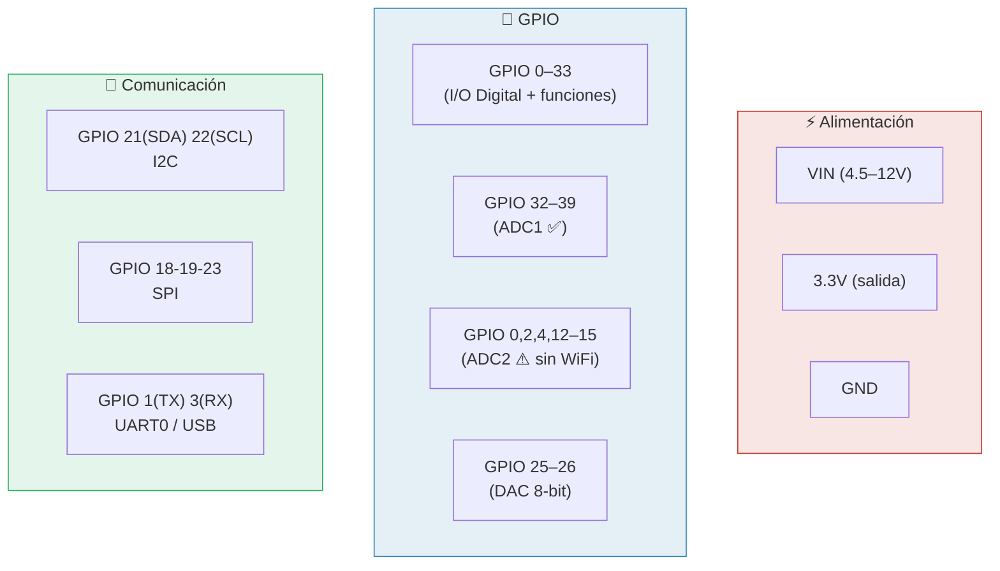
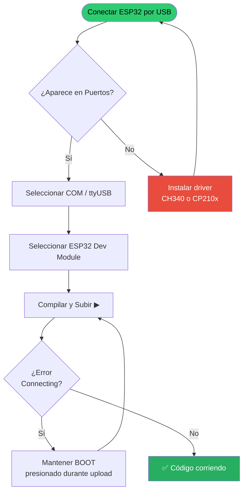
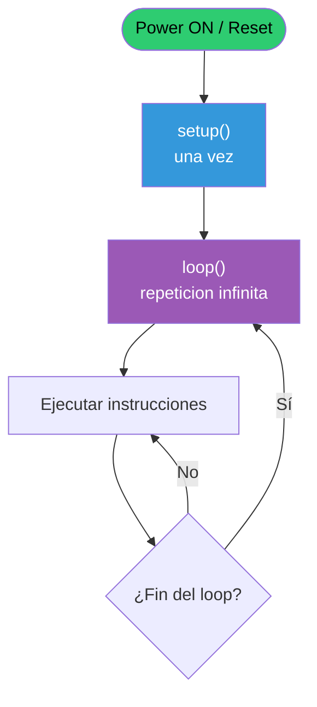
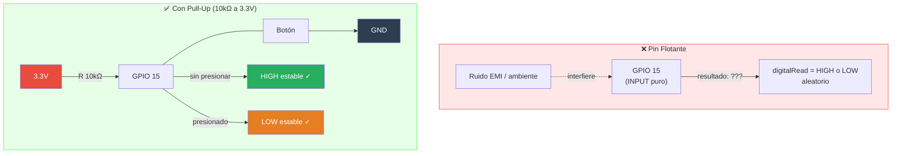
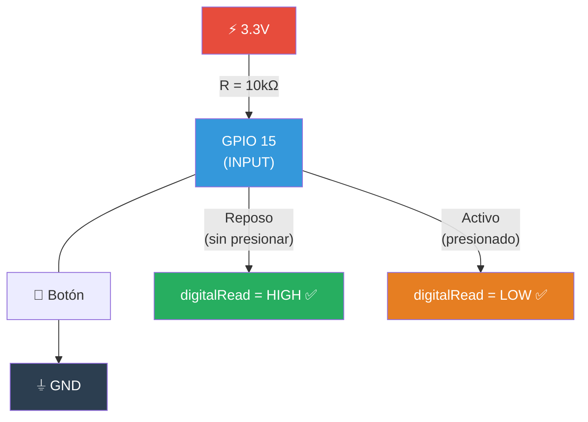
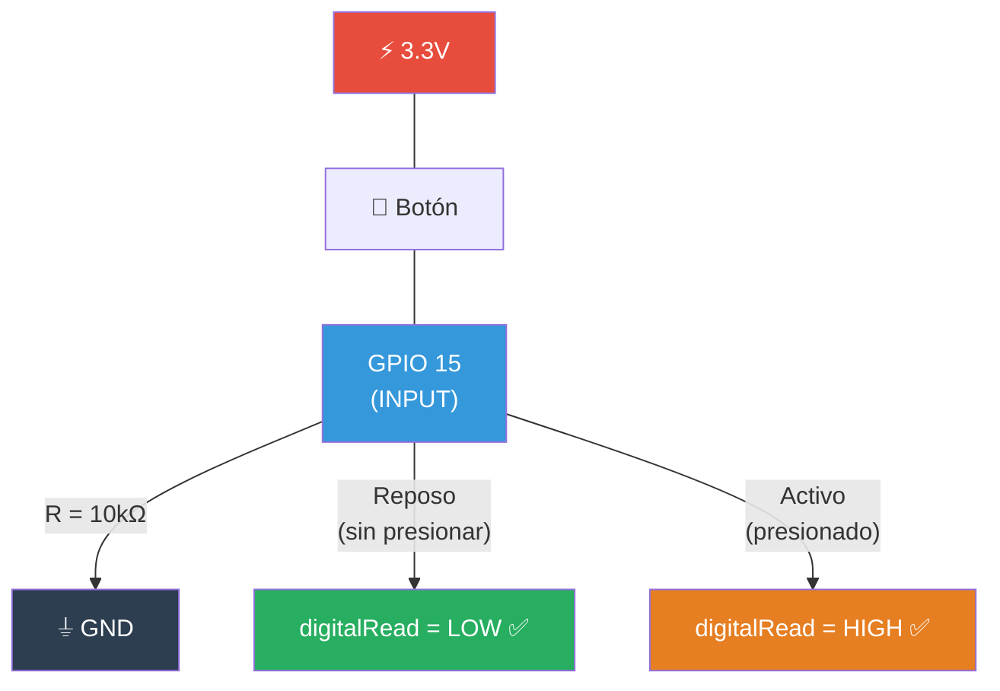
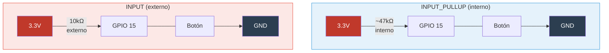
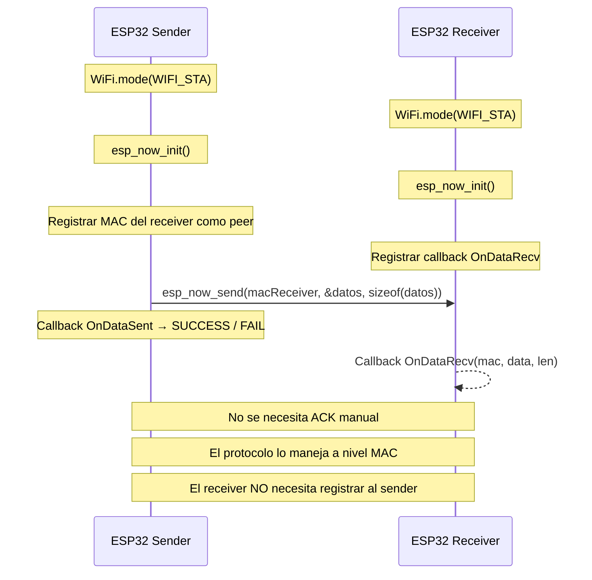
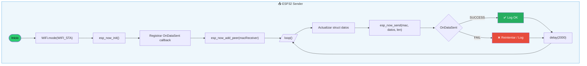
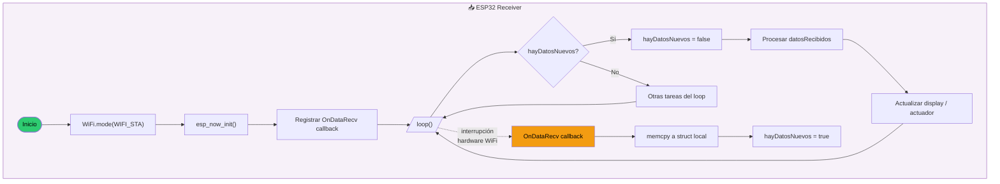

<div class="absolute inset-0 bg-black/65" />

<div class="relative z-10 flex flex-col items-center justify-center h-full">

# ESP32 con Arduino IDE

De los pines al protocolo ESP-NOW — guía práctica completa

<div class="pt-10">
  <span @click="$slidev.nav.next" class="px-2 py-1 rounded cursor-pointer" flex="~ justify-center items-center gap-2" hover="bg-white bg-opacity-10">
    Presiona espacio para continuar <div class="i-carbon:arrow-right inline-block"/>
  </span>
</div>

<div class="abs-br m-6 flex gap-2">
  <button @click="$slidev.nav.openInEditor()" title="Open in Editor" class="text-xl slidev-icon-btn opacity-50 !border-none !hover:text-white">
    <div class="i-carbon:edit" />
  </button>
</div>

</div>

<!--
Bienvenida a la clase de ESP32 con Arduino IDE. Empezamos desde el primer programa hasta la comunicación inalámbrica entre dos placas. Preguntar: ¿alguien programó Arduino antes? ¿alguien usó ESP32?
-->

---
layout: default
transition: fade-out
---

# Contenido

<Toc maxDepth="1" columns="2" class="text-sm"></Toc>

<!--
Recorrer el índice para que los estudiantes sepan hacia dónde vamos. Tenemos: setup del entorno, conceptos base, GPIO, pull-up/down, ADC, PWM, sensores, y cerramos con ESP-NOW para comunicar dos placas sin router.
-->

---
layout: image-right
image: /images/ESP32 Dev Kit.png
backgroundSize: contain
transition: slide-up
---

# ¿Qué es el ESP32?

**Microcontrolador de Espressif Systems — 2016**

<v-clicks>

- 🧠 **Dual-core** Xtensa LX6 @ hasta 240 MHz
- 📶 **WiFi** 802.11 b/g/n + **Bluetooth** 4.2 / BLE integrados
- 💾 **520 KB SRAM** interna, Flash de 4 MB (en el módulo)
- ⚡ Lógica a **3.3V** — no tolera 5V en pines GPIO
- 🔌 Hasta **34 pines GPIO** (algunos solo entrada)
- 📊 **ADC 12-bit**, DAC 8-bit, PWM, I²C, SPI, UART
- 💤 **Deep sleep** ~10 μA — ideal para baterías
- 💲 **~$2–5 USD** todo incluido

</v-clicks>

<div v-click class="mt-4 p-3 rounded bg-blue-500/15 border border-blue-400/40 text-sm">
  🌍 Espressif (Shanghai) eligió open-source como filosofía central. Todo el SDK ESP-IDF está en GitHub. Eso construyó una comunidad enorme.
</div>

<!--
El ESP32 fue un salto enorme respecto al ESP8266. Tiene dos núcleos, WiFi + BT integrado, y un ecosistema de periféricos rico. Clave desde el primer momento: opera a 3.3V — diferente al Arduino Uno clásico que es 5V.
-->

---
transition: fade-out
---

# Variantes del ESP32

<div class="grid grid-cols-3 gap-3 mt-3">

<div v-click class="p-3 rounded-lg border border-blue-400/40 bg-blue-500/10 text-center">
  <div class="font-bold text-blue-300 mb-2">ESP32 (original)</div>
  <Image src="/images/ESP32 Dev Kit.png" class="h-24 mx-auto" />
  <div class="text-xs mt-2 opacity-80">Dual-core LX6 @ 240MHz<br>WiFi + BT 4.2<br>El más común para aprender</div>
</div>

<div v-click class="p-3 rounded-lg border border-green-400/40 bg-green-500/10 text-center">
  <div class="font-bold text-green-300 mb-2">ESP32-S3</div>
  <Image src="/images/esp32 s3.jpg" class="h-24 mx-auto" />
  <div class="text-xs mt-2 opacity-80">Dual-core LX7 @ 240MHz<br>BLE 5, USB OTG nativo<br>Mejor para ML / visión</div>
</div>

<div v-click class="p-3 rounded-lg border border-purple-400/40 bg-purple-500/10 text-center">
  <div class="font-bold text-purple-300 mb-2">ESP32-C3</div>
  <Image src="/images/ESP32-C3.jpg" class="h-24 mx-auto" />
  <div class="text-xs mt-2 opacity-80">Single-core RISC-V @ 160MHz<br>BLE 5, más barato<br>Ideal para nodos IoT simples</div>
</div>

</div>

<div v-click class="mt-4 p-3 rounded bg-yellow-500/15 border border-yellow-400/40 text-sm">
  📌 En esta clase usamos el <strong>ESP32 DEVKIT V1</strong> (original, dual-core LX6). Es el más accesible y tiene la mayor comunidad y documentación disponible.
</div>

<!--
Mencionar brevemente las variantes para que los estudiantes sepan que hay más opciones. Para aprender, el ESP32 original es el indicado por la cantidad de tutoriales disponibles.
-->

---
transition: slide-left
---

# Pinout del ESP32 DEVKIT V1

<div class="grid grid-cols-2 gap-4 mt-2">

<div>

**Grupos de pines importantes:**

<div class="text-sm space-y-2 mt-2">

<div class="p-2 rounded bg-red-500/15 border border-red-400/30">
  🔴 <strong>Alimentación:</strong> 3.3V (salida regulada), GND, VIN (acepta 5V–12V)
</div>

<div class="p-2 rounded bg-blue-500/15 border border-blue-400/30">
  🔵 <strong>GPIO Digitales:</strong> Pines 0–33 con I/O (lógica 3.3V)
</div>

<div class="p-2 rounded bg-green-500/15 border border-green-400/30">
  🟢 <strong>ADC1 (preferir siempre):</strong> GPIO 32, 33, 34, 35, 36, 39
</div>

<div class="p-2 rounded bg-orange-500/15 border border-orange-400/30">
  🟠 <strong>ADC2 (⚠️):</strong> GPIO 0, 2, 4, 12–15, 25–27 → no funciona con WiFi activo
</div>

<div class="p-2 rounded bg-yellow-500/15 border border-yellow-400/30">
  🟡 <strong>DAC (analógico real):</strong> GPIO 25 y 26
</div>

<div class="p-2 rounded bg-purple-500/15 border border-purple-400/30">
  🟣 <strong>Solo Entrada:</strong> GPIO 34, 35, 36, 39 — sin pull interno, sin salida
</div>

<div class="p-2 rounded bg-gray-500/15 border border-gray-400/30">
  ⚪ <strong>Strapping:</strong> GPIO 0, 2, 15 — afectan el modo de arranque
</div>

</div>

</div>

<div>



<div class="text-xs opacity-60 mt-2">
  ⚠️ ADC2 es inutilizable cuando WiFi/ESP-NOW está activo. Usar siempre ADC1 (GPIO 32–39) en proyectos IoT.
</div>

</div>

</div>

<!--
El pinout es lo más importante de memorizar. Los errores más comunes: usar ADC2 con WiFi activo (silenciosamente devuelve valores incorrectos), poner 5V en un pin GPIO y quemar el ESP32, y usar pines de strapping (GPIO 0 especialmente) sin entender sus implicancias en el boot.
-->

---
layout: center
transition: fade-out
---

# ⚠️ Seguridad: Reglas de Oro

<div class="grid grid-cols-2 gap-4 mt-4 max-w-3xl mx-auto">

<div v-click class="p-4 rounded-lg border border-red-400/50 bg-red-500/10">
  <div class="font-bold text-red-300 text-lg mb-3">❌ NUNCA hagas esto</div>
  <ul class="text-sm space-y-1">
    <li>🚫 Conectar 5V directamente a pines GPIO</li>
    <li>🚫 Conectar un LED sin resistencia en serie</li>
    <li>🚫 Cortocircuitar VCC y GND</li>
    <li>🚫 Usar GPIO 34–39 como salidas digitales</li>
    <li>🚫 Superar 40 mA por pin individual</li>
    <li>🚫 Superar 200 mA en total por la placa</li>
    <li>🚫 Conectar cargas inductivas (motores, relés) sin diodo flyback</li>
    <li>🚫 Alimentar sensores I2C de 5V sin level shifter</li>
    <li>🚫 Tocar el módulo con electricidad estática</li>
  </ul>
</div>

<div v-click class="p-4 rounded-lg border border-green-400/50 bg-green-500/10">
  <div class="font-bold text-green-300 text-lg mb-3">✅ Siempre haz esto</div>
  <ul class="text-sm space-y-1">
    <li>✔ Verificar voltaje: siempre 3.3V en pines</li>
    <li>✔ Resistencia en serie con cada LED (≥ 220Ω)</li>
    <li>✔ Pull-up o Pull-down en entradas de botones</li>
    <li>✔ Desconectar alimentación antes de cablear</li>
    <li>✔ Usar level shifter para sensores a 5V</li>
    <li>✔ Medir con multímetro antes de conectar</li>
    <li>✔ Capacitor de bypass (100nF) en alimentación</li>
    <li>✔ Revisar el datasheet de cada componente</li>
    <li>✔ Separar GND de señal de GND de potencia</li>
  </ul>
</div>

</div>

<!--
Esta slide es crítica. El ESP32 se puede dañar irreversiblemente con una conexión incorrecta. Enfatizar el LED sin resistencia — es el error más común y arruina el pin instantáneamente. También mencionar que a diferencia del Arduino Uno, el ESP32 NO tolera 5V en sus pines GPIO. Ese es el cambio de hábito más importante.
-->

---
transition: slide-left
---

# Límites eléctricos del ESP32

<div class="grid grid-cols-2 gap-4 mt-3">

<div>

| Parámetro | Valor Máximo |
|---|---|
| Voltaje de alimentación (VIN) | 4.5V – 12V |
| Voltaje lógico GPIO | **3.3V** |
| Voltaje máximo absoluto GPIO | **3.6V** ← no superar |
| Corriente máxima por pin GPIO | **40 mA** |
| Corriente total GPIO | **200 mA** |
| Voltaje máximo en pines ADC | **3.3V** |
| Temperatura de operación | −40°C a +85°C |

<div class="mt-3 p-3 rounded bg-orange-500/15 border border-orange-400/40 text-sm">
  ⚠️ El HC-SR04 (ultrasonido) opera a 5V. El pin ECHO puede dañar el ESP32. Usar siempre un <strong>divisor resistivo</strong> (1kΩ + 2kΩ) o un módulo level shifter.
</div>

</div>

<div>

<div v-click class="p-4 rounded bg-blue-500/10 border border-blue-400/30 text-sm mb-3">

**Cálculo de resistencia para LED:**

$$R = \frac{V_{cc} - V_{f}}{I_{LED}}$$

Con 3.3V, LED rojo ($V_f$ = 2.0V), corriente de 10mA:

$$R = \frac{3.3 - 2.0}{0.010} = 130\,\Omega \rightarrow \text{usar } 220\,\Omega$$

(siempre el valor comercial inmediato superior)

</div>

<div v-click class="p-3 rounded bg-red-500/10 border border-red-400/30 text-sm">

**Pines de solo entrada (sin salida):**

GPIO **34, 35, 36, 39** — No tienen driver de salida ni resistencia pull interna. Siempre agregar pull externo.

</div>

</div>

</div>

<!--
El cálculo de la resistencia para LED es fundamental y frecuentemente ignorado. Siempre usar el valor comercial superior al calculado. El margen de seguridad en corriente de pin (40mA) es el absolutamente máximo — para no degradar el pin, operar entre 10–20mA máximo.
-->

---
layout: image-right
image: /images/arduino ide.png
backgroundSize: contain
transition: fade-out
---

# Arduino IDE — Instalación

**Paso 1: Descargar Arduino IDE 2.x**

- 🌐 Buscar: `arduino.cc/en/software`
- Disponible para Windows, macOS y Linux
- IDE 2.x recomendada (autocompletado, debug integrado)

**Paso 2: Agregar soporte para ESP32**

<v-clicks>

1. **File → Preferences**
2. En *Additional Boards Manager URLs* pegar:

```
https://raw.githubusercontent.com/espressif/arduino-esp32/gh-pages/package_esp32_index.json
```

3. **Tools → Board → Boards Manager**
4. Buscar `esp32` → instalar **"esp32 by Espressif Systems"**
5. **Tools → Board → ESP32 Arduino → ESP32 Dev Module**

</v-clicks>

<!--
Mostrar paso a paso en pantalla si es posible. La URL del JSON es la que más falla cuando se escribe a mano — copiar y pegar. La instalación puede demorar varios minutos. Luego mencionar los drivers CH340/CP210x para Windows.
-->

---
transition: slide-up
---

# Configuración y primer upload

<div class="grid grid-cols-2 gap-4 mt-3">

<div class="space-y-2">

**Configuración recomendada en Arduino IDE:**

<div class="text-sm space-y-2">
  <div class="p-2 rounded bg-white/5 border border-white/10"><strong>Board:</strong> ESP32 Dev Module</div>
  <div class="p-2 rounded bg-white/5 border border-white/10"><strong>Upload Speed:</strong> 921600</div>
  <div class="p-2 rounded bg-white/5 border border-white/10"><strong>CPU Frequency:</strong> 240MHz (WiFi/BT)</div>
  <div class="p-2 rounded bg-white/5 border border-white/10"><strong>Flash Size:</strong> 4MB</div>
  <div class="p-2 rounded bg-white/5 border border-white/10"><strong>Port:</strong> COM3 / /dev/ttyUSB0</div>
</div>

<div v-click class="p-3 mt-2 rounded bg-yellow-500/15 border border-yellow-400/40 text-sm">
  🪟 <strong>Windows:</strong> Si el puerto no aparece, instalar el driver <strong>CH340</strong> o <strong>CP210x</strong> según el chip USB de tu placa.
</div>

<div v-click class="p-3 mt-2 rounded bg-blue-500/15 border border-blue-400/40 text-sm">
  💡 <strong>Truco:</strong> Si el upload falla con "Connecting...", mantener presionado el botón <strong>BOOT</strong> de la placa mientras aparece ese mensaje, soltar cuando empieza la barra de progreso.
</div>

</div>

<div>



</div>

</div>

<!--
El problema del botón BOOT es el más frecuente con módulos genéricos. Algunos tienen auto-reset pero muchos no. Mencionar que en Arduino IDE 2.x y con cores ESP32 recientes, esto se suele resolver automáticamente.
-->

---
transition: slide-left
---

# Estructura básica del programa Arduino

<div class="grid grid-cols-2 gap-4 mt-2">

<div>

```cpp {all|1-5|7-12|14-22|all}
// ── Zona global: constantes, variables, includes ──
#include <Arduino.h>  // incluido automaticamente

const int LED_PIN = 2;   // LED built-in del ESP32
int contador = 0;

// ── setup(): se ejecuta UNA SOLA VEZ al encender/reset ──
void setup() {
  Serial.begin(115200);           // inicia comunicacion serial
  pinMode(LED_PIN, OUTPUT);       // configura pin como salida
  Serial.println("ESP32 listo!");
}

// ── loop(): se ejecuta INFINITAMENTE ──
void loop() {
  digitalWrite(LED_PIN, HIGH);    // encender LED
  delay(500);                     // esperar 500ms
  digitalWrite(LED_PIN, LOW);     // apagar LED
  delay(500);

  contador++;
  Serial.println("Blink #" + String(contador));
}
```

</div>

<div>



<div class="mt-3 text-sm space-y-2">

<div class="p-2 rounded bg-blue-500/10 border border-blue-400/30">
  🔵 <code>setup()</code> — Inicialización única: pines, Serial, WiFi, sensores, librerías
</div>

<div class="p-2 rounded bg-purple-500/10 border border-purple-400/30">
  🟣 <code>loop()</code> — El corazón del programa. Corre para siempre, sin parar.
</div>

<div class="p-2 rounded bg-gray-500/10 border border-gray-400/30">
  ⚪ No existe un "main()" explícito — Arduino lo genera internamente.
</div>

</div>

</div>

</div>

<!--
La diferencia con la programación tradicional: no hay "fin del programa". El loop() es el paradigma central del embedded. Analogía: setup() es el momento de nacer y configurarse, loop() es el corazón que late para siempre. Mencionar que internamente Arduino sí tiene un main() que llama a setup() y luego loop() en un while(true).
-->

---
transition: fade-out
---

# Variables y tipos de datos

<div class="grid grid-cols-2 gap-4 mt-2">

<div>

```cpp {all|1-8|10-14|16-20|22-24}
// ── Tipos primitivos ──
int     velocidad  = 120;       // -2,147,483,648 a +2,147,483,647
long    distancia  = 100000L;   // igual que int en ESP32 (32-bit)
float   temp       = 23.5;      // decimal 32-bit (~7 dígitos)
double  precision  = 3.14159265;// decimal 64-bit (~15 dígitos)
bool    encendido  = true;      // true / false (1 / 0)
char    letra      = 'A';       // un carácter ASCII
byte    nivel      = 255;       // uint8_t: 0–255

// ── Constantes ──
const int  MAX_TEMP  = 80;      // no cambia en ejecucion
#define    BAUD_RATE  115200    // constante del preprocesador
const char SSID[]    = "MiRed"; // string C (array de chars)
String     mensaje   = "Hola";  // objeto String de Arduino

// ── Arrays ──
int    lecturas[5]   = {0, 0, 0, 0, 0};
float  buffer[10];               // 10 floats sin inicializar

// ── Variables de tiempo (SIEMPRE unsigned long) ──
unsigned long ahora  = millis(); // ms desde que arrancó
unsigned long inicio = 0;
```

</div>

<div>

| Tipo | Bytes | Rango |
|---|---|---|
| `bool` / `byte` | 1 | `true/false` / 0–255 |
| `int` | **4*** | −2B a +2B |
| `unsigned int` | 4 | 0 – 4,294,967,295 |
| `long` | 4 | −2B a +2B |
| `float` | 4 | ±3.4×10³⁸ |
| `double` | 8 | ±1.7×10³⁰⁸ |
| `String` | variable | objeto heap |

<div class="text-xs opacity-60 mt-1">* En ESP32 (32-bit), <code>int</code> es 4 bytes. En Arduino UNO (AVR 8-bit), es 2 bytes. ¡Diferencia importante al portar código!</div>

<div v-click class="mt-3 p-3 rounded bg-green-500/10 border border-green-400/30 text-sm">
  💡 Usar siempre <code>unsigned long</code> para almacenar el valor de <code>millis()</code>. De lo contrario habrá desbordamiento a los 49 días y el temporizador se rompe.
</div>

<div v-click class="mt-2 p-3 rounded bg-yellow-500/10 border border-yellow-400/30 text-sm">
  💡 Preferir <code>const int</code> sobre <code>#define</code> — tiene tipo, scope y es debuggeable.
</div>

</div>

</div>

<!--
Importante mencionar la diferencia de int entre ESP32 y AVR Arduino — puede causar bugs sutiles al portar código. El unsigned long para millis() es una práctica obligatoria que aparece en TODO proyecto serio con ESP32.
-->

---
transition: slide-up
---

# GPIO — Entradas y Salidas Digitales

<div class="grid grid-cols-2 gap-4 mt-2">

<div>

**Las 3 funciones clave de GPIO:**

```cpp {all|1-6|8-15|17-24}
// ── 1. Configuración de modo ──
void setup() {
  pinMode(2,  OUTPUT);        // pin 2 como salida
  pinMode(15, INPUT);         // pin 15 como entrada (necesita pull externo)
  pinMode(14, INPUT_PULLUP);  // entrada con R interna a VCC
  pinMode(13, INPUT_PULLDOWN);// entrada con R interna a GND (ESP32 only)
}

// ── 2. Escritura digital ──
void escribir() {
  digitalWrite(2, HIGH);  // pin → 3.3V (nivel lógico 1)
  delay(1000);
  digitalWrite(2, LOW);   // pin → 0V  (nivel lógico 0)
  delay(1000);
}

// ── 3. Lectura digital ──
void leer() {
  int estado = digitalRead(14); // devuelve HIGH (1) o LOW (0)

  if (estado == LOW) {          // LOW = presionado (con PULLUP)
    Serial.println("¡Botón presionado!");
    digitalWrite(2, HIGH);      // encender LED
  } else {
    digitalWrite(2, LOW);       // apagar LED
  }
}
```

</div>

<div>

**Modos de `pinMode()`:**

<div class="text-sm space-y-2 mt-2">

<div class="p-2 rounded bg-blue-500/10 border border-blue-400/30">
  <code>OUTPUT</code> — Puede entregar o absorber corriente (hasta 40mA)
</div>

<div class="p-2 rounded bg-green-500/10 border border-green-400/30">
  <code>INPUT</code> — Lee estado externo. <strong>Requiere pull externo</strong> para evitar flotación.
</div>

<div class="p-2 rounded bg-purple-500/10 border border-purple-400/30">
  <code>INPUT_PULLUP</code> — INPUT + activa R interna (~47kΩ) a 3.3V
</div>

<div class="p-2 rounded bg-orange-500/10 border border-orange-400/30">
  <code>INPUT_PULLDOWN</code> — INPUT + activa R interna (~47kΩ) a GND <em>(solo ESP32)</em>
</div>

</div>

<div v-click class="mt-3 p-3 rounded bg-yellow-500/10 border border-yellow-400/30 text-sm">
  🔑 <strong>HIGH</strong> = 3.3V = lógico 1<br>
  🔑 <strong>LOW</strong> = 0V = lógico 0<br>
  ⚠️ GPIO 34, 35, 36, 39: solo lectura, sin OUTPUT posible.
</div>

</div>

</div>

<!--
Práctica recomendada: siempre definir los pines como constantes al inicio. Facilita el cambio de pin: const int BOTON = 15; en lugar de 15 directo. Mencionar que INPUT_PULLDOWN es específico del ESP32 — Arduino UNO no lo tiene.
-->

---
transition: slide-left
---

# El problema del pin flotante

<div class="grid grid-cols-2 gap-4 mt-3">

<div>

**¿Qué pasa con un pin `INPUT` sin nada conectado?**

<div v-click class="p-3 rounded bg-red-500/15 border border-red-400/40 text-sm mb-3">
  ⚡ El pin <strong>flota</strong>. Su valor es indeterminado: puede leer HIGH o LOW aleatoriamente por ruido eléctrico, capacitancia o interferencias del ambiente.
</div>

```cpp
// ❌ Pin floating — resultado impredecible
pinMode(15, INPUT);
int boton = digitalRead(15);  // ¿HIGH? ¿LOW? ¡Ni se sabe!

// ✅ Con pull-up interno — resultado confiable
pinMode(15, INPUT_PULLUP);
int boton = digitalRead(15);  // HIGH en reposo, LOW al presionar

// ✅ Con pull-down interno — resultado confiable
pinMode(15, INPUT_PULLDOWN);
int boton = digitalRead(15);  // LOW en reposo, HIGH al presionar
```

<div v-click class="mt-3 p-2 rounded bg-green-500/10 border border-green-400/30 text-sm">
  💡 Regla de oro: <strong>nunca</strong> dejar un pin configurado como INPUT sin un pull-up o pull-down, sea interno o externo.
</div>

</div>

<div>



</div>

</div>

<!--
Analogía: un interruptor de luz desconectado de la corriente — no sabes si está encendido o apagado porque no hay referencia eléctrica. El pull-up o pull-down da esa referencia al sistema. La razón de que el pin flote es puramente eléctrica: la impedancia de entrada del pin es tan alta que cualquier campo eléctrico cercano lo mueve.
-->

---
transition: fade-out
---

# Pull-Up Resistor

<div class="grid grid-cols-2 gap-4 mt-2">

<div>

**La R "jala" el pin hacia VCC (3.3V)**

- Sin botón presionado → pin conectado a 3.3V a través de R → lee **HIGH**
- Botón presionado → pin se conecta directo a GND → lee **LOW**
- Lógica **inversa** (activo LOW): presionar = LOW

```cpp {all|1-4|6-13}
const int BOTON = 15;
const int LED   = 2;
void setup() {
  pinMode(BOTON, INPUT);       // R externa 10kΩ entre 3.3V y pin
  pinMode(LED, OUTPUT);
}

void loop() {
  int estado = digitalRead(BOTON);

  if (estado == LOW) {          // LOW = presionado (lógica inversa)
    digitalWrite(LED, HIGH);    // encender LED
    Serial.println("Presionado");
  } else {
    digitalWrite(LED, LOW);
  }
}
```

</div>

<div>



<div class="mt-3 p-3 rounded bg-blue-500/10 border border-blue-400/30 text-sm">
  📌 <strong>Valor típico:</strong> 10kΩ (rango aceptable: 4.7kΩ – 100kΩ)<br>
  📌 <strong>Si el cable es largo</strong> o hay ruido: usar 4.7kΩ<br>
  📌 <strong>Para bus I2C:</strong> 4.7kΩ es el estándar
</div>

</div>

</div>

<!--
La lógica inversa es lo que más confunde a los estudiantes. Con pull-up, presionar el botón da LOW — parece anti-intuitivo. Tiene sentido de seguridad: si el cable al botón se corta, el pin queda en HIGH (estado conocido) en vez de LOW que podría activar algo peligroso. Por eso la industria usa pull-up como estándar.
-->

---
transition: slide-up
---

# Pull-Down Resistor

<div class="grid grid-cols-2 gap-4 mt-2">

<div>

**La R "jala" el pin hacia GND (0V)**

- Sin botón presionado → pin conectado a GND a través de R → lee **LOW**
- Botón presionado → pin se conecta directo a 3.3V → lee **HIGH**
- Lógica **directa** (activo HIGH): presionar = HIGH

```cpp {all|1-4|6-14}
const int BOTON = 15;
const int LED   = 2;
void setup() {
  pinMode(BOTON, INPUT);        // R externa 10kΩ entre pin y GND
  pinMode(LED, OUTPUT);
}

void loop() {
  int estado = digitalRead(BOTON);

  if (estado == HIGH) {          // HIGH = presionado (lógica directa)
    digitalWrite(LED, HIGH);     // encender LED
    Serial.println("Presionado");
  } else {
    digitalWrite(LED, LOW);
  }
}
```

</div>

<div>



<div class="mt-3 p-3 rounded bg-orange-500/10 border border-orange-400/30 text-sm">
  ⚠️ GPIO 34, 35, 36, 39 del ESP32 <strong>no tienen pull-down interno</strong>. Siempre agregar resistencia externa.<br>
  ⚠️ En Arduino UNO/Mega no existe <code>INPUT_PULLDOWN</code> — solo pull-down externo.
</div>

</div>

</div>

<!--
Pull-down es más "natural" para principiantes porque presionar = HIGH. Sin embargo pull-up es más común en hardware profesional. Importante: el ESP32 SÍ tiene INPUT_PULLDOWN nativo (a diferencia de la mayoría de AVR), lo que es muy conveniente.
-->

---
transition: fade-out
---

# Pull-Up vs Pull-Down — Comparación

<div class="grid grid-cols-3 gap-3 mt-3">

<div class="p-3 rounded-lg border border-white/20 bg-white/5">
  <div class="font-bold text-center mb-3 opacity-70">Característica</div>
  <div class="text-sm space-y-2">
    <div class="p-2 bg-white/5 rounded">Estado en reposo</div>
    <div class="p-2 bg-white/5 rounded">Estado activo</div>
    <div class="p-2 bg-white/5 rounded">Tipo de lógica</div>
    <div class="p-2 bg-white/5 rounded">Pull interno ESP32</div>
    <div class="p-2 bg-white/5 rounded">Usos típicos</div>
    <div class="p-2 bg-white/5 rounded">Estándar industria</div>
  </div>
</div>

<div v-click class="p-3 rounded-lg border border-blue-400/40 bg-blue-500/10">
  <div class="font-bold text-center text-blue-300 mb-3">⬆️ Pull-Up</div>
  <div class="text-sm space-y-2">
    <div class="p-2 bg-blue-500/10 rounded text-green-300 font-mono">HIGH (3.3V)</div>
    <div class="p-2 bg-blue-500/10 rounded text-orange-300 font-mono">LOW (0V)</div>
    <div class="p-2 bg-blue-500/10 rounded">Inversa (activo LOW)</div>
    <div class="p-2 bg-blue-500/10 rounded text-green-300">✅ INPUT_PULLUP (~47kΩ)</div>
    <div class="p-2 bg-blue-500/10 rounded text-xs">Botones, I2C, UART, 1-Wire</div>
    <div class="p-2 bg-blue-500/10 rounded text-green-300">✅ Mayoritario</div>
  </div>
</div>

<div v-click class="p-3 rounded-lg border border-orange-400/40 bg-orange-500/10">
  <div class="font-bold text-center text-orange-300 mb-3">⬇️ Pull-Down</div>
  <div class="text-sm space-y-2">
    <div class="p-2 bg-orange-500/10 rounded text-orange-300 font-mono">LOW (0V)</div>
    <div class="p-2 bg-orange-500/10 rounded text-green-300 font-mono">HIGH (3.3V)</div>
    <div class="p-2 bg-orange-500/10 rounded">Directa (activo HIGH)</div>
    <div class="p-2 bg-orange-500/10 rounded text-yellow-300">⚠️ INPUT_PULLDOWN (ESP32 only)</div>
    <div class="p-2 bg-orange-500/10 rounded text-xs">SPI CS, algunos sensores</div>
    <div class="p-2 bg-orange-500/10 rounded text-yellow-300">— Menos común</div>
  </div>
</div>

</div>

<div v-click class="mt-3 p-3 rounded bg-purple-500/15 border border-purple-400/40 text-sm">
  💡 <strong>Regla práctica:</strong> Usar siempre <code>INPUT_PULLUP</code> para botones. Es el estándar de la industria y requiere solo un botón entre el pin y GND. El bus I2C también lo requiere en sus líneas SDA y SCL.
</div>

<!--
El estándar I2C requiere pull-up en SDA y SCL — es parte de la especificación del protocolo. Muchos shields de Arduino ya los traen incluidos. Importante: INPUT_PULLDOWN es exclusivo del ESP32, no existe en Arduino UNO/Mega clásico.
-->

---
transition: slide-left
---

# Pull-Up interno del ESP32

<div class="grid grid-cols-2 gap-4 mt-2">

<div>

**`INPUT_PULLUP` — La forma más simple: solo botón + GND**

```cpp {all|1-7|9-15|17-25}
// ── R EXTERNA (circuito explícito) ──
// Necesitas: R 10kΩ entre 3.3V y el pin, botón entre pin y GND
void setup_externo() {
  pinMode(15, INPUT);   // nada más — cuenta con la R física
  // útil cuando los cables son largos (> 50cm)
  // o para bus I2C (usar 4.7kΩ externo siempre)
}

// ── R INTERNA del ESP32 (~47kΩ) — más simple ──
// Solo necesitas: botón entre el pin y GND
void setup_interno() {
  pinMode(15, INPUT_PULLUP);  // activa R interna automáticamente
  // No hay componentes adicionales necesarios
  // ideal para prototipos y proyectos simples
}

// ── Ejemplo completo con anti-rebote (debounce) ──
const int BOTON = 15;
unsigned long ultimoPress = 0;

void loop_con_debounce() {
  if (digitalRead(BOTON) == LOW) {      // presionado (lógica inversa)
    if (millis() - ultimoPress > 50) {  // debounce: ignorar 50ms
      ultimoPress = millis();
      Serial.println("Click!");
    }
  }
}
```

</div>

<div>

<div class="p-3 rounded bg-blue-500/10 border border-blue-400/30 text-sm mb-3">

**Cuándo usar R interna vs externa:**

| Situación | Usar |
|---|---|
| Prototipo simple | `INPUT_PULLUP` interno |
| Cables > 50 cm | R externa 10kΩ |
| Bus I2C / SMBus | R externa 4.7kΩ |
| GPIO 34–39 | Siempre externa |
| Ambiente industrial ruidoso | R externa 4.7kΩ |

</div>



</div>

</div>

<!--
El INPUT_PULLUP es la forma más limpia de conectar un botón: solo el botón entre pin y GND. Sin resistencias externas. El ESP32 adicionalmente tiene INPUT_PULLDOWN, que es exclusivo de este microcontrolador y muy conveniente para no tener que agregar componentes.
-->

---
transition: fade-out
---

# Entradas Analógicas — ADC

<div class="grid grid-cols-2 gap-4 mt-2">

<div>

**ADC convierte voltaje analógico → número digital**

```cpp {all|1-7|9-17|19-24}
// ── ADC básico ──
const int POT_PIN = 34;   // siempre usar ADC1: GPIO 32–39

void setup() {
  Serial.begin(115200);
  // No se necesita pinMode() para pines analógicos
}

void loop() {
  int valor = analogRead(POT_PIN);          // devuelve 0 – 4095
  float voltaje = valor * (3.3f / 4095.0f); // convertir a Voltios

  Serial.print("ADC raw: ");
  Serial.print(valor);
  Serial.print(" | Voltaje: ");
  Serial.print(voltaje, 2);
  Serial.println(" V");
  delay(200);
}

// ── Cambiar resolución (opcional) ──
void setup_resolucion() {
  analogReadResolution(12);  // 12-bit: 0–4095  (default ESP32)
  analogReadResolution(10);  // 10-bit: 0–1023  (compat Arduino)
  analogSetAttenuation(ADC_11db); // rango completo 0–3.3V
}
```

</div>

<div>

| Parámetro | Valor |
|---|---|
| Resolución default | **12 bits (0 – 4095)** |
| Voltaje de referencia | **3.3V** |
| ADC1 (usar siempre) | GPIO 32, 33, 34, 35, 36, 39 |
| ADC2 (evitar) | GPIO 0, 2, 4, 12–15, 25–27 |

<div v-click class="mt-3 p-3 rounded bg-red-500/15 border border-red-400/40 text-sm">
  ⚠️ <strong>ADC2 no funciona cuando WiFi o ESP-NOW está activo.</strong><br>
  Usar siempre ADC1 (GPIO 32–39) en cualquier proyecto con conectividad.
</div>

<div v-click class="mt-2 p-3 rounded bg-yellow-500/15 border border-yellow-400/40 text-sm">
  ⚡ El ADC del ESP32 tiene <strong>no-linealidad</strong> en los extremos (cerca de 0V y 3.3V). Para mejor precisión, operar en el rango 0.1V – 3.1V y usar <code>analogReadResolution()</code> + calibración.
</div>

<div v-click class="mt-2 p-3 rounded bg-red-500/15 border border-red-400/40 text-sm">
  🚨 <strong>Jamás superar 3.3V en un pin ADC.</strong> El ESP32 no tolera 5V en pines analógicos. Se daña permanentemente.
</div>

</div>

</div>

<!--
La limitación de ADC2 con WiFi es una de las más confusas del ESP32. Si el proyecto usa WiFi o ESP-NOW, todos los analógicos deben ir a ADC1. Los pines ADC2 solo funcionan cuando WiFi está completamente desactivado. Es un bug conocido del hardware que Espressif documentó.
-->

---
transition: slide-up
---

# Salidas PWM

<div class="grid grid-cols-2 gap-4 mt-2">

<div>

**PWM simula una salida analógica variando el ciclo de trabajo**

```cpp {all|1-10|12-23}
// ── API LEDC del ESP32 (nativa) ──
const int LED_PIN = 2;
const int CANAL   = 0;      // 16 canales disponibles: 0–15
const int FREQ    = 5000;   // frecuencia en Hz
const int RESOL   = 8;      // 8-bit = valores 0–255

void setup() {
  ledcSetup(CANAL, FREQ, RESOL); // configurar el canal PWM
  ledcAttachPin(LED_PIN, CANAL); // vincular pin físico al canal
}

void loop() {
  // Fade-in: de apagado a máximo brillo
  for (int b = 0; b <= 255; b++) {
    ledcWrite(CANAL, b);  // 0 = off, 255 = máximo
    delay(8);
  }
  // Fade-out: de máximo a apagado
  for (int b = 255; b >= 0; b--) {
    ledcWrite(CANAL, b);
    delay(8);
  }
  // Tono en buzzer (canal 1, 1kHz)
  ledcSetup(1, 1000, 8);
  ledcAttachPin(4, 1);
  ledcWrite(1, 128);  // 50% duty cycle
}
```

</div>

<div>

```
Ciclo de trabajo (Duty Cycle):

100%  ████████████████  →  3.3V promedio
 75%  ████████████░░░░  →  2.5V promedio
 50%  ████████░░░░░░░░  →  1.65V promedio
 25%  ████░░░░░░░░░░░░  →  0.83V promedio
  0%  ░░░░░░░░░░░░░░░░  →  0V

  ┌──┐    ┌──┐    ┌──┐  ← 50%
──┘  └────┘  └────┘  └──
```

<div v-click class="mt-3 p-3 rounded bg-green-500/10 border border-green-400/30 text-sm">

**Usos comunes de PWM:**
- Controlar brillo de LEDs y tiras RGB
- Velocidad de motores DC (con driver L298N)
- Servomotores: 50Hz, pulso 1ms–2ms
- Generación de tonos en buzzers
- Reguladores de voltaje conmutados

</div>

<div v-click class="mt-2 p-3 rounded bg-blue-500/10 border border-blue-400/30 text-sm">
  💡 En cores recientes del ESP32, <code>analogWrite(pin, 0–255)</code> funciona como wrapper simplificado de LEDC.
</div>

</div>

</div>

<!--
La API LEDC (LED Control) es nativa del ESP32 y muy poderosa: 16 canales independientes, frecuencias configurables de 1Hz a 40MHz, resolución 1–16 bits. Para servomotores usar 50Hz con resolución de 16-bit para mayor precisión. analogWrite() es el atajo para quien viene de Arduino clásico.
-->

---
transition: slide-left
---

# Comunicación Serial (UART)

<div class="grid grid-cols-2 gap-4 mt-2">

<div>

```cpp {all|1-10|12-20|22-30}
// ── Configuración ──
void setup() {
  Serial.begin(115200);      // UART0 — por USB para debug
  Serial2.begin(              // UART2 — pines personalizables
    9600,                     // baud rate
    SERIAL_8N1,               // 8 bits, sin paridad, 1 stop
    16,                       // RX pin
    17                        // TX pin
  );
}

// ── Enviar datos ──
void enviar() {
  Serial.print("Temp: ");       // sin nueva línea
  Serial.println(23.5);         // con nueva línea
  Serial.printf("T: %.1f C\n", 23.5);  // printf estilo C

  Serial.write(0xFF);           // byte crudo (sin conversión)
  delay(1000);
}

// ── Recibir datos del Serial Monitor ──
void recibir() {
  if (Serial.available() > 0) {
    String entrada = Serial.readStringUntil('\n');
    entrada.trim();             // eliminar \r\n y espacios

    Serial.print("Recibí: ");
    Serial.println(entrada);
  }
}
```

</div>

<div>

**3 puertos UART en ESP32:**

<div class="text-sm mt-2 space-y-2">

<div class="p-2 rounded bg-blue-500/10 border border-blue-400/30">
  <strong>UART0</strong> → GPIO 1 (TX) / 3 (RX) → <code>Serial</code> → conectado al USB para debug
</div>

<div class="p-2 rounded bg-gray-500/10 border border-gray-400/30">
  <strong>UART1</strong> → GPIO 10/9 (flash interna) → ⚠️ No usar para comunicaciones externas
</div>

<div class="p-2 rounded bg-green-500/10 border border-green-400/30">
  <strong>UART2</strong> → GPIO 17 (TX) / 16 (RX) por default → <code>Serial2</code> → sensores externos
</div>

</div>

<div v-click class="mt-3 p-3 rounded bg-purple-500/10 border border-purple-400/30 text-sm">

**Serial Monitor en Arduino IDE:**
- Ctrl + Shift + M abre el monitor
- El baud rate **debe coincidir** con `Serial.begin()`
- Usar siempre `115200` con ESP32
- NL + CR en el selector de línea para mejor compatibilidad

</div>

<div v-click class="mt-2 p-3 rounded bg-yellow-500/10 border border-yellow-400/30 text-sm">
  💡 <code>Serial.printf()</code> es el equivalente a C printf — para floats y enteros es mucho más limpio que concatenar Strings.
</div>

</div>

</div>

<!--
Serial es la herramienta número uno de debugging. Siempre empezar con Serial.println() para verificar que el código llega a ciertos puntos. La función printf() con %f para floats evita el problema de concatenación de Strings. Mencionar que Serial.println() a 115200 es prácticamente instantáneo — no agrega delay perceptible.
-->

---
transition: fade-out
---

# Conectar componentes pasivos

<div class="grid grid-cols-3 gap-3 mt-3">

<div v-click class="p-3 rounded-lg border border-yellow-400/40 bg-yellow-500/10">
  <div class="text-center font-bold mb-2">💡 LED + Resistencia</div>

```
ESP32 GPIO 2
     │
   [220Ω]   ← SIEMPRE una R
     │
  [LED ▷|]  ← ánodo (pata larga)
     │
    GND
```

  <div class="text-xs mt-2 opacity-80">
    Fórmula: R = (3.3 − Vf) / If<br>
    LED rojo: (3.3−2.0)/0.010 = 130Ω<br>
    → Usar 220Ω (valor comercial)
  </div>
</div>

<div v-click class="p-3 rounded-lg border border-blue-400/40 bg-blue-500/10">
  <div class="text-center font-bold mb-2">🔘 Botón Pull-Up</div>

```
  3.3V
   │
 [10kΩ]   ← pull-up externo
   │
 GPIO 15  ← leer aquí
   │
[BOTÓN]
   │
  GND
```

  <div class="text-xs mt-2 opacity-80">
    Reposo → HIGH<br>
    Presionado → LOW<br>
    O usar INPUT_PULLUP sin R
  </div>
</div>

<div v-click class="p-3 rounded-lg border border-green-400/40 bg-green-500/10">
  <div class="text-center font-bold mb-2">🎚️ Potenciómetro</div>

```
  3.3V
   │
  ╔═╗
  ║ ║ ← wiper (cursor)
  ╚═╝── GPIO 34 (ADC1)
   │
  GND
```

  <div class="text-xs mt-2 opacity-80">
    analogRead(34) → 0 a 4095<br>
    ¡Nunca superar 3.3V!<br>
    Si es 5V → divisor resistivo
  </div>
</div>

</div>

<div v-click class="mt-3 p-3 rounded bg-blue-500/10 border border-blue-400/30 text-sm">
  📌 <strong>Código de colores de resistencias (primeras bandas):</strong>
  Negro(0) · Marrón(1) · Rojo(2) · Naranja(3) · Amarillo(4) · Verde(5) · Azul(6) · Violeta(7) · Gris(8) · Blanco(9).
  <strong>Multiplicador:</strong> 3ª banda. Ej: Rojo-Rojo-Marrón = 22 × 10 = <strong>220Ω</strong>.
</div>

<!--
Los tres componentes más fundamentales de cualquier proyecto. El LED sin resistencia es el error más destructivo — la R protege tanto el LED como el pin del ESP32. El potenciómetro siempre entre 3.3V y GND, nunca con 5V — dañaría el ADC.
-->

---
transition: slide-up
---

# Sensores comunes con ESP32

<div class="grid grid-cols-2 gap-4 mt-2">

<div>

**DHT11 / DHT22 — Temperatura y Humedad**

```cpp
#include <DHT.h>

DHT dht(4, DHT22);  // pin 4, sensor DHT22

void setup() {
  Serial.begin(115200);
  dht.begin();
}

void loop() {
  float humedad = dht.readHumidity();
  float temp    = dht.readTemperature(); // Celsius

  if (isnan(humedad) || isnan(temp)) {
    Serial.println("Error leyendo DHT!");
    return;
  }
  Serial.printf("T: %.1fC  H: %.1f%%\n", temp, humedad);
  delay(2000); // DHT22: mínimo 2s entre lecturas
}
```

<div class="text-xs opacity-60 mt-1">Librería: "DHT sensor library" by Adafruit (Library Manager)</div>

</div>

<div>

**HC-SR04 — Distancia por Ultrasonido**

```cpp
const int TRIG = 5;
const int ECHO = 18;

void setup() {
  pinMode(TRIG, OUTPUT);
  pinMode(ECHO, INPUT);
  Serial.begin(115200);
}

void loop() {
  digitalWrite(TRIG, LOW);
  delayMicroseconds(2);
  digitalWrite(TRIG, HIGH);
  delayMicroseconds(10);
  digitalWrite(TRIG, LOW);

  long dur  = pulseIn(ECHO, HIGH);     // μs
  float cm  = dur * 0.034f / 2.0f;    // convertir a cm

  Serial.printf("Distancia: %.1f cm\n", cm);
  delay(200);
}
```

<div class="text-xs mt-1 opacity-60 p-2 rounded bg-red-500/10 border border-red-400/20">
  ⚠️ HC-SR04 trabaja a 5V. El pin ECHO puede dañar el ESP32 — usar divisor de voltaje (1kΩ + 2kΩ) o un módulo level shifter.
</div>

</div>

</div>

<!--
Dos sensores fundamentales. El DHT22 es más preciso que el DHT11 (±0.5°C vs ±2°C). El HC-SR04 es la trampa clásica: el TRIG se puede alimentar con 3.3V pero el ECHO sale a 5V. Conectarlo directo al ESP32 sin divisor resistivo puede dañar el pin. La solución económica: dos resistencias (1kΩ en serie + 2kΩ a GND) forman un divisor que reduce 5V a ~3.3V.
-->

---
transition: slide-left
---

# delay() vs millis() — No bloqueante

<div class="grid grid-cols-2 gap-4 mt-2">

<div>

**❌ Con `delay()` — el micro se congela**

```cpp
void loop() {
  // Leer sensor cada 1 segundo
  float temp = leerSensor();
  Serial.println(temp);

  delay(1000); // ← BLOQUEADO 1 segundo completo
               // No puede leer botones
               // No puede actualizar display
               // No responde a eventos WiFi
               // No puede hacer NADA más
}
```

<div class="p-3 mt-3 rounded bg-red-500/10 border border-red-400/30 text-sm">
  ⛔ En proyectos con WiFi, Serial, sensores o displays múltiples, el <code>delay()</code> rompe todo. El ESP32 parece "congelarse".
</div>

</div>

<div>

**✅ Con `millis()` — ejecución no bloqueante**

```cpp
unsigned long tUltimaLectura = 0;
unsigned long tUltimoLed     = 0;

void loop() {
  unsigned long ahora = millis();

  // Tarea 1: leer sensor cada 1000ms
  if (ahora - tUltimaLectura >= 1000) {
    tUltimaLectura = ahora;
    float temp = leerSensor();
    Serial.println(temp);
  }

  // Tarea 2: parpadear LED cada 200ms (en paralelo)
  if (ahora - tUltimoLed >= 200) {
    tUltimoLed = ahora;
    digitalWrite(LED, !digitalRead(LED));
  }

  // Tarea 3: leer botón (siempre responsivo)
  if (digitalRead(BOTON) == LOW) { ... }
}
```

</div>

</div>

<div v-click class="mt-2 p-3 rounded bg-green-500/10 border border-green-400/30 text-sm">
  💡 <strong>Regla:</strong> Usar <code>delay()</code> solo para tiempos muy cortos (&lt; 10ms, como debounce). Para cualquier espera mayor, siempre usar el patrón <code>millis()</code>.
</div>

<!--
Este single es uno de los conceptos más importantes para pasar de principiante a intermedio. El delay() bloquea todo. El millis() permite multitarea cooperativa. En proyectos reales con WiFi + sensores + pantalla, el delay() es el enemigo número uno. Dar ejemplo concreto: delay(5000) esperando un sensor hace que el botón no responda durante ese tiempo.
-->

---
layout: center
transition: slide-up
---

# ESP-NOW

<div class="text-center mt-4">
  <div class="text-6xl mb-4">📡</div>
  <div class="text-2xl font-bold">Comunicación peer-to-peer inalámbrica</div>
  <div class="text-base opacity-70 mt-2">Sin router · Sin Internet · Sin AP · Sin configuración de red</div>
</div>

<div class="grid grid-cols-4 gap-3 mt-6 max-w-3xl mx-auto">

<div v-click class="text-center p-3 rounded-lg border border-blue-400/40 bg-blue-500/10">
  <div class="text-2xl mb-1">⚡</div>
  <div class="font-bold text-sm">~1ms latencia</div>
  <div class="text-xs opacity-70">vs ~50ms MQTT/WiFi</div>
</div>

<div v-click class="text-center p-3 rounded-lg border border-green-400/40 bg-green-500/10">
  <div class="text-2xl mb-1">📦</div>
  <div class="font-bold text-sm">250 bytes máx.</div>
  <div class="text-xs opacity-70">por mensaje</div>
</div>

<div v-click class="text-center p-3 rounded-lg border border-purple-400/40 bg-purple-500/10">
  <div class="text-2xl mb-1">🌐</div>
  <div class="font-bold text-sm">Hasta 20 peers</div>
  <div class="text-xs opacity-70">(7 encriptados)</div>
</div>

<div v-click class="text-center p-3 rounded-lg border border-orange-400/40 bg-orange-500/10">
  <div class="text-2xl mb-1">🔋</div>
  <div class="font-bold text-sm">Muy eficiente</div>
  <div class="text-xs opacity-70">ideal con batterías</div>
</div>

</div>

<!--
ESP-NOW es la funcionalidad más interesante del ESP32 para IoT local. Sin depender de router ni Internet. Perfecto para: sensores remotos enviando a un hub central, sistemas de control entre dos placas, domótica sin conexión a la nube. La latencia de ~1ms es enorme ventaja vs MQTT que puede tener 50-500ms dependiendo del broker.
-->

---
transition: fade-out
---

# ESP-NOW — Arquitectura y conceptos clave

<div class="grid grid-cols-2 gap-4 mt-2">

<div>

**Vocabulario ESP-NOW:**

<div class="text-sm space-y-2 mt-2">

<div class="p-2 rounded bg-white/5 border border-white/10">
  <strong>MAC Address:</strong> identificador único de 6 bytes de cada ESP32 (ej: <code>AA:BB:CC:DD:EE:FF</code>). Es fija de fábrica. Se usa para direccionar mensajes.
</div>

<div class="p-2 rounded bg-white/5 border border-white/10">
  <strong>Peer:</strong> un dispositivo registrado con el que vas a comunicarte. El sender debe registrar al receiver como peer antes de enviar.
</div>

<div class="p-2 rounded bg-white/5 border border-white/10">
  <strong>OnDataSent callback:</strong> se llama automáticamente después de cada envío con el resultado (SUCCESS / FAIL).
</div>

<div class="p-2 rounded bg-white/5 border border-white/10">
  <strong>OnDataRecv callback:</strong> se llama automáticamente en el receptor cuando llegan datos nuevos. Corre en el core WiFi del ESP32.
</div>

<div class="p-2 rounded bg-white/5 border border-white/10">
  <strong>struct:</strong> los datos a enviar se empaquetan en una estructura (<code>typedef struct</code>). <strong>Debe ser idéntica</strong> en sender y receiver.
</div>

</div>

</div>

<div>



</div>

</div>

<!--
La belleza de ESP-NOW es la simplicidad: solo necesitas conocer la MAC del otro ESP32 y puedes comunicarte sin configurar ningún servidor. El protocolo es asíncrono — los callbacks son llamados por el hardware WiFi en su propio core, por eso el loop() sigue corriendo libremente en el otro núcleo.
-->

---
transition: slide-left
---

# ESP-NOW — Paso 1: Obtener la MAC Address

```cpp
// ── Subir esto a CADA ESP32 para conocer su dirección MAC ──
#include <WiFi.h>

void setup() {
  Serial.begin(115200);
  delay(1000);

  WiFi.mode(WIFI_STA);       // modo Station (requerido por ESP-NOW)

  Serial.println("=========================");
  Serial.print("MAC Address: ");
  Serial.println(WiFi.macAddress()); // ej: "AA:BB:CC:DD:EE:FF"
  Serial.println("=========================");
}

void loop() {}
```

<div class="mt-4 p-3 rounded bg-yellow-500/15 border border-yellow-400/40 text-sm">

📋 **Flujo de trabajo para usar ESP-NOW:**

1. Subir este sketch al **Receiver** (el que va a recibir datos)
2. Abrir Serial Monitor a `115200` → Anotar la MAC: `AA:BB:CC:DD:EE:FF`
3. En el sketch del **Sender**, reemplazar `macReceiver[]` con esa MAC
4. Subir el sketch del Sender al otro ESP32
5. Abrir Serial Monitor del Sender → verificar `Estado envío: OK`

</div>

<div class="mt-2 p-3 rounded bg-blue-500/10 border border-blue-400/30 text-sm">
  💡 La MAC del ESP32 es de la interfaz WiFi del módulo — diferente a la del Bluetooth. También accesible con <code>ESP.getEfuseMac()</code> (devuelve <code>uint64_t</code>).
</div>

<!--
Paso fundamental que se olvida siempre: PRIMERO hay que obtener la MAC del receptor antes de programar el Sender. La MAC es como el número de teléfono — sin ella no sabes a quién llamar. Siempre usar WIFI_STA para ESP-NOW — el modo AP_STA requiere configuración especial del canal.
-->

---
transition: fade-out
---

# ESP-NOW — Código Sender (Emisor)

```cpp {all|1-14|16-24|26-43|45-53}
#include <esp_now.h>
#include <WiFi.h>

// ── 1. MAC del receptor — cambiar por la tuya ──
uint8_t macReceiver[] = { 0xAA, 0xBB, 0xCC, 0xDD, 0xEE, 0xFF };

// ── 2. Estructura de datos — DEBE ser idéntica en el Receiver ──
typedef struct DatosSensor {
  float temperatura;
  float humedad;
  int   contador;
  bool  alerta;
} DatosSensor;

DatosSensor datos;  // instancia global

// ── 3. Callback: se ejecuta inmediatamente después de cada envío ──
void OnDataSent(const uint8_t *mac_addr, esp_now_send_status_t status) {
  Serial.print("Envío a ");
  Serial.printf("%02X:%02X:%02X:%02X:%02X:%02X → ",
    mac_addr[0], mac_addr[1], mac_addr[2],
    mac_addr[3], mac_addr[4], mac_addr[5]);
  Serial.println(status == ESP_NOW_SEND_SUCCESS ? "✅ OK" : "❌ FAIL");
}

void setup() {
  Serial.begin(115200);
  WiFi.mode(WIFI_STA);                    // SIEMPRE en modo Station

  if (esp_now_init() != ESP_OK) {         // inicializar ESP-NOW
    Serial.println("Error en esp_now_init()");
    return;
  }
  esp_now_register_send_cb(OnDataSent);   // registrar callback de envío

  // ── 4. Registrar el receptor como "peer" ──
  esp_now_peer_info_t peerInfo = {};
  memcpy(peerInfo.peer_addr, macReceiver, 6);
  peerInfo.channel = 0;       // 0 = canal actual del WiFi
  peerInfo.encrypt = false;   // sin encriptación (más simple)

  if (esp_now_add_peer(&peerInfo) != ESP_OK) {
    Serial.println("Error al agregar peer");
    return;
  }
  Serial.println("Sender listo.");
}

void loop() {
  // ── 5. Llenar la estructura y enviar ──
  datos.temperatura = random(200, 350) / 10.0f;  // valor simulado
  datos.humedad     = random(400, 900) / 10.0f;
  datos.contador++;
  datos.alerta = (datos.temperatura > 30.0f);

  esp_now_send(macReceiver, (uint8_t *)&datos, sizeof(datos));
  delay(2000); // enviar cada 2 segundos
}
```

<!--
El patrón de struct es la clave: ambos ESP32 deben usar exactamente la misma estructura (mismo nombre, mismo orden, mismos tipos). Si no coinciden, los datos llegan corrupt silenciosamente. El callback OnDataSent nos dice si el receptor acusó recibo a nivel de protocolo MAC — no a nivel de aplicación.
-->

---
transition: slide-up
---

# ESP-NOW — Código Receiver (Receptor)

```cpp {all|1-14|16-27|29-42}
#include <esp_now.h>
#include <WiFi.h>

// ── 1. Misma estructura que el Sender — EXACTAMENTE igual ──
typedef struct DatosSensor {
  float temperatura;
  float humedad;
  int   contador;
  bool  alerta;
} DatosSensor;

DatosSensor datosRecibidos;  // aquí se copian los datos entrantes

bool hayDatosNuevos = false; // flag para procesar en loop()

// ── 2. Callback: llamado automáticamente al recibir datos ──
void OnDataRecv(const uint8_t *mac, const uint8_t *incomingData, int len) {
  memcpy(&datosRecibidos, incomingData, sizeof(datosRecibidos));
  hayDatosNuevos = true;    // señalizar al loop() para procesar

  // Imprimir MAC del sender
  Serial.printf("De: %02X:%02X:%02X:%02X:%02X:%02X | %d bytes\n",
    mac[0], mac[1], mac[2], mac[3], mac[4], mac[5], len);
}

void setup() {
  Serial.begin(115200);
  WiFi.mode(WIFI_STA);

  if (esp_now_init() != ESP_OK) {
    Serial.println("Error en esp_now_init()");
    return;
  }
  // ── El receiver SOLO registra su callback — no agrega peer ──
  esp_now_register_recv_cb(OnDataRecv);

  Serial.println("Receiver listo. Esperando datos...");
}

void loop() {
  if (hayDatosNuevos) {
    hayDatosNuevos = false;  // limpiar flag
    Serial.println("──── Datos recibidos ────");
    Serial.printf("Temperatura: %.1f C\n",  datosRecibidos.temperatura);
    Serial.printf("Humedad:     %.1f %%\n", datosRecibidos.humedad);
    Serial.printf("Contador:    %d\n",       datosRecibidos.contador);
    Serial.printf("Alerta:      %s\n",       datosRecibidos.alerta ? "⚠️ SI" : "OK");
  }
  // El loop puede hacer otras cosas: actualizar pantalla, leer sensores, etc.
}
```

<!--
Importante: el receiver NO necesita conocer la MAC del sender ni registrarlo como peer para RECIBIR. Solo si quisiera RESPONDER necesitaría registrarlo. El flag hayDatosNuevos es una buena práctica: separa el callback (que corre en el core WiFi) del procesamiento (en el core de la aplicación).
-->

---
transition: fade-out
---

# ESP-NOW — Diagrama de flujo completo

<div class="grid grid-cols-2 gap-4 mt-2">

<div>



</div>

<div>



</div>

</div>

<div v-click class="mt-2 p-3 rounded bg-purple-500/15 border border-purple-400/40 text-sm">
  🔁 <strong>Comunicación bidireccional:</strong> Para que el Receiver también envíe de vuelta, debe registrar al Sender como peer y llamar <code>esp_now_send()</code> dentro del <code>OnDataRecv</code>. Esto habilita comunicación full-duplex entre ambas placas.
</div>

<!--
El diagrama muestra la asimetría clave: el Sender conoce al Receiver (registra peer), pero el Receiver no necesita conocer al Sender para recibir. Esto facilita redes hub-and-spoke donde muchos nodos sensores envían a un hub central sin configuración adicional.
-->

---
layout: center
transition: slide-up
---

# Resumen y próximos pasos

<div class="grid grid-cols-2 gap-4 mt-4 max-w-3xl mx-auto text-sm">

<div class="p-4 rounded-lg border border-white/20 bg-white/5">
  <div class="font-bold mb-3 text-base">✅ Lo que aprendimos hoy</div>
  <ul class="space-y-1">
    <li>🔧 Instalación y configuración de Arduino IDE con ESP32</li>
    <li>⚡ Reglas de seguridad eléctrica (3.3V, corrientes)</li>
    <li>📝 <code>setup()</code> y <code>loop()</code> — la base de Arduino</li>
    <li>🔤 Variables, tipos y constantes</li>
    <li>🔌 GPIO: <code>pinMode</code>, <code>digitalRead</code>, <code>digitalWrite</code></li>
    <li>⬆️ Pull-Up y Pull-Down: concepto, diferencias y usos</li>
    <li>📊 ADC: <code>analogRead()</code> y el problema de ADC2 con WiFi</li>
    <li>🌊 PWM: LEDC para controlar LEDs y motores</li>
    <li>🖨️ Serial: debugging con <code>Serial.println()</code> y <code>printf</code></li>
    <li>🔩 LED, botón y potenciómetro en circuito</li>
    <li>🌡️ DHT22 y HC-SR04 con precauciones de voltaje</li>
    <li>⏱️ Patrón <code>millis()</code> no bloqueante</li>
    <li>📡 ESP-NOW: comunicación peer-to-peer entre dos ESP32</li>
  </ul>
</div>

<div class="p-4 rounded-lg border border-blue-400/40 bg-blue-500/10">
  <div class="font-bold mb-3 text-base">🚀 Para seguir aprendiendo</div>
  <ul class="space-y-1">
    <li>📶 WiFi: <code>WiFiClient</code> + servidor HTTP embebido</li>
    <li>☁️ MQTT: publicar datos a Home Assistant o la nube</li>
    <li>🔗 I2C: pantalla OLED, BME280, MPU6050</li>
    <li>🔗 SPI: módulos SD, pantallas TFT</li>
    <li>💾 LittleFS: sistema de archivos en flash</li>
    <li>⚙️ FreeRTOS: tareas paralelas en los 2 núcleos</li>
    <li>😴 Deep Sleep: ahorro de energía con baterías</li>
    <li>🔒 TLS / HTTPS: comunicación segura</li>
    <li>🤖 ESP-IDF: el SDK nativo de Espressif</li>
  </ul>

  <div class="mt-3 p-2 rounded bg-blue-500/20 text-xs space-y-1">
    <div>📚 <strong>Documentación:</strong> <code>docs.espressif.com</code></div>
    <div>🎓 <strong>Tutoriales:</strong> <code>randomnerdtutorials.com</code></div>
    <div>🧪 <strong>Ejemplos:</strong> <code>esp32io.com</code></div>
    <div>💬 <strong>Comunidad:</strong> <code>esp32.com/viewforum.php?f=2</code></div>
  </div>
</div>

</div>

<!--
Cerrar con una vista panorámica de lo que falta explorar. El ESP32 es un universo enorme — lo que vimos hoy es la base sólida sobre la que se construye todo lo demás. Próximo paso natural: conectar a WiFi, publicar datos con MQTT y visualizarlos en un dashboard.
-->
