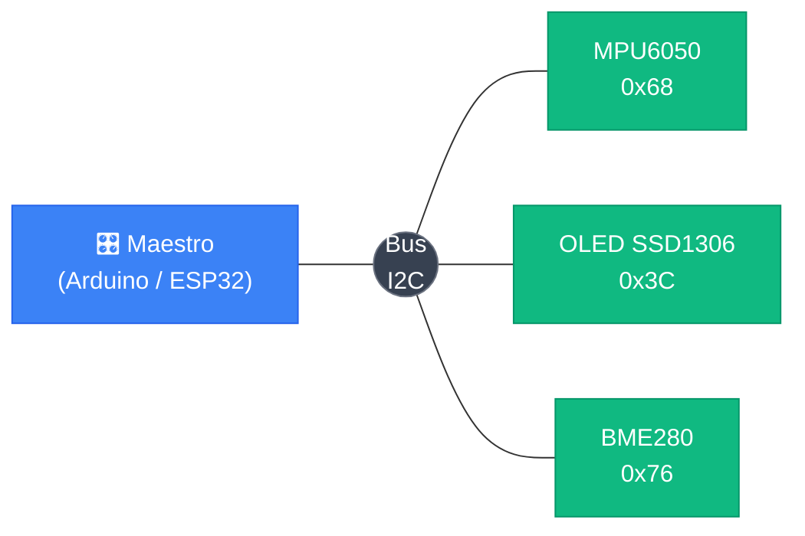
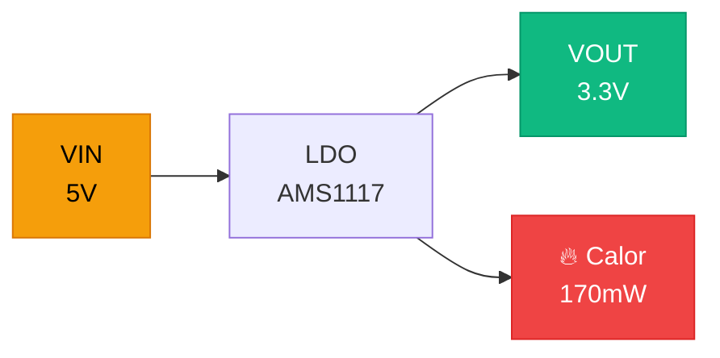

<div class="absolute inset-0 bg-black/60" />

<div class="relative z-10 flex h-full flex-col items-center justify-center">

# Circuitos de Alimentación y Niveles Lógicos

## Clase 5 — I2C · SPI · Reguladores · Compatibilidad lógica

<div class="pt-10">
  <span @click="$slidev.nav.next" class="px-2 py-1 rounded cursor-pointer" flex="~ justify-center items-center gap-2" hover="bg-white bg-opacity-10">
    Presiona espacio para continuar <div class="i-carbon:arrow-right inline-block"/>
  </span>
</div>

</div>

<!--
Bienvenidos a la clase 5. Antes de entrar a los circuitos de alimentación, cerramos dos temas pendientes de la clase 4: I2C y SPI. Los usamos con el ENS160+AHT21, el DS3231 y la OLED, así que conviene entenderlos bien antes de seguir.
-->

---
transition: fade-out
---

# Contenido

<Toc maxDepth="1" columns="2" class="text-sm" />

<!--
Mostrar la estructura. Primera parte: protocolos de comunicación (pendientes de clase 4). Segunda parte: circuitos de alimentación y niveles lógicos.
-->

---
transition: slide-up
---

# Niveles Lógicos

<div class="grid grid-cols-3 gap-6 mt-8 items-center">

  <div class="p-6 rounded-xl border border-green-400/40 bg-green-500/10 text-center">
    <div class="font-mono text-5xl font-bold text-green-300 mb-3">1</div>
    <div class="font-bold text-lg mb-1">Lógico HIGH</div>
    <div class="text-sm opacity-80">Voltaje cercano a VCC</div>
    <div class="font-mono text-green-300 mt-2 text-sm">≈ 3.3V en ESP32</div>
  </div>

  <Image src="/images/clase_5/cat_math.jpg" class="h-44 mx-auto rounded-xl object-contain" />

  <div class="p-6 rounded-xl border border-red-400/40 bg-red-500/10 text-center">
    <div class="font-mono text-5xl font-bold text-red-300 mb-3">0</div>
    <div class="font-bold text-lg mb-1">Lógico LOW</div>
    <div class="text-sm opacity-80">Voltaje cercano a GND</div>
    <div class="font-mono text-red-300 mt-2 text-sm">≈ 0V en ESP32</div>
  </div>

</div>

<div class="mt-6 p-3 rounded bg-white/5 border border-white/10 text-sm text-center">
  Los microcontroladores no hablan en 1s y 0s abstractos — hablan en <strong>voltajes</strong>. Entender los rangos es crítico para integrar sensores y módulos correctamente.
</div>

<style>
h1 {
  background-color: #2B90B6;
  background-image: linear-gradient(45deg, #4EC5D4 10%, #146b8c 20%);
  background-size: 100%;
  -webkit-background-clip: text;
  -moz-background-clip: text;
  -webkit-text-fill-color: transparent;
  -moz-text-fill-color: transparent;
}
</style>

<!--
Preguntar: ¿qué voltaje tiene el "1" en un sistema de 5V? Cualquier valor cercano a 5V. ¿Y en un sistema de 3.3V? Cercano a 3.3V. El concepto HIGH/LOW es relativo al voltaje de alimentación.

Anécdota: el ESP32 opera a 3.3V. Si conectan un sensor de 5V directamente, pueden dañarlo. Esto lo profundizamos en esta sección.
-->

---
transition: slide-down
---

# Umbrales de Voltaje — La Zona Indeterminada

<div class="flex items-stretch gap-6 mt-4">

  <div class="flex flex-col text-xs font-mono w-32 shrink-0 text-center rounded border border-white/20 overflow-hidden">
    <div class="bg-green-100/30 border-b border-green-400/40 py-5 text-green-800 font-bold leading-tight">
      HIGH<br><span class="opacity-70 font-normal">≥ 2.0V</span>
    </div>
    <div class="bg-yellow-200/20 border-b border-yellow-400/30 py-6 text-yellow-700 leading-tight">
      ⚠ ZONA<br>GRIS<br><span class="opacity-70 font-normal">0.8–2.0V</span>
    </div>
    <div class="bg-red-200/30 py-5 text-red-700 font-bold leading-tight">
      LOW<br><span class="opacity-70 font-normal">≤ 0.8V</span>
    </div>
  </div>

  <div class="flex flex-col gap-3 flex-1">
    <div class="p-3 rounded-lg border border-green-400/40 bg-green-500/10 text-xs">
      <div class="font-bold mb-1">HIGH (lógico 1)</div>
      <div class="opacity-80">El ESP32 interpreta como 1 cualquier voltaje <strong>por encima de 2.0V</strong>. El margen garantiza que el ruido no cause errores en este rango.</div>
    </div>
    <div class="p-3 rounded-lg border border-yellow-400/40 bg-yellow-500/10 text-xs">
      <div class="font-bold mb-1">⚠ Zona Indeterminada (0.8V – 2.0V)</div>
      <div class="opacity-80">El pin puede leer 0 o 1 <strong>aleatoriamente</strong>. Un pin flotante sin conexión definida cae exactamente aquí — comportamiento impredecible garantizado.</div>
    </div>
    <div class="p-3 rounded-lg border border-red-400/40 bg-red-500/10 text-xs">
      <div class="font-bold mb-1">LOW (lógico 0)</div>
      <div class="opacity-80">El ESP32 interpreta como 0 cualquier voltaje <strong>por debajo de 0.8V</strong>. Voltaje cercano a GND, estado bien definido.</div>
    </div>
  </div>

</div>

<div class="mt-3 p-2 rounded bg-white/5 border border-white/10 text-xs">
  No es blanco o negro — hay <strong>rangos tolerados</strong>. Esto se llama <em>noise margin</em> (margen de ruido). Todo el diseño de pull-ups y level shifters apunta a mantener las líneas fuera de la zona gris.
</div>

<!--
Estos umbrales son específicos del ESP32 / familia CMOS 3.3V. Un sistema de 5V TTL tiene umbrales diferentes (HIGH ≥ 2.4V, LOW ≤ 0.4V). Por eso mezclar tecnologías requiere análisis cuidadoso.

Dibujar en pizarrón: una recta vertical de 0V a 3.3V con las tres zonas coloreadas. Señalar que "flotante" cae en el medio.
-->

---
transition: slide-down
---

# El Pin Flotante

<div class="grid grid-cols-2 gap-6 mt-4">

  <div class="flex flex-col gap-3">
    <div class="p-3 rounded-lg border border-red-400/40 bg-red-500/10 text-xs">
      <div class="font-bold mb-2">¿Qué es un pin flotante?</div>
      <p class="opacity-80">Un pin <strong>no conectado a ningún nivel definido</strong> — ni a VCC ni a GND. Su voltaje queda a merced del entorno:</p>
      <ul class="mt-2 space-y-1 opacity-70 list-disc list-inside">
        <li>Ruido electromagnético del ambiente</li>
        <li>Campos eléctricos de cables cercanos</li>
        <li>El roce de un dedo puede cambiar su voltaje</li>
      </ul>
    </div>
    <div class="p-3 rounded-lg border border-yellow-400/40 bg-yellow-500/10 text-xs">
      <div class="font-bold mb-1">¿Dónde cae su voltaje?</div>
      <p class="opacity-80">En la <strong>zona indeterminada</strong> (0.8V–2.0V). En I2C: tramas corruptas, dispositivos que no responden, comunicaciones erráticas.</p>
    </div>
  </div>

  <div class="flex flex-col gap-3">
    <div class="p-3 rounded-lg border border-blue-400/40 bg-blue-500/10 text-xs">
      <div class="font-bold mb-2">Solución: forzar un nivel definido por defecto</div>
      <div class="grid grid-cols-2 gap-2 mt-1">
        <div class="p-2 rounded bg-green-500/10 border border-green-400/30 text-center">
          <div class="font-bold text-green-300 mb-1">Pull-Up</div>
          <div class="opacity-70">Resistencia a VCC<br>→ defecto <strong>HIGH</strong></div>
        </div>
        <div class="p-2 rounded bg-red-500/10 border border-red-400/30 text-center">
          <div class="font-bold text-red-300 mb-1">Pull-Down</div>
          <div class="opacity-70">Resistencia a GND<br>→ defecto <strong>LOW</strong></div>
        </div>
      </div>
    </div>
    <div class="p-3 rounded-lg border border-purple-400/40 bg-purple-500/10 text-xs">
      <div class="font-bold mb-1">¿Cuándo usar cada una?</div>
      <ul class="opacity-80 space-y-1">
        <li><strong>Pull-up:</strong> I2C, botones activos en LOW, UART en reposo</li>
        <li><strong>Pull-down:</strong> botones activos en HIGH, señales de enable</li>
      </ul>
    </div>
  </div>

</div>

<!--
Demostración en el aula: conectar un cable a un pin GPIO sin pull-up y leerlo por Serial. Ver cómo cambia aleatoriamente. Agregar una resistencia pull-up y ver cómo se estabiliza en HIGH.

La línea SDA de I2C sin pull-up es exactamente este escenario.
-->

---
transition: slide-down
---

# Valores de Pull-Up, Internos y Compatibilidad 3.3V/5V

<div class="grid grid-cols-2 gap-4 mt-3">

  <div class="flex flex-col gap-3">
    <div class="p-3 rounded-lg border border-white/20 bg-white/5 text-xs">
      <div class="font-bold mb-2">Elección del valor</div>

| Valor | Resultado |
|---|---|
| `100 kΩ` | Flancos lentos → bits corruptos |
| **`4.7 kΩ`** ✓ | Ideal — Standard 100 kHz |
| **`2.2 kΩ`** ✓ | Fast mode 400 kHz o cables largos |
| `100 Ω` | Corriente excesiva → daño |

<div class="mt-2 opacity-60">Más velocidad o más metros → resistencia más baja</div>
    </div>
    <div class="p-3 rounded-lg border border-purple-400/40 bg-purple-500/10 text-xs">
      <div class="font-bold mb-1">Pull-Ups Internos del ESP32</div>
      <div class="opacity-80">~<strong>45 kΩ</strong> — activables con <code>INPUT_PULLUP</code> o vía Wire automáticamente</div>
      <div class="text-yellow-300 mt-1">⚠ Demasiado alto para I2C en producción. OK para botones o prototipado muy simple.</div>
    </div>
  </div>

  <div class="flex flex-col gap-3">
    <div class="p-3 rounded-lg border border-yellow-400/40 bg-yellow-500/10 text-xs">
      <div class="font-bold mb-2">⚡ Compatibilidad 3.3V vs 5V</div>
      <p class="opacity-80 mb-2">El ESP32 es un sistema de <strong>3.3V</strong>. Algunos módulos I2C de Arduino operan a <strong>5V</strong>.</p>
      <div class="p-2 rounded bg-red-500/20 border border-red-400/30 mb-2">
        <strong>Peligro:</strong> 5V directo al ESP32 supera el límite ~3.6V de sus pines → daño permanente.
      </div>
      <div class="opacity-80"><strong>Solución:</strong> Level Shifter Bidireccional (BSS138) — convierte entre 3.3V y 5V en ambas direcciones.</div>
    </div>
    <div class="p-2 rounded bg-white/5 border border-white/10 text-xs">
      Módulos modernos (OLED, BME280, MPU6050 breakouts) ya incluyen regulador → compatibles con 3.3V directamente.
    </div>
  </div>

</div>

<!--
Error común: conectar un shield de 5V de Arduino directamente al ESP32 sin level shifter. Los primeros ESP8266 eran más tolerantes, pero el ESP32 NO.

Regla de oro: si un módulo dice "5V" en VCC, investigar si sus pines de señal también son de 5V o si ya tienen un regulador que los baja a 3.3V.
-->

---
layout: image-right
image: ./images/clase_5/i2c_master_slave.svg
backgroundSize: contain
transition: slide-left
---

# I2C — El Bus Físico

<v-clicks>

- **SDA** (Serial Data) — datos en ambas direcciones
- **SCL** (Serial Clock) — reloj, siempre lo genera el maestro
- Solo **2 cables** para todos los dispositivos

</v-clicks>

<div v-click class="mt-4 p-3 rounded-lg border border-yellow-400/40 bg-yellow-500/10 text-sm">
  <strong>Bus open-drain — pull-ups obligatorios</strong><br>
  SDA y SCL son <em>open-drain</em>: los dispositivos solo pueden poner la línea en LOW. La resistencia pull-up es el único mecanismo para volver a HIGH — sin ella el bus no funciona.
</div>

<div v-click class="mt-3 grid grid-cols-2 gap-3">
  <div class="p-3 rounded border border-green-400/30 bg-green-500/10 text-xs">
    <div class="font-bold mb-1">Conexión en ESP32</div>
    <div class="font-mono opacity-80 mt-1">SDA → GPIO + 4.7 kΩ → 3.3V<br>SCL → GPIO + 4.7 kΩ → 3.3V</div>
    <div class="opacity-60 mt-1">Una resistencia por línea, para todos los dispositivos del bus</div>
  </div>
  <div class="p-3 rounded border border-blue-400/30 bg-blue-500/10 text-xs">
    <div class="font-bold mb-1">Pines I2C en ESP32-S3</div>
    <div class="opacity-80 mt-1">SDA: GPIO 8 · SCL: GPIO 9</div>
    <div class="opacity-60 mt-1">Configurables: <code>Wire.begin(SDA_PIN, SCL_PIN)</code></div>
  </div>
</div>

<!--
Analogía: open-drain es como un interruptor que solo puede conectar a GND. La resistencia pull-up es el resorte que vuelve la línea a HIGH. Sin el resorte, la línea queda flotando.

Preguntar: ¿si tengo muchos dispositivos necesito más resistencias? No — sigue siendo una sola resistencia por línea, pero su valor puede bajar (más corriente disponible).
-->
---
transition: slide-down
---

# Open-Drain — Por Qué I2C Necesita Pull-Ups

<div class="grid grid-cols-2 gap-6 mt-3">

  <div class="flex flex-col gap-2">
    <Image src="/images/clase_5/i2c_bus_topology.svg" class="h-44 mx-auto rounded-xl border border-white/20 bg-white/90 p-2 object-contain" />
    <div class="p-2 rounded bg-white/5 border border-white/10 text-xs">
      <strong>Open-drain:</strong> cada dispositivo tiene un transistor que <em>solo</em> puede conectar la línea a GND. Nadie puede empujar activamente a HIGH.
    </div>
  </div>

  <div class="flex flex-col gap-3">
    <div class="p-3 rounded-lg border border-red-400/40 bg-red-500/10 text-xs">
      <div class="font-bold mb-1">Sin pull-up → imposible</div>
      <div class="opacity-80">La línea puede bajar a LOW, pero <strong>nunca vuelve a HIGH</strong> — nadie la empuja hacia arriba. Comunicación completamente imposible.</div>
    </div>
    <div class="p-3 rounded-lg border border-green-400/40 bg-green-500/10 text-xs">
      <div class="font-bold mb-1">Con pull-up → funciona</div>
      <div class="opacity-80">La resistencia devuelve la línea a HIGH cuando ningún dispositivo la jala. Transmitir 0: jalar a GND. Transmitir 1: soltar (la resistencia sube).</div>
    </div>
    <div class="p-3 rounded-lg border border-blue-400/40 bg-blue-500/10 text-xs">
      <div class="font-bold mb-1">Ventaja: bus compartido sin conflicto</div>
      <div class="opacity-80">Si dos dispositivos jalaran a la vez (ambos transmiten 0), no hay cortocircuito — ambos drenan a GND sin pelear.</div>
    </div>
  </div>

</div>

<!--
Dibujar en pizarrón el transistor open-drain: colector conectado a la línea, emisor a GND. El transistor solo puede cerrar el circuito a GND, no puede empujar a VCC.

Comparar con push-pull (SPI): el driver tiene dos transistores — uno a VCC y uno a GND. Puede empujar en ambas direcciones. Por eso SPI no necesita pull-ups.
-->
---
transition: slide-down
---

# I2C — Arquitectura Maestro/Esclavo

<div class="text-center mt-2">



</div>

<div class="grid grid-cols-2 gap-4 mt-3">
  <div class="p-3 rounded-lg border border-blue-400/40 bg-blue-500/10 text-xs">
    <div class="font-bold mb-2">Maestro</div>
    <ul class="space-y-1 opacity-80">
      <li>Siempre inicia la comunicación</li>
      <li>Genera el reloj (SCL)</li>
      <li>"Llama" al esclavo por su dirección</li>
    </ul>
  </div>
  <div class="p-3 rounded-lg border border-green-400/40 bg-green-500/10 text-xs">
    <div class="font-bold mb-2">Esclavo</div>
    <ul class="space-y-1 opacity-80">
      <li>Solo responde cuando se lo llama</li>
      <li>Tiene una dirección única en el bus</li>
      <li>Confirma que escuchó con un bit ACK</li>
    </ul>
  </div>
</div>

<!--
Analogía: el maestro es como el profesor que llama lista. Dice un nombre (dirección) y solo ese alumno responde. Los demás están quietos. El maestro controla cuándo se habla (el reloj).

Existe "multi-master" pero es raro en IoT — agrega complejidad de arbitraje. En prácticamente todos nuestros proyectos hay un solo maestro.
-->

---
transition: slide-down
---

# I2C — Las Direcciones de 7+1 Bits

<div class="flex items-center justify-center gap-px font-mono text-xs mt-4 mb-4">
  <div class="px-3 py-2 bg-blue-500/20 border border-blue-400/40 rounded-l text-center">A6</div>
  <div class="px-3 py-2 bg-blue-500/20 border-t border-b border-blue-400/40 text-center">A5</div>
  <div class="px-3 py-2 bg-blue-500/20 border-t border-b border-blue-400/40 text-center">A4</div>
  <div class="px-3 py-2 bg-blue-500/20 border-t border-b border-blue-400/40 text-center">A3</div>
  <div class="px-3 py-2 bg-blue-500/20 border-t border-b border-blue-400/40 text-center">A2</div>
  <div class="px-3 py-2 bg-blue-500/20 border-t border-b border-blue-400/40 text-center">A1</div>
  <div class="px-3 py-2 bg-blue-500/20 border border-r-0 border-blue-400/40 text-center">A0</div>
  <div class="px-3 py-2 bg-red-500/20 border border-red-400/40 rounded-r text-center min-w-10">R/W</div>
  <div class="ml-4 opacity-50">← 8 bits en el bus físico</div>
</div>

<div class="grid grid-cols-2 gap-3">
  <div class="p-3 rounded-lg border border-blue-400/40 bg-blue-500/10 text-xs">
    <div class="font-bold text-sm mb-2">Dirección (7 bits)</div>
    <ul class="space-y-1 opacity-80">
      <li>2⁷ = <strong>128</strong> posibles (0x00–0x7F)</li>
      <li>~16 reservadas → <strong>~112 disponibles</strong></li>
      <li>Por convención: expresadas en <strong>hex</strong></li>
      <li>Ejemplos: <code>0x68</code>, <code>0x3C</code>, <code>0x76</code></li>
    </ul>
  </div>
  <div class="p-3 rounded-lg border border-red-400/40 bg-red-500/10 text-xs">
    <div class="font-bold text-sm mb-2">Bit R/W — La Confusión</div>
    <ul class="space-y-1 opacity-80">
      <li><strong>0</strong> = Escribir al esclavo</li>
      <li><strong>1</strong> = Leer del esclavo</li>
      <li class="text-yellow-300">⚠ Algunos datasheets muestran la dirección como 8 bits (con R/W incluido)</li>
      <li>MPU6050: datasheet dice <code>0xD0</code> → Wire usa <code>0x68</code></li>
    </ul>
  </div>
</div>

<div class="mt-3 p-2 rounded bg-white/5 border border-white/10 text-xs">
  <strong>Regla:</strong> en Wire siempre se usa la dirección de <strong>7 bits</strong>. Si el datasheet dice <code>0xD0</code>, dividilo entre 2 → <code>0x68</code>.
</div>

<!--
Dibujar en pizarrón: 0x68 en binario = 1101 000. Agregar el bit R/W=0 (escribir) → 1101 0000 = 0xD0. Eso es lo que viaja físicamente por el bus. Wire.h hace ese shift automáticamente.

Preguntar: ¿direcciones reservadas? Sí — 0x00 es broadcast (hablan todos), 0x01–0x07 y 0x78–0x7F están reservadas para usos especiales.
-->

---
transition: slide-down
---

# I2C — Dirección Configurable y Conflictos

<div class="grid grid-cols-2 gap-4 mt-3">
  <div class="flex flex-col gap-3">
    <div class="p-3 rounded-lg border border-green-400/40 bg-green-500/10 text-xs">
      <div class="font-bold text-sm mb-2">Configuración por Hardware</div>
      <p class="opacity-80 mb-2">Muchos módulos tienen pines <code>AD0</code>, <code>AD1</code> o <code>ADDR</code> que permiten cambiar 1–2 bits de la dirección con un jumper o conectando a VCC/GND.</p>
      <div class="space-y-1 font-mono mt-2">
        <div class="px-2 py-1 bg-black/20 rounded">AD0 = GND → <strong>0x68</strong></div>
        <div class="px-2 py-1 bg-black/20 rounded">AD0 = 3.3V → <strong>0x69</strong></div>
      </div>
      <p class="opacity-60 mt-2">→ 2 MPU6050 en el mismo bus</p>
    </div>
    <div class="p-3 rounded-lg border border-yellow-400/40 bg-yellow-500/10 text-xs">
      <div class="font-bold mb-1">⚠ Conflicto de Dirección</div>
      <p class="opacity-80">Si dos dispositivos tienen la misma dirección fija sin pin de configuración, no pueden coexistir.</p>
      <p class="opacity-80 mt-1"><strong>Solución:</strong> multiplexor I2C <code>TCA9548A</code> — crea 8 sub-buses independientes, cada uno con su propio set de dispositivos.</p>
    </div>
  </div>
  <div class="flex flex-col gap-3">
    <div class="p-3 rounded-lg border border-purple-400/40 bg-purple-500/10 text-xs">
      <div class="font-bold text-sm mb-1">🔍 I2C Scanner</div>
      <p class="opacity-70">Sketch que recorre todas las direcciones e imprime cuáles responden — indispensable para depurar.</p>
    </div>

```cpp
#include <Wire.h>
void setup() {
  Wire.begin();
  Serial.begin(115200);
  for (byte addr = 1; addr < 127; addr++) {
    Wire.beginTransmission(addr);
    byte err = Wire.endTransmission();
    if (err == 0) {
      Serial.print("Dispositivo en 0x");
      Serial.println(addr, HEX);
    }
  }
}
void loop() {}
```

  </div>
</div>

<!--
El TCA9548A se conecta en el bus principal (dirección 0x70–0x77). Puedes seleccionar un canal con Wire.write(1 << canal). Útil para tener 8 displays OLED SSD1306 (todos con dirección 0x3C).

El I2C scanner es lo primero que correr cuando un sensor no responde. Rápidamente dice si el problema es de dirección, conexión o código.
-->

---
transition: slide-down
---

# I2C — Librería Wire de Arduino

<div class="grid grid-cols-2 gap-4 mt-3">
  <div class="flex flex-col gap-2">
    <div class="p-3 rounded border border-blue-400/30 bg-blue-500/10 text-xs">
      <div class="font-bold mb-2">Funciones clave</div>

| Función | Acción |
|---|---|
| `Wire.begin()` | Inicia como maestro |
| `Wire.beginTransmission(addr)` | Abre sesión |
| `Wire.write(byte)` | Envía un byte |
| `Wire.endTransmission()` | Cierra + STOP |
| `Wire.requestFrom(addr, n)` | Solicita n bytes |
| `Wire.read()` | Lee un byte |

</div>
    <div class="p-2 rounded border border-white/10 bg-white/5 text-xs">
      <strong>Velocidades:</strong> Standard <code>100 kHz</code> (defecto) · Fast <code>400 kHz</code><br>
      <code>Wire.setClock(400000);</code> — antes de Wire.begin()
    </div>
  </div>
  <div class="text-left">

```cpp
#include <Wire.h>
#define MPU_ADDR 0x68

void setup() {
  Wire.begin();
  Serial.begin(115200);
  // Despertar el MPU6050
  Wire.beginTransmission(MPU_ADDR);
  Wire.write(0x6B); // PWR_MGMT_1
  Wire.write(0x00); // Quitar sleep
  Wire.endTransmission();
}

void loop() {
  // Leer acelerómetro eje X
  Wire.beginTransmission(MPU_ADDR);
  Wire.write(0x3B);
  Wire.endTransmission(false); // Repeated START
  Wire.requestFrom(MPU_ADDR, 2);
  int16_t ax = (Wire.read() << 8) | Wire.read();
  Serial.println(ax);
  delay(100);
}
```

  </div>
</div>

<!--
endTransmission(false) genera un Repeated START en lugar de STOP — esencial para leer registros en la mayoría de los sensores. Con true (o sin argumento) se envía STOP y el sensor puede resetear su puntero de registro interno.

La velocidad 400 kHz (Fast mode) funciona con la mayoría de módulos modernos. Algunos soportan Fast+ a 1 MHz.
-->

---
transition: slide-up
---

# SPI — El Bus de 4 Cables

<div class="mt-2 p-2 rounded border border-white/10 bg-white/5 text-xs mb-3">
  Serial Peripheral Interface — desarrollado por Motorola. Común en pantallas TFT, tarjetas SD, ADCs rápidos y sensores de alta velocidad.
</div>

| Pin | Nombre completo | Dirección | Descripción |
|---|---|---|---|
| **MOSI** | Master Out Slave In | Maestro → Esclavo | Datos que el maestro envía al esclavo |
| **MISO** | Master In Slave Out | Esclavo → Maestro | Datos que el esclavo devuelve al maestro |
| **SCK** | Serial Clock | Maestro → Esclavo | Señal de reloj que sincroniza la transferencia |
| **CS / SS** | Chip Select / Slave Select | Maestro → Esclavo | Activa el esclavo deseado poniéndolo en LOW |

<div class="mt-3 grid grid-cols-2 gap-2 text-xs">
  <div class="p-2 rounded border border-green-400/30 bg-green-500/10">
    <strong>Full-duplex:</strong> MOSI y MISO operan simultáneamente — envío y recepción al mismo tiempo
  </div>
  <div class="p-2 rounded border border-blue-400/30 bg-blue-500/10">
    <strong>Sin direcciones:</strong> CS bajo (LOW) = dispositivo activo. Sin arbitraje ni ACK.
  </div>
</div>

<!--
Preguntar: ¿qué pasa si CS está en HIGH? El esclavo ignora completamente MOSI y SCK — su MISO queda en alta impedancia (tri-state), no interfiere con el bus.

SPI es más simple en protocolo pero usa más pines. Sin handshake, sin ACK: el maestro habla y el esclavo escucha (o responde simultáneamente por MISO).
-->

---
layout: image-right
image: ./images/clase_5/spi_multiple_slaves.svg
backgroundSize: contain
transition: slide-down
---

# SPI — N Dispositivos en el Bus

Cada esclavo tiene su propio pin **CS**. El maestro activa solo uno a la vez poniéndolo en `LOW`.

<div class="mt-4 p-3 rounded border border-blue-400/30 bg-blue-500/10 text-xs mb-3">
  <div class="font-bold mb-2">Pines GPIO necesarios</div>
  <div class="font-mono space-y-1">
    <div class="opacity-80">MOSI + MISO + SCK = <strong>3</strong> fijos</div>
    <div class="opacity-80">+ 1 CS por cada esclavo</div>
  </div>
  <div class="mt-2 font-bold">Para N dispositivos: <strong>3 + N pines</strong></div>
</div>

<div class="p-3 rounded border border-yellow-400/30 bg-yellow-500/10 text-xs mb-3">
  <strong>Comparación con I2C:</strong><br>
  I2C: siempre 2 pines sin importar cuántos dispositivos<br>
  SPI: crece 1 pin por cada esclavo nuevo
</div>

<div class="p-2 rounded border border-white/10 bg-white/5 text-xs">
  <strong>Velocidad:</strong> 1–80 MHz (vs I2C 100–400 kHz) — hasta <strong>800× más rápido</strong>
</div>

<!--
Ejemplo concreto: pantalla TFT 320×240 a 16 bits = 1.2 MB por frame. A 400 kHz (I2C) tardaría 24 segundos por frame. A 40 MHz (SPI) tarda 0.24 ms — eso es 60 fps sin problema.

Existe el modo "daisy chain" donde los esclavos se encadenan en serie y comparten un único CS. Se usa en algunos shift registers (74HC595) y DACs. No es universal.
-->

---
transition: slide-up
---

# SPI vs I2C — Comparativa

<div class="grid grid-cols-2 gap-4 mt-3">

  <div class="p-3 rounded-lg border border-blue-400/40 bg-blue-500/10 text-xs">
    <div class="font-bold text-sm mb-2 text-blue-300">I2C</div>

| Característica | Valor |
|---|---|
| Cables de señal | **2** (SDA + SCL) |
| Pines para N dispositivos | **2** (siempre) |
| Velocidad | 100 – 400 kHz |
| Dúplex | Semi (alternado) |
| Selección de esclavo | Dirección 7 bits |
| Pull-up | **Obligatorio** |
| Distancia máx. | ~1 m |
| Protocolo | ACK · START · STOP |

  </div>

  <div class="p-3 rounded-lg border border-green-400/40 bg-green-500/10 text-xs">
    <div class="font-bold text-sm mb-2 text-green-300">SPI</div>

| Característica | Valor |
|---|---|
| Cables de señal | **4** (MOSI·MISO·SCK·CS) |
| Pines para N dispositivos | **3 + N** |
| Velocidad | 1 – 80 MHz |
| Dúplex | **Completo** (simultáneo) |
| Selección de esclavo | Pin CS dedicado |
| Pull-up | No necesario |
| Distancia máx. | ~30 cm (PCB) |
| Protocolo | Simple (sin ACK) |

  </div>

</div>

<!--
Resumen para los alumnos: I2C = conveniente, pocos cables, velocidad moderada. SPI = rápido, más pines, sin negociación.

En proyectos IoT típicos se usan los dos al mismo tiempo: I2C para los sensores, SPI para la pantalla o el almacenamiento.

¿Preguntas antes de pasar al tema de circuitos de alimentación?
-->

---
layout: center
transition: slide-up
---

# Circuitos de Alimentación

<Image src="/images/clase_5/electrician_dog.webp" class="h-60 mx-auto mt-4 rounded-xl object-contain" />

<style>
h1 {
  background-color: #2B90B6;
  background-image: linear-gradient(45deg, #4EC5D4 10%, #146b8c 20%);
  background-size: 100%;
  -webkit-background-clip: text;
  -moz-background-clip: text;
  -webkit-text-fill-color: transparent;
  -moz-text-fill-color: transparent;
}
</style>

<!--
Transición al segundo bloque de la clase. Pasamos de protocolos de comunicación a entender cómo se alimentan los circuitos y cómo se garantiza la compatibilidad de voltaje entre componentes.
-->

---
transition: slide-up
---

# Fundamentos: Voltaje, Corriente y Potencia

<div class="grid grid-cols-2 gap-6 mt-4">

  <div class="space-y-3">
    <div class="p-3 rounded-lg border border-blue-400/40 bg-blue-500/10">
      <div class="font-bold text-sm text-blue-300 mb-1">Voltaje (V)</div>
      <div class="text-xs opacity-90">La "presión" que empuja la corriente.</div>
      <div class="text-xs opacity-75 mt-1">ESP32 necesita <strong>3.3V exactos</strong>. Más → daña. Menos → no funciona.</div>
    </div>
    <div class="p-3 rounded-lg border border-green-400/40 bg-green-500/10">
      <div class="font-bold text-sm text-green-300 mb-1">Corriente (A / mA)</div>
      <div class="text-xs opacity-90">Cantidad de electricidad que fluye.</div>
      <div class="text-xs opacity-75 mt-1">Reposo: 30–80 mA | WiFi transmitiendo: <strong>~240 mA pico</strong></div>
    </div>
    <div class="p-3 rounded-lg border border-yellow-400/40 bg-yellow-500/10">
      <div class="font-bold text-sm text-yellow-300 mb-1">Potencia P = V × I</div>
      <div class="text-xs opacity-90">3.3V × 100mA = <strong>0.33W</strong></div>
      <div class="text-xs opacity-75 mt-1">Útil para calcular duración de batería o calor de un regulador.</div>
    </div>
  </div>

  <div class="flex flex-col gap-3">
    <Image src="/images/clase 2/ESP32-Power-Requirement.jpg" class="h-36 mx-auto rounded-xl border border-white/20 bg-white/90 p-2 object-contain" />
    <div class="p-3 rounded-2xl border border-red-300/30 bg-red-500/10 text-xs">
      <div class="text-xs uppercase tracking-wide opacity-70 mb-1">⚠️ Por qué importa</div>
      Un voltaje incorrecto puede <strong>reiniciar el ESP32</strong>, causar errores en sensores, o dañarlo permanentemente.
    </div>
  </div>

</div>

<!--
Usar la analogía del agua: voltaje = presión del grifo, corriente = caudal, potencia = litros × presión por segundo.
Preguntar: "¿Cuánta corriente consume el ESP32 transmitiendo por WiFi?" → 240mA. Si la batería no puede entregar eso, el voltaje colapsa y el sistema falla o se reinicia.
-->

---
transition: slide-down
---

# Fuentes de Alimentación en IoT

<div class="grid grid-cols-2 gap-4 mt-6">

  <div v-click class="p-3 rounded-lg border border-blue-400/40 bg-blue-500/10">
    <div class="font-bold text-sm mb-1 text-blue-300">🔌 USB 5V</div>
    <div class="text-xs opacity-80 space-y-1">
      <div>500 mA (USB 2.0) / 900 mA (USB 3.0)</div>
      <div>✓ Ideal para desarrollo en escritorio</div>
      <div>✗ No sirve en campo sin cable</div>
    </div>
  </div>

  <div v-click class="p-3 rounded-lg border border-green-400/40 bg-green-500/10">
    <div class="font-bold text-sm mb-1 text-green-300">🔋 Li-ion / LiPo</div>
    <div class="text-xs opacity-80 space-y-1">
      <div>3.7V nominal | Recargable</div>
      <div>✓ Estándar en IoT portátil</div>
      <div>⚠️ Requiere cargador + protección</div>
    </div>
  </div>

  <div v-click class="p-3 rounded-lg border border-yellow-400/40 bg-yellow-500/10">
    <div class="font-bold text-sm mb-1 text-yellow-300">🪫 Pilas AA (alcalinas)</div>
    <div class="text-xs opacity-80 space-y-1">
      <div>1.5V/celda | 3 en serie = 4.5V</div>
      <div>✓ Fáciles de conseguir en cualquier lugar</div>
      <div>✗ No recargables, voltaje cae con el uso</div>
    </div>
  </div>

  <div v-click class="p-3 rounded-lg border border-purple-400/40 bg-purple-500/10">
    <div class="font-bold text-sm mb-1 text-purple-300">🔌 Fuente DC Externa</div>
    <div class="text-xs opacity-80 space-y-1">
      <div>Adaptadores de pared | Alta corriente</div>
      <div>✓ Motores, LEDs, relés en proyectos fijos</div>
      <div>✗ No es portátil</div>
    </div>
  </div>

</div>

<!--
Pregunta abierta: "¿Cuál usarían para un sensor ambiental que vive en el jardín por 6 meses?"
Respuesta esperada: LiPo o AA. USB es conveniente en el escritorio, pero un cable en el jardín toda la temporada no es realista.
-->

---
layout: two-cols
layoutClass: gap-12
transition: fade-out
---

# Cómo Leer un Datasheet

**Secciones clave a buscar:**

<div class="space-y-2 mt-3">
  <div class="p-2 rounded border border-blue-400/30 bg-blue-500/10 text-xs">
    <strong class="text-blue-300">Operating Voltage Range</strong><br/>
    <span class="opacity-80">Rango en que el chip funciona. ESP32: 3.0V – 3.6V</span>
  </div>
  <div class="p-2 rounded border border-green-400/30 bg-green-500/10 text-xs">
    <strong class="text-green-300">Typical Current Consumption</strong><br/>
    <span class="opacity-80">Consumo en cada modo: activo, sleep, WiFi TX</span>
  </div>
  <div class="p-2 rounded border border-yellow-400/30 bg-yellow-500/10 text-xs">
    <strong class="text-yellow-300">Pines de Alimentación</strong><br/>
    <span class="opacity-80">Identificar VCC/3V3, GND, EN (enable), VBAT</span>
  </div>
  <div class="p-2 rounded border border-red-400/30 bg-red-500/10 text-xs">
    <strong class="text-red-300">⚠️ Absolute Maximum Ratings</strong><br/>
    <span class="opacity-80">La sección más importante. Leer ANTES de conectar.</span>
  </div>
</div>

::right::

**ESP32 — Valores de referencia:**

<div class="mt-3 space-y-3">
  <div class="font-mono bg-black/30 p-3 rounded text-xs leading-relaxed">
    Operating:   3.0V — 3.6V<br/>
    Reposo:      ~30–80 mA<br/>
    Activo:      ~80–160 mA<br/>
    WiFi TX:     ~240 mA pico<br/>
    Pines:       3V3, GND, EN
  </div>

  <div class="p-3 rounded-2xl border border-red-300/30 bg-red-500/10 text-xs">
    <div class="text-xs uppercase tracking-wide opacity-70 mb-1">⚠️ Absolute Maximum Ratings</div>
    Los límites que <strong>NUNCA deben superarse</strong>, aunque sea por un instante. Superarlos daña el chip permanentemente, aunque parezca seguir funcionando.
  </div>
</div>

<!--
Mostrar un datasheet real de ESP32 en pantalla. Recorrer las 4 secciones en vivo.
Pregunta retórica: "¿Qué pasa si conecto 5V directo al pin 3V3 del ESP32?" → Daño permanente. Por eso leemos el datasheet primero.
-->

---
layout: center
transition: slide-up
---

# 3.2 Regulación de Voltaje

<div class="mt-4 text-center text-xl opacity-70">LDO · Buck · Boost · Buck-Boost</div>

<style>
h1 {
  background-color: #2B90B6;
  background-image: linear-gradient(45deg, #7dd3fc 10%, #0f766e 45%, #f59e0b 90%);
  background-size: 100%;
  -webkit-background-clip: text;
  -moz-background-clip: text;
  -webkit-text-fill-color: transparent;
  -moz-text-fill-color: transparent;
}
</style>

<!--
Las fuentes rara vez entregan exactamente el voltaje que necesita el circuito. Un regulador toma un voltaje variable o incorrecto y entrega uno fijo y estable.
Sin un regulador, cualquier variación en la batería o USB llegaría directo al ESP32.
-->

---
transition: slide-left
---

# LDO — El Más Simple

<div class="grid grid-cols-2 gap-6 mt-4">

  <div class="space-y-3 text-left">
    <div class="text-xs opacity-90">
      Funciona como <strong>resistencia variable</strong> que quema el voltaje sobrante como calor. La entrada siempre es mayor que la salida.
    </div>

    <div class="p-2 rounded border border-yellow-400/40 bg-yellow-500/10 text-xs">
      <strong>Disipación:</strong> (5V − 3.3V) × 100mA = <strong>170mW de calor</strong>
    </div>

    <div class="text-xs space-y-1 mt-2">
      <div class="font-bold text-green-300">✓ Cuándo usar LDO:</div>
      <div>• Corrientes bajas (&lt;200mA)</div>
      <div>• Prototipado rápido en escritorio</div>
      <div>• Diferencia de voltaje pequeña</div>
    </div>

    <div class="p-2 rounded bg-black/30 text-xs font-mono opacity-75">
      Ejemplo: AMS1117-3.3<br/>(en casi todos los módulos ESP32)
    </div>
  </div>

  <div class="text-left">



  </div>

</div>

<!--
Preguntar: "¿Cuánto calor genera el LDO si lo ponemos en una caja cerrada sin ventilación?" → Mucho, y puede hacer que el ESP32 se reinicie por temperatura.
Regla práctica: si el regulador quema más de ~500mW necesita disipador o hay que reemplazarlo por un Buck.
-->

---
transition: slide-down
---

# Buck · Boost · Buck-Boost

<div class="grid grid-cols-3 gap-4 mt-4 text-left">

  <div class="p-3 rounded-lg border border-green-400/40 bg-green-500/10">
    <div class="font-bold text-sm mb-2 text-green-300">📉 Buck (Reductor)</div>
    <div class="text-xs space-y-1">
      <div><strong>Alto → bajo voltaje</strong></div>
      <div>Inductor + conmutación rápida</div>
      <div class="text-green-300 font-bold mt-1">Eficiencia: 85–95%</div>
      <div class="opacity-80 mt-1">Ej: 12V → 3.3V para ESP32</div>
    </div>
  </div>

  <div class="p-3 rounded-lg border border-blue-400/40 bg-blue-500/10">
    <div class="font-bold text-sm mb-2 text-blue-300">📈 Boost (Elevador)</div>
    <div class="text-xs space-y-1">
      <div><strong>Bajo → alto voltaje</strong></div>
      <div>Cuando la fuente puede caer</div>
      <div class="text-blue-300 font-bold mt-1">Eficiencia: 85–90%</div>
      <div class="opacity-80 mt-1">Ej: pila AA 1.5V → 3.3V</div>
    </div>
  </div>

  <div class="p-3 rounded-lg border border-purple-400/40 bg-purple-500/10">
    <div class="font-bold text-sm mb-2 text-purple-300">↕️ Buck-Boost</div>
    <div class="text-xs space-y-1">
      <div><strong>Sube o baja según necesite</strong></div>
      <div>Ideal para batería LiPo</div>
      <div class="text-purple-300 font-bold mt-1">4.2V → 3.0V → 3.3V fijo</div>
      <div class="opacity-80 mt-1">Más caro y complejo</div>
    </div>
  </div>

</div>

<div class="mt-4 p-3 rounded bg-white/5 border border-white/10 text-xs">
  <strong>Regla práctica:</strong> Si el regulador está caliente al tacto después de 30 segundos → problema de eficiencia. Considerar reemplazar por Buck.
</div>

<!--
Preguntar: "¿Cuál usarían para un proyecto con batería 12V y ESP32 a 3.3V?"
Respuesta: Buck. La diferencia de voltaje es grande y la corriente puede ser alta — el LDO generaría demasiado calor.
-->

---
transition: fade-out
---

# ¿Cómo Elegir el Regulador?

<div class="grid grid-cols-2 gap-4 mt-4">

  <div class="space-y-2">
    <div class="p-2 rounded border border-white/20 bg-white/5 text-xs">
      <strong>1. ¿Cuánta corriente máxima necesita?</strong>
      <div class="opacity-75 mt-1">→ El regulador debe soportar ×1.5 del máximo esperado</div>
    </div>
    <div class="p-2 rounded border border-white/20 bg-white/5 text-xs">
      <strong>2. ¿Importa la duración de batería?</strong>
      <div class="opacity-75 mt-1">→ Si sí: descartar LDO, usar Buck o Buck-Boost</div>
    </div>
    <div class="p-2 rounded border border-white/20 bg-white/5 text-xs">
      <strong>3. ¿Qué tan simple debe ser el diseño?</strong>
      <div class="opacity-75 mt-1">→ LDO = mínimo componentes. Buck necesita inductor.</div>
    </div>
    <div class="p-2 rounded border border-white/20 bg-white/5 text-xs">
      <strong>4. ¿Cuánto espacio hay en el PCB?</strong>
      <div class="opacity-75 mt-1">→ LDO compacto. Buck mayor área de PCB.</div>
    </div>
    <div class="mt-3 p-3 rounded border border-green-400/40 bg-green-500/10 text-xs">
      <strong>Para este curso:</strong><br/>
      • Escritorio / prototipo → LDO (AMS1117)<br/>
      • Campo con batería → Buck / Buck-Boost
    </div>
  </div>

  <div class="p-3 rounded border border-purple-400/30 bg-purple-500/10 text-xs">
    <div class="font-semibold text-purple-300 mb-2">Comparativa rápida</div>

| Tipo | Eficiencia | Complejidad | Mejor para |
|---|---|---|---|
| LDO | ~60% | ★☆☆ | Prototipado |
| Buck | ~90% | ★★☆ | Batería, alta I |
| Boost | ~88% | ★★☆ | Fuente baja |
| Buck-Boost | ~85% | ★★★ | LiPo variable |

  </div>

</div>

<!--
Esta slide es el checkpoint mental. Si los estudiantes pueden responder estas 4 preguntas, sabrán qué regulador elegir en cualquier proyecto.
Caso real para discutir: collar IoT GPS + WiFi con LiPo → Buck-Boost, porque la LiPo varía de 4.2V a 3.0V durante semanas.
-->

---
layout: center
transition: slide-up
---

# 3.3 Baterías y Carga

<div class="mt-4 text-center text-xl opacity-70">Seguridad y Protección Mínima</div>

<style>
h1 {
  background-color: #2B90B6;
  background-image: linear-gradient(45deg, #f59e0b 10%, #ef4444 50%, #ec4899 90%);
  background-size: 100%;
  -webkit-background-clip: text;
  -moz-background-clip: text;
  -webkit-text-fill-color: transparent;
  -moz-text-fill-color: transparent;
}
</style>

<!--
Las baterías son el corazón de cualquier proyecto IoT portátil. Pero son el componente más peligroso si no se usan correctamente.
-->

---
transition: slide-up
---

# Li-ion / LiPo — Voltajes Clave

<div class="mt-6 space-y-3">

  <div class="p-3 rounded-lg border border-green-400/40 bg-green-500/10 flex items-center gap-4">
    <div class="text-3xl font-bold text-green-300 shrink-0 w-16 text-right">4.2V</div>
    <div>
      <div class="font-bold text-sm text-green-300">Carga completa — MÁXIMO ABSOLUTO</div>
      <div class="text-xs opacity-75 mt-1">Superar degrada la celda. Puede causar hinchamiento o incendio.</div>
    </div>
  </div>

  <div class="p-3 rounded-lg border border-blue-400/40 bg-blue-500/10 flex items-center gap-4">
    <div class="text-3xl font-bold text-blue-300 shrink-0 w-16 text-right">3.7V</div>
    <div>
      <div class="font-bold text-sm text-blue-300">Tensión nominal</div>
      <div class="text-xs opacity-75 mt-1">El voltaje "promedio" de trabajo. Base para cálculos de energía y capacidad.</div>
    </div>
  </div>

  <div class="p-3 rounded-lg border border-red-400/40 bg-red-500/10 flex items-center gap-4">
    <div class="text-3xl font-bold text-red-300 shrink-0 w-16 text-right">3.0V</div>
    <div>
      <div class="font-bold text-sm text-red-300">Corte por descarga — MÍNIMO</div>
      <div class="text-xs opacity-75 mt-1">Descargar más daña irreversiblemente la celda y puede volverla peligrosa.</div>
    </div>
  </div>

</div>

<div class="mt-4 p-3 rounded-2xl border border-red-300/30 bg-red-500/10 text-xs">
  <div class="text-xs uppercase tracking-wide opacity-70 mb-1">⚠️ Regla absoluta</div>
  <strong>NUNCA cargar una LiPo hinchada, golpeada o con la envoltura dañada.</strong> Es un peligro de incendio inmediato.
</div>

<!--
Preguntar: "¿Quién ha visto una batería hinchada?" Escuchar experiencias. Explicar que el hinchamiento es gas generado por reacciones electroquímicas no deseadas (sobrecarga o cortocircuito interno).
Dato: estos 3 voltajes son específicos para Li-ion/LiPo de una celda. Otras químicas (NiMH, LiFePO4) tienen números distintos.
-->

---
transition: slide-left
---

# TP4056 y BMS

<div class="grid grid-cols-2 gap-6 mt-4">

  <div class="space-y-3">
    <div class="font-bold text-sm text-green-300">TP4056 — El cargador estándar</div>
    <div class="font-mono bg-black/30 p-2 rounded text-xs">
      Entrada:   USB 5V<br/>
      Corriente: 1A (típico)<br/>
      Salida:    4.2V controlado
    </div>
    <div class="text-xs opacity-90">
      Versión con <strong>DW01 integrado</strong> maneja carga y protección en un solo módulo. Preferible para principiantes.
    </div>
    <div class="p-2 rounded border border-teal-400/30 bg-teal-500/10 text-xs">
      <strong>Módulos power bank:</strong> integran carga + protección + boost. Permiten cargar y usar simultáneamente.
    </div>
  </div>

  <div class="space-y-2">
    <div class="font-bold text-sm text-blue-300">BMS — ¿Qué protege?</div>
    <div class="p-2 rounded border border-yellow-400/30 bg-yellow-500/10 text-xs">
      🔋 <strong>Sobrecarga:</strong> corta si la celda supera 4.2V
    </div>
    <div class="p-2 rounded border border-red-400/30 bg-red-500/10 text-xs">
      📉 <strong>Sobredescarga:</strong> corta si la celda baja de 3.0V
    </div>
    <div class="p-2 rounded border border-orange-400/30 bg-orange-500/10 text-xs">
      ⚡ <strong>Cortocircuito:</strong> corta la corriente instantáneamente
    </div>
    <div class="mt-1 p-2 rounded border border-green-400/40 bg-green-500/10 text-xs">
      <strong>Regla del curso:</strong> Siempre usar módulos con BMS integrado. Nunca conectar LiPo sin protección.
    </div>
  </div>

</div>

<!--
Aclaración importante: TP4056 sin protección + LiPo sin BMS es una combinación peligrosa en un taller.
Por eso recomendamos siempre la versión con DW01 integrado — un módulo único maneja todo.
Mencionar los módulos power bank como alternativa más cara pero más conveniente para proyectos finales.
-->

---
transition: slide-down
---

# Buenas Prácticas de Seguridad

<div class="grid grid-cols-2 gap-3 mt-4">

  <div class="space-y-2">
    <div class="p-2 rounded border border-red-400/40 bg-red-500/10 text-xs">
      <div class="font-bold text-red-300">🔴 1. Verificar polaridad SIEMPRE</div>
      <div class="opacity-80 mt-1">Un LiPo al revés es un incidente inmediato. Rojo=+, Negro=−.</div>
    </div>
    <div class="p-2 rounded border border-red-400/40 bg-red-500/10 text-xs">
      <div class="font-bold text-red-300">🔴 2. No dejar cargando sin supervisión</div>
      <div class="opacity-80 mt-1">Especialmente con módulos desconocidos.</div>
    </div>
    <div class="p-2 rounded border border-red-400/40 bg-red-500/10 text-xs">
      <div class="font-bold text-red-300">🔴 3. Conectores estandarizados</div>
      <div class="opacity-80 mt-1">JST-PH 2mm en módulos ESP32. Evitar cables improvisados.</div>
    </div>
  </div>

  <div class="space-y-2">
    <div class="p-2 rounded border border-red-400/40 bg-red-500/10 text-xs">
      <div class="font-bold text-red-300">🔴 4. Calibre de cables correcto</div>
      <div class="opacity-80 mt-1">1–2A → mínimo AWG 24 | Mayor corriente → AWG 22</div>
    </div>
    <div class="p-2 rounded border border-red-400/40 bg-red-500/10 text-xs">
      <div class="font-bold text-red-300">🔴 5. Fusible en la línea positiva</div>
      <div class="opacity-80 mt-1">El fusible se sacrifica antes que la batería o el ESP32.</div>
    </div>
    <div class="p-2 rounded border border-red-400/40 bg-red-500/10 text-xs">
      <div class="font-bold text-red-300">🔴 6. Almacenamiento al 50% (3.8V)</div>
      <div class="opacity-80 mt-1">Si no se usa por días. Superficie no inflamable. Nunca en bolsillos.</div>
    </div>
  </div>

</div>

<div class="mt-3 p-3 rounded bg-white/5 border border-white/10 text-xs">
  Estas reglas son obligatorias en el taller. Un incidente con LiPo afecta a todo el curso.
</div>

<!--
Estas no son sugerencias opcionales. Son reglas de laboratorio.
Anécdota: mencionar un caso real de batería hinchada o mal conectada. El impacto es inmediato y puede arruinar el taller.
Preguntar: "¿Alguien tiene una LiPo en el bolsillo ahora?" → Pausa dramática.
-->

---
layout: two-cols
layoutClass: gap-12
transition: fade-out
---

# Medir Nivel de Batería con ESP32

**Divisor Resistivo + ADC**

<div class="mt-3 space-y-2">
  <div class="text-xs opacity-90">Dos resistencias reducen el voltaje de la batería al rango del ADC del ESP32 (0–3.3V).</div>

  <div class="font-mono bg-black/30 p-2 rounded text-xs">
    R1 = R2 = 10kΩ<br/>
    V_out = V_bat × R2/(R1+R2)
  </div>

```cpp
int raw = analogRead(ADC_PIN);
float v = raw * (3.3 / 4095.0);
float vbat = v * 2;  // R1 = R2
int pct = map(vbat*100, 300, 420, 0, 100);
```

  <div class="p-2 rounded border border-yellow-400/40 bg-yellow-500/10 text-xs mt-1">
    ⚠️ ADC del ESP32 es ruidoso y no lineal. LiPo tampoco es lineal → resultado es <strong>aproximado</strong>.
  </div>
</div>

::right::

**Fuel Gauge (MAX17043)**

<div class="mt-3 space-y-2">
  <div class="text-xs opacity-90">IC especializado que mide la batería por impedancia interna. Comunica por I2C y entrega % preciso.</div>

  <div class="space-y-1 mt-2">
    <div class="p-2 rounded border border-green-400/30 bg-green-500/10 text-xs">✓ Mucho más preciso que ADC</div>
    <div class="p-2 rounded border border-green-400/30 bg-green-500/10 text-xs">✓ Compensación de temperatura</div>
    <div class="p-2 rounded border border-green-400/30 bg-green-500/10 text-xs">✓ Predicción de tiempo restante</div>
  </div>

  <div class="p-2 rounded border border-blue-400/40 bg-blue-500/10 text-xs mt-2">
    Usar cuando el nivel de batería importa de verdad: dispositivos portátiles, alertas de batería baja.
  </div>

  <div class="p-2 rounded bg-white/5 border border-white/10 text-xs mt-2">
    <strong>Para el curso:</strong> empezar con divisor resistivo para entender el concepto. Fuel gauge = solución profesional.
  </div>
</div>

<!--
El map() con valores ×100 evita el uso de float donde map() usa enteros.
Advertir: el porcentaje real de LiPo es muy no-lineal respecto al voltaje. A 3.7V no estás al 50%, estás más cerca del 20-30%.
Para MAX17043: hay librería Arduino directa: SparkFun_MAX1704x_Fuel_Gauge_Arduino_Library.
-->

---
transition: fade-out
---

<div class="h-full flex flex-col items-center justify-center text-center">
  <div class="text-2xl mb-8">¿Preguntas?</div>
  <Image src="/images/question_cat.jpg" class="h-72 mx-auto rounded-lg" />
</div>
