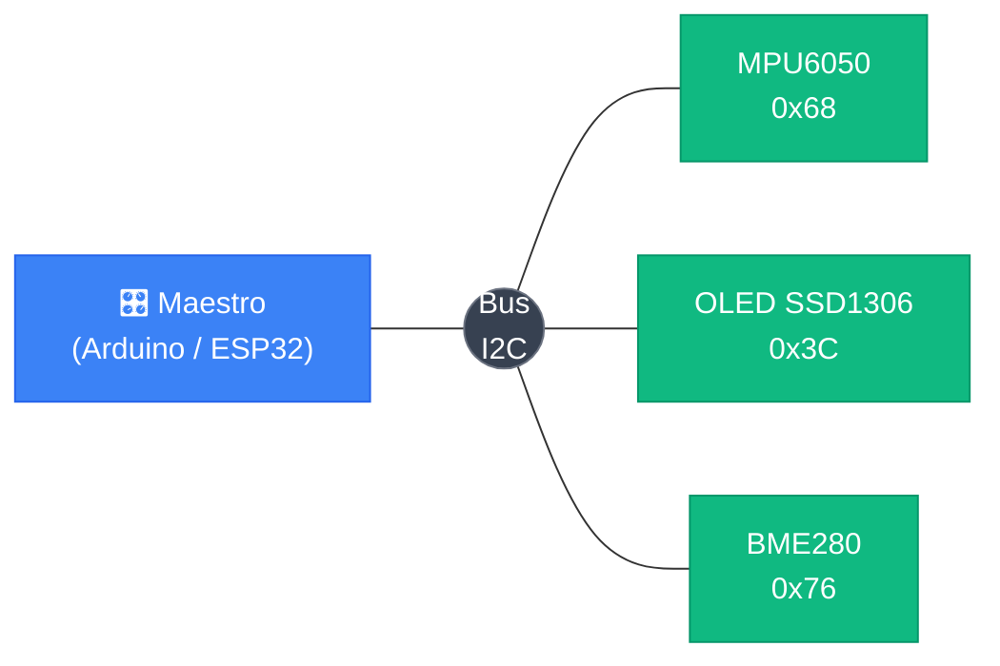

<div class="absolute inset-0 bg-black/60" />

<div class="relative z-10 flex h-full flex-col items-center justify-center">

# Circuitos de Alimentación y Niveles Lógicos

## Clase 5 — I2C · SPI · Reguladores · Compatibilidad lógica

<div class="pt-10">
  <span @click="$slidev.nav.next" class="px-2 py-1 rounded cursor-pointer" flex="~ justify-center items-center gap-2" hover="bg-white bg-opacity-10">
    Presiona espacio para continuar <div class="i-carbon:arrow-right inline-block"/>
  </span>
</div>

</div>

<!--
Bienvenidos a la clase 5. Antes de entrar a los circuitos de alimentación, cerramos dos temas pendientes de la clase 4: I2C y SPI. Los usamos con el ENS160+AHT21, el DS3231 y la OLED, así que conviene entenderlos bien antes de seguir.
-->

---
transition: fade-out
---

# Contenido

<Toc maxDepth="1" columns="2" class="text-sm" />

<!--
Mostrar la estructura. Primera parte: protocolos de comunicación (pendientes de clase 4). Segunda parte: circuitos de alimentación y niveles lógicos.
-->

---
transition: slide-up
---

# Niveles Lógicos

<div class="grid grid-cols-3 gap-6 mt-8 items-center">

  <div class="p-6 rounded-xl border border-green-400/40 bg-green-500/10 text-center">
    <div class="font-mono text-5xl font-bold text-green-300 mb-3">1</div>
    <div class="font-bold text-lg mb-1">Lógico HIGH</div>
    <div class="text-sm opacity-80">Voltaje cercano a VCC</div>
    <div class="font-mono text-green-300 mt-2 text-sm">≈ 3.3V en ESP32</div>
  </div>

  <Image src="/images/clase_5/cat_math.jpg" class="h-44 mx-auto rounded-xl object-contain" />

  <div class="p-6 rounded-xl border border-red-400/40 bg-red-500/10 text-center">
    <div class="font-mono text-5xl font-bold text-red-300 mb-3">0</div>
    <div class="font-bold text-lg mb-1">Lógico LOW</div>
    <div class="text-sm opacity-80">Voltaje cercano a GND</div>
    <div class="font-mono text-red-300 mt-2 text-sm">≈ 0V en ESP32</div>
  </div>

</div>

<div class="mt-6 p-3 rounded bg-white/5 border border-white/10 text-sm text-center">
  Los microcontroladores no hablan en 1s y 0s abstractos — hablan en <strong>voltajes</strong>. Entender los rangos es crítico para integrar sensores y módulos correctamente.
</div>

<style>
h1 {
  background-color: #2B90B6;
  background-image: linear-gradient(45deg, #4EC5D4 10%, #146b8c 20%);
  background-size: 100%;
  -webkit-background-clip: text;
  -moz-background-clip: text;
  -webkit-text-fill-color: transparent;
  -moz-text-fill-color: transparent;
}
</style>

<!--
Preguntar: ¿qué voltaje tiene el "1" en un sistema de 5V? Cualquier valor cercano a 5V. ¿Y en un sistema de 3.3V? Cercano a 3.3V. El concepto HIGH/LOW es relativo al voltaje de alimentación.

Anécdota: el ESP32 opera a 3.3V. Si conectan un sensor de 5V directamente, pueden dañarlo. Esto lo profundizamos en esta sección.
-->

---
transition: slide-down
---

# Umbrales de Voltaje — La Zona Indeterminada

<div class="flex items-stretch gap-6 mt-4">

  <div class="flex flex-col text-xs font-mono w-32 shrink-0 text-center rounded border border-white/20 overflow-hidden">
    <div class="bg-green-100/30 border-b border-green-400/40 py-5 text-green-800 font-bold leading-tight">
      HIGH<br><span class="opacity-70 font-normal">≥ 2.0V</span>
    </div>
    <div class="bg-yellow-200/20 border-b border-yellow-400/30 py-6 text-yellow-700 leading-tight">
      ⚠ ZONA<br>GRIS<br><span class="opacity-70 font-normal">0.8–2.0V</span>
    </div>
    <div class="bg-red-200/30 py-5 text-red-700 font-bold leading-tight">
      LOW<br><span class="opacity-70 font-normal">≤ 0.8V</span>
    </div>
  </div>

  <div class="flex flex-col gap-3 flex-1">
    <div class="p-3 rounded-lg border border-green-400/40 bg-green-500/10 text-xs">
      <div class="font-bold mb-1">HIGH (lógico 1)</div>
      <div class="opacity-80">El ESP32 interpreta como 1 cualquier voltaje <strong>por encima de 2.0V</strong>. El margen garantiza que el ruido no cause errores en este rango.</div>
    </div>
    <div class="p-3 rounded-lg border border-yellow-400/40 bg-yellow-500/10 text-xs">
      <div class="font-bold mb-1">⚠ Zona Indeterminada (0.8V – 2.0V)</div>
      <div class="opacity-80">El pin puede leer 0 o 1 <strong>aleatoriamente</strong>. Un pin flotante sin conexión definida cae exactamente aquí — comportamiento impredecible garantizado.</div>
    </div>
    <div class="p-3 rounded-lg border border-red-400/40 bg-red-500/10 text-xs">
      <div class="font-bold mb-1">LOW (lógico 0)</div>
      <div class="opacity-80">El ESP32 interpreta como 0 cualquier voltaje <strong>por debajo de 0.8V</strong>. Voltaje cercano a GND, estado bien definido.</div>
    </div>
  </div>

</div>

<div class="mt-3 p-2 rounded bg-white/5 border border-white/10 text-xs">
  No es blanco o negro — hay <strong>rangos tolerados</strong>. Esto se llama <em>noise margin</em> (margen de ruido). Todo el diseño de pull-ups y level shifters apunta a mantener las líneas fuera de la zona gris.
</div>

<!--
Estos umbrales son específicos del ESP32 / familia CMOS 3.3V. Un sistema de 5V TTL tiene umbrales diferentes (HIGH ≥ 2.4V, LOW ≤ 0.4V). Por eso mezclar tecnologías requiere análisis cuidadoso.

Dibujar en pizarrón: una recta vertical de 0V a 3.3V con las tres zonas coloreadas. Señalar que "flotante" cae en el medio.
-->

---
transition: slide-down
---

# El Pin Flotante

<div class="grid grid-cols-2 gap-6 mt-4">

  <div class="flex flex-col gap-3">
    <div class="p-3 rounded-lg border border-red-400/40 bg-red-500/10 text-xs">
      <div class="font-bold mb-2">¿Qué es un pin flotante?</div>
      <p class="opacity-80">Un pin <strong>no conectado a ningún nivel definido</strong> — ni a VCC ni a GND. Su voltaje queda a merced del entorno:</p>
      <ul class="mt-2 space-y-1 opacity-70 list-disc list-inside">
        <li>Ruido electromagnético del ambiente</li>
        <li>Campos eléctricos de cables cercanos</li>
        <li>El roce de un dedo puede cambiar su voltaje</li>
      </ul>
    </div>
    <div class="p-3 rounded-lg border border-yellow-400/40 bg-yellow-500/10 text-xs">
      <div class="font-bold mb-1">¿Dónde cae su voltaje?</div>
      <p class="opacity-80">En la <strong>zona indeterminada</strong> (0.8V–2.0V). En I2C: tramas corruptas, dispositivos que no responden, comunicaciones erráticas.</p>
    </div>
  </div>

  <div class="flex flex-col gap-3">
    <div class="p-3 rounded-lg border border-blue-400/40 bg-blue-500/10 text-xs">
      <div class="font-bold mb-2">Solución: forzar un nivel definido por defecto</div>
      <div class="grid grid-cols-2 gap-2 mt-1">
        <div class="p-2 rounded bg-green-500/10 border border-green-400/30 text-center">
          <div class="font-bold text-green-300 mb-1">Pull-Up</div>
          <div class="opacity-70">Resistencia a VCC<br>→ defecto <strong>HIGH</strong></div>
        </div>
        <div class="p-2 rounded bg-red-500/10 border border-red-400/30 text-center">
          <div class="font-bold text-red-300 mb-1">Pull-Down</div>
          <div class="opacity-70">Resistencia a GND<br>→ defecto <strong>LOW</strong></div>
        </div>
      </div>
    </div>
    <div class="p-3 rounded-lg border border-purple-400/40 bg-purple-500/10 text-xs">
      <div class="font-bold mb-1">¿Cuándo usar cada una?</div>
      <ul class="opacity-80 space-y-1">
        <li><strong>Pull-up:</strong> I2C, botones activos en LOW, UART en reposo</li>
        <li><strong>Pull-down:</strong> botones activos en HIGH, señales de enable</li>
      </ul>
    </div>
  </div>

</div>

<!--
Demostración en el aula: conectar un cable a un pin GPIO sin pull-up y leerlo por Serial. Ver cómo cambia aleatoriamente. Agregar una resistencia pull-up y ver cómo se estabiliza en HIGH.

La línea SDA de I2C sin pull-up es exactamente este escenario.
-->

---
transition: slide-down
---

# Valores de Pull-Up, Internos y Compatibilidad 3.3V/5V

<div class="grid grid-cols-2 gap-4 mt-3">

  <div class="flex flex-col gap-3">
    <div class="p-3 rounded-lg border border-white/20 bg-white/5 text-xs">
      <div class="font-bold mb-2">Elección del valor</div>

| Valor | Resultado |
|---|---|
| `100 kΩ` | Flancos lentos → bits corruptos |
| **`4.7 kΩ`** ✓ | Ideal — Standard 100 kHz |
| **`2.2 kΩ`** ✓ | Fast mode 400 kHz o cables largos |
| `100 Ω` | Corriente excesiva → daño |

<div class="mt-2 opacity-60">Más velocidad o más metros → resistencia más baja</div>
    </div>
    <div class="p-3 rounded-lg border border-purple-400/40 bg-purple-500/10 text-xs">
      <div class="font-bold mb-1">Pull-Ups Internos del ESP32</div>
      <div class="opacity-80">~<strong>45 kΩ</strong> — activables con <code>INPUT_PULLUP</code> o vía Wire automáticamente</div>
      <div class="text-yellow-600 mt-1">⚠ Demasiado alto para I2C en producción. OK para botones o prototipado muy simple.</div>
    </div>
  </div>

  <div class="flex flex-col gap-3">
    <div class="p-3 rounded-lg border border-yellow-400/40 bg-yellow-500/10 text-xs">
      <div class="font-bold mb-2">⚡ Compatibilidad 3.3V vs 5V</div>
      <p class="opacity-80 mb-2">El ESP32 es un sistema de <strong>3.3V</strong>. Algunos módulos I2C de Arduino operan a <strong>5V</strong>.</p>
      <div class="p-2 rounded bg-red-500/20 border border-red-400/30 mb-2">
        <strong>Peligro:</strong> 5V directo al ESP32 supera el límite ~3.6V de sus pines → daño permanente.
      </div>
      <div class="opacity-80"><strong>Solución:</strong> Level Shifter Bidireccional (BSS138) — convierte entre 3.3V y 5V en ambas direcciones.</div>
    </div>
    <div class="p-2 rounded bg-white/5 border border-white/10 text-xs">
      Módulos modernos (OLED, BME280, MPU6050 breakouts) ya incluyen regulador → compatibles con 3.3V directamente.
    </div>
  </div>

</div>

<!--
Error común: conectar un shield de 5V de Arduino directamente al ESP32 sin level shifter. Los primeros ESP8266 eran más tolerantes, pero el ESP32 NO.

Regla de oro: si un módulo dice "5V" en VCC, investigar si sus pines de señal también son de 5V o si ya tienen un regulador que los baja a 3.3V.
-->

---
layout: image-right
image: ./images/clase_5/i2c_master_slave.svg
backgroundSize: contain
transition: slide-left
---

# I2C — El Bus Físico

- **SDA** (Serial Data) — datos en ambas direcciones
- **SCL** (Serial Clock) — reloj, siempre lo genera el maestro
- Solo **2 cables** para todos los dispositivos

<div  class="mt-4 p-3 rounded-lg border border-yellow-400/40 bg-yellow-500/10 text-sm">
  <strong>Bus open-drain — pull-ups obligatorios</strong><br>
  SDA y SCL son <em>open-drain</em>: los dispositivos solo pueden poner la línea en LOW. La resistencia pull-up es el único mecanismo para volver a HIGH — sin ella el bus no funciona.
</div>

<div  class="mt-3 grid grid-cols-2 gap-3">
  <div class="p-3 rounded border border-green-400/30 bg-green-500/10 text-xs">
    <div class="font-bold mb-1">Conexión en ESP32</div>
    <div class="font-mono opacity-80 mt-1">SDA → GPIO + 4.7 kΩ → 3.3V<br>SCL → GPIO + 4.7 kΩ → 3.3V</div>
    <div class="opacity-60 mt-1">Una resistencia por línea, para todos los dispositivos del bus</div>
  </div>
  <div class="p-3 rounded border border-blue-400/30 bg-blue-500/10 text-xs">
    <div class="font-bold mb-1">Pines I2C en ESP32-S3</div>
    <div class="opacity-80 mt-1">SDA: GPIO 8 · SCL: GPIO 9</div>
    <div class="opacity-60 mt-1">Configurables: <code>Wire.begin(SDA_PIN, SCL_PIN)</code></div>
  </div>
</div>

<!--
Analogía: open-drain es como un interruptor que solo puede conectar a GND. La resistencia pull-up es el resorte que vuelve la línea a HIGH. Sin el resorte, la línea queda flotando.

Preguntar: ¿si tengo muchos dispositivos necesito más resistencias? No — sigue siendo una sola resistencia por línea, pero su valor puede bajar (más corriente disponible).
-->
---
transition: slide-down
---

# Open-Drain — Por Qué I2C Necesita Pull-Ups

<div class="grid grid-cols-2 gap-6 mt-3">

  <div class="flex flex-col gap-2">
    <Image src="/images/clase_5/i2c_bus_topology.svg" class="h-44 mx-auto rounded-xl border border-white/20 bg-white/90 p-2 object-contain" />
    <div class="p-2 rounded bg-white/5 border border-white/10 text-xs">
      <strong>Open-drain:</strong> cada dispositivo tiene un transistor que <em>solo</em> puede conectar la línea a GND. Nadie puede empujar activamente a HIGH.
    </div>
  </div>

  <div class="flex flex-col gap-3">
    <div class="p-3 rounded-lg border border-red-400/40 bg-red-500/10 text-xs">
      <div class="font-bold mb-1">Sin pull-up → imposible</div>
      <div class="opacity-80">La línea puede bajar a LOW, pero <strong>nunca vuelve a HIGH</strong> — nadie la empuja hacia arriba. Comunicación completamente imposible.</div>
    </div>
    <div class="p-3 rounded-lg border border-green-400/40 bg-green-500/10 text-xs">
      <div class="font-bold mb-1">Con pull-up → funciona</div>
      <div class="opacity-80">La resistencia devuelve la línea a HIGH cuando ningún dispositivo la jala. Transmitir 0: jalar a GND. Transmitir 1: soltar (la resistencia sube).</div>
    </div>
    <div class="p-3 rounded-lg border border-blue-400/40 bg-blue-500/10 text-xs">
      <div class="font-bold mb-1">Ventaja: bus compartido sin conflicto</div>
      <div class="opacity-80">Si dos dispositivos jalaran a la vez (ambos transmiten 0), no hay cortocircuito — ambos drenan a GND sin pelear.</div>
    </div>
  </div>

</div>

<!--
Dibujar en pizarrón el transistor open-drain: colector conectado a la línea, emisor a GND. El transistor solo puede cerrar el circuito a GND, no puede empujar a VCC.

Comparar con push-pull (SPI): el driver tiene dos transistores — uno a VCC y uno a GND. Puede empujar en ambas direcciones. Por eso SPI no necesita pull-ups.
-->
---
transition: slide-down
---

# I2C — Arquitectura Maestro/Esclavo

<div class="text-center mt-2">



</div>

<div class="grid grid-cols-2 gap-4 mt-3">
  <div class="p-3 rounded-lg border border-blue-400/40 bg-blue-500/10 text-xs">
    <div class="font-bold mb-2">Maestro</div>
    <ul class="space-y-1 opacity-80">
      <li>Siempre inicia la comunicación</li>
      <li>Genera el reloj (SCL)</li>
      <li>"Llama" al esclavo por su dirección</li>
    </ul>
  </div>
  <div class="p-3 rounded-lg border border-green-400/40 bg-green-500/10 text-xs">
    <div class="font-bold mb-2">Esclavo</div>
    <ul class="space-y-1 opacity-80">
      <li>Solo responde cuando se lo llama</li>
      <li>Tiene una dirección única en el bus</li>
      <li>Confirma que escuchó con un bit ACK</li>
    </ul>
  </div>
</div>

<!--
Analogía: el maestro es como el profesor que llama lista. Dice un nombre (dirección) y solo ese alumno responde. Los demás están quietos. El maestro controla cuándo se habla (el reloj).

Existe "multi-master" pero es raro en IoT — agrega complejidad de arbitraje. En prácticamente todos nuestros proyectos hay un solo maestro.
-->

---
transition: slide-down
---

# I2C — Las Direcciones de 7+1 Bits

<div class="flex items-center justify-center gap-px font-mono text-xs mt-4 mb-4">
  <div class="px-3 py-2 bg-blue-500/20 border border-blue-400/40 rounded-l text-center">A6</div>
  <div class="px-3 py-2 bg-blue-500/20 border-t border-b border-blue-400/40 text-center">A5</div>
  <div class="px-3 py-2 bg-blue-500/20 border-t border-b border-blue-400/40 text-center">A4</div>
  <div class="px-3 py-2 bg-blue-500/20 border-t border-b border-blue-400/40 text-center">A3</div>
  <div class="px-3 py-2 bg-blue-500/20 border-t border-b border-blue-400/40 text-center">A2</div>
  <div class="px-3 py-2 bg-blue-500/20 border-t border-b border-blue-400/40 text-center">A1</div>
  <div class="px-3 py-2 bg-blue-500/20 border border-r-0 border-blue-400/40 text-center">A0</div>
  <div class="px-3 py-2 bg-red-500/20 border border-red-400/40 rounded-r text-center min-w-10">R/W</div>
  <div class="ml-4 opacity-50">← 8 bits en el bus físico</div>
</div>

<div class="grid grid-cols-2 gap-3">
  <div class="p-3 rounded-lg border border-blue-400/40 bg-blue-500/10 text-xs">
    <div class="font-bold text-sm mb-2">Dirección (7 bits)</div>
    <ul class="space-y-1 opacity-80">
      <li>2⁷ = <strong>128</strong> posibles (0x00–0x7F)</li>
      <li>~16 reservadas → <strong>~112 disponibles</strong></li>
      <li>Por convención: expresadas en <strong>hex</strong></li>
      <li>Ejemplos: <code>0x68</code>, <code>0x3C</code>, <code>0x76</code></li>
    </ul>
  </div>
  <div class="p-3 rounded-lg border border-red-400/40 bg-red-500/10 text-xs">
    <div class="font-bold text-sm mb-2">Bit R/W — La Confusión</div>
    <ul class="space-y-1 opacity-80">
      <li><strong>0</strong> = Escribir al esclavo</li>
      <li><strong>1</strong> = Leer del esclavo</li>
      <li class="text-yellow-600">⚠ Algunos datasheets muestran la dirección como 8 bits (con R/W incluido)</li>
      <li>MPU6050: datasheet dice <code>0xD0</code> → Wire usa <code>0x68</code></li>
    </ul>
  </div>
</div>

<div class="mt-3 p-2 rounded bg-white/5 border border-white/10 text-xs">
  <strong>Regla:</strong> en Wire siempre se usa la dirección de <strong>7 bits</strong>. Si el datasheet dice <code>0xD0</code>, dividilo entre 2 → <code>0x68</code>.
</div>

<!--
Dibujar en pizarrón: 0x68 en binario = 1101 000. Agregar el bit R/W=0 (escribir) → 1101 0000 = 0xD0. Eso es lo que viaja físicamente por el bus. Wire.h hace ese shift automáticamente.

Preguntar: ¿direcciones reservadas? Sí — 0x00 es broadcast (hablan todos), 0x01–0x07 y 0x78–0x7F están reservadas para usos especiales.
-->

---
transition: slide-down
---

# I2C — Dirección Configurable y Conflictos

<div class="grid grid-cols-2 gap-4 mt-3">
  <div class="flex flex-col gap-3">
    <div class="p-3 rounded-lg border border-green-400/40 bg-green-500/10 text-xs">
      <div class="font-bold text-sm mb-2">Configuración por Hardware</div>
      <p class="opacity-80 mb-2">Muchos módulos tienen pines <code>AD0</code>, <code>AD1</code> o <code>ADDR</code> que permiten cambiar 1–2 bits de la dirección con un jumper o conectando a VCC/GND.</p>
      <div class="space-y-1 font-mono mt-2">
        <div class="px-2 py-1 bg-black/20 rounded">AD0 = GND → <strong>0x68</strong></div>
        <div class="px-2 py-1 bg-black/20 rounded">AD0 = 3.3V → <strong>0x69</strong></div>
      </div>
      <p class="opacity-60 mt-2">→ 2 MPU6050 en el mismo bus</p>
    </div>
    <div class="p-3 rounded-lg border border-yellow-400/40 bg-yellow-500/10 text-xs">
      <div class="font-bold mb-1">⚠ Conflicto de Dirección</div>
      <p class="opacity-80">Si dos dispositivos tienen la misma dirección fija sin pin de configuración, no pueden coexistir.</p>
      <p class="opacity-80 mt-1"><strong>Solución:</strong> multiplexor I2C <code>TCA9548A</code> — crea 8 sub-buses independientes, cada uno con su propio set de dispositivos.</p>
    </div>
  </div>
  <div class="flex flex-col gap-3">
    <div class="p-3 rounded-lg border border-purple-400/40 bg-purple-500/10 text-xs">
      <div class="font-bold text-sm mb-1">🔍 I2C Scanner</div>
      <p class="opacity-70">Sketch que recorre todas las direcciones e imprime cuáles responden — indispensable para depurar.</p>
    </div>

```cpp
#include <Wire.h>
void setup() {
  Wire.begin();
  Serial.begin(115200);
  for (byte addr = 1; addr < 127; addr++) {
    Wire.beginTransmission(addr);
    byte err = Wire.endTransmission();
    if (err == 0) {
      Serial.print("Dispositivo en 0x");
      Serial.println(addr, HEX);
    }
  }
}
void loop() {}
```

  </div>
</div>

<!--
El TCA9548A se conecta en el bus principal (dirección 0x70–0x77). Puedes seleccionar un canal con Wire.write(1 << canal). Útil para tener 8 displays OLED SSD1306 (todos con dirección 0x3C).

El I2C scanner es lo primero que correr cuando un sensor no responde. Rápidamente dice si el problema es de dirección, conexión o código.
-->

---
transition: slide-down
---

# I2C — Librería Wire de Arduino

<div class="grid grid-cols-2 gap-4 mt-3">
  <div class="flex flex-col gap-2">
    <div class="p-3 rounded border border-blue-400/30 bg-blue-500/10 text-xs">
      <div class="font-bold mb-2">Funciones clave</div>

| Función | Acción |
|---|---|
| `Wire.begin()` | Inicia como maestro |
| `Wire.beginTransmission(addr)` | Abre sesión |
| `Wire.write(byte)` | Envía un byte |
| `Wire.endTransmission()` | Cierra + STOP |
| `Wire.requestFrom(addr, n)` | Solicita n bytes |
| `Wire.read()` | Lee un byte |

</div>
    <div class="p-2 rounded border border-white/10 bg-white/5 text-xs">
      <strong>Velocidades:</strong> Standard <code>100 kHz</code> (defecto) · Fast <code>400 kHz</code><br>
      <code>Wire.setClock(400000);</code> — antes de Wire.begin()
    </div>
  </div>
  <div class="text-left">

```cpp
#include <Wire.h>
#define MPU_ADDR 0x68

void setup() {
  Wire.begin();
  Serial.begin(115200);
  // Despertar el MPU6050
  Wire.beginTransmission(MPU_ADDR);
  Wire.write(0x6B); // PWR_MGMT_1
  Wire.write(0x00); // Quitar sleep
  Wire.endTransmission();
}

void loop() {
  // Leer acelerómetro eje X
  Wire.beginTransmission(MPU_ADDR);
  Wire.write(0x3B);
  Wire.endTransmission(false); // Repeated START
  Wire.requestFrom(MPU_ADDR, 2);
  int16_t ax = (Wire.read() << 8) | Wire.read();
  Serial.println(ax);
  delay(100);
}
```

  </div>
</div>

<!--
endTransmission(false) genera un Repeated START en lugar de STOP — esencial para leer registros en la mayoría de los sensores. Con true (o sin argumento) se envía STOP y el sensor puede resetear su puntero de registro interno.

La velocidad 400 kHz (Fast mode) funciona con la mayoría de módulos modernos. Algunos soportan Fast+ a 1 MHz.
-->

---
transition: slide-up
---

# SPI — El Bus de 4 Cables

<div class="mt-2 p-2 rounded border border-white/10 bg-white/5 text-xs mb-3">
  Serial Peripheral Interface — desarrollado por Motorola. Común en pantallas TFT, tarjetas SD, ADCs rápidos y sensores de alta velocidad.
</div>

| Pin | Nombre completo | Dirección | Descripción |
|---|---|---|---|
| **MOSI** | Master Out Slave In | Maestro → Esclavo | Datos que el maestro envía al esclavo |
| **MISO** | Master In Slave Out | Esclavo → Maestro | Datos que el esclavo devuelve al maestro |
| **SCK** | Serial Clock | Maestro → Esclavo | Señal de reloj que sincroniza la transferencia |
| **CS / SS** | Chip Select / Slave Select | Maestro → Esclavo | Activa el esclavo deseado poniéndolo en LOW |

<div class="mt-3 grid grid-cols-2 gap-2 text-xs">
  <div class="p-2 rounded border border-green-400/30 bg-green-500/10">
    <strong>Full-duplex:</strong> MOSI y MISO operan simultáneamente — envío y recepción al mismo tiempo
  </div>
  <div class="p-2 rounded border border-blue-400/30 bg-blue-500/10">
    <strong>Sin direcciones:</strong> CS bajo (LOW) = dispositivo activo. Sin arbitraje ni ACK.
  </div>
</div>

<!--
Preguntar: ¿qué pasa si CS está en HIGH? El esclavo ignora completamente MOSI y SCK — su MISO queda en alta impedancia (tri-state), no interfiere con el bus.

SPI es más simple en protocolo pero usa más pines. Sin handshake, sin ACK: el maestro habla y el esclavo escucha (o responde simultáneamente por MISO).
-->

---
layout: image-right
image: ./images/clase_5/spi_multiple_slaves.svg
backgroundSize: contain
transition: slide-down
---

# SPI — N Dispositivos en el Bus

Cada esclavo tiene su propio pin **CS**. El maestro activa solo uno a la vez poniéndolo en `LOW`.

<div class="mt-4 p-3 rounded border border-blue-400/30 bg-blue-500/10 text-xs mb-3">
  <div class="font-bold mb-2">Pines GPIO necesarios</div>
  <div class="font-mono space-y-1">
    <div class="opacity-80">MOSI + MISO + SCK = <strong>3</strong> fijos</div>
    <div class="opacity-80">+ 1 CS por cada esclavo</div>
  </div>
  <div class="mt-2 font-bold">Para N dispositivos: <strong>3 + N pines</strong></div>
</div>

<div class="p-3 rounded border border-yellow-400/30 bg-yellow-500/10 text-xs mb-3">
  <strong>Comparación con I2C:</strong><br>
  I2C: siempre 2 pines sin importar cuántos dispositivos<br>
  SPI: crece 1 pin por cada esclavo nuevo
</div>

<div class="p-2 rounded border border-white/10 bg-white/5 text-xs">
  <strong>Velocidad:</strong> 1–80 MHz (vs I2C 100–400 kHz) — hasta <strong>800× más rápido</strong>
</div>

<!--
Ejemplo concreto: pantalla TFT 320×240 a 16 bits = 1.2 MB por frame. A 400 kHz (I2C) tardaría 24 segundos por frame. A 40 MHz (SPI) tarda 0.24 ms — eso es 60 fps sin problema.

Existe el modo "daisy chain" donde los esclavos se encadenan en serie y comparten un único CS. Se usa en algunos shift registers (74HC595) y DACs. No es universal.
-->

---
transition: slide-up
---

# SPI vs I2C — Comparativa

<div class="grid grid-cols-2 gap-4 mt-3">

  <div class="p-3 rounded-lg border border-blue-400/40 bg-blue-500/10 text-xs">
    <div class="font-bold text-sm mb-2 text-blue-300">I2C</div>

| Característica | Valor |
|---|---|
| Cables de señal | **2** (SDA + SCL) |
| Pines para N dispositivos | **2** (siempre) |
| Velocidad | 100 – 400 kHz |
| Dúplex | Semi (alternado) |
| Selección de esclavo | Dirección 7 bits |
| Pull-up | **Obligatorio** |
| Distancia máx. | ~1 m |
| Protocolo | ACK · START · STOP |

  </div>

  <div class="p-3 rounded-lg border border-green-400/40 bg-green-500/10 text-xs">
    <div class="font-bold text-sm mb-2 text-green-300">SPI</div>

| Característica | Valor |
|---|---|
| Cables de señal | **4** (MOSI·MISO·SCK·CS) |
| Pines para N dispositivos | **3 + N** |
| Velocidad | 1 – 80 MHz |
| Dúplex | **Completo** (simultáneo) |
| Selección de esclavo | Pin CS dedicado |
| Pull-up | No necesario |
| Distancia máx. | ~30 cm (PCB) |
| Protocolo | Simple (sin ACK) |

  </div>

</div>

<!--
Resumen para los alumnos: I2C = conveniente, pocos cables, velocidad moderada. SPI = rápido, más pines, sin negociación.

En proyectos IoT típicos se usan los dos al mismo tiempo: I2C para los sensores, SPI para la pantalla o el almacenamiento.

¿Preguntas antes de pasar al tema de circuitos de alimentación?
-->

---
layout: center
transition: slide-up
---

# Circuitos de Alimentación

<Image src="/images/clase_5/electrician_dog.webp" class="h-60 mx-auto mt-4 rounded-xl object-contain" />

<style>
h1 {
  background-color: #2B90B6;
  background-image: linear-gradient(45deg, #4EC5D4 10%, #146b8c 20%);
  background-size: 100%;
  -webkit-background-clip: text;
  -moz-background-clip: text;
  -webkit-text-fill-color: transparent;
  -moz-text-fill-color: transparent;
}
</style>

<!--
Transición al segundo bloque de la clase. Pasamos de protocolos de comunicación a entender cómo se alimentan los circuitos y cómo se garantiza la compatibilidad de voltaje entre componentes.
-->

---
transition: slide-down
---

# 3.1 Fundamentos de Alimentación

<div class="mt-1 text-sm text-white/70">Un voltaje incorrecto o inestable puede hacer que el ESP32 se reinicie solo, lea sensores con error, o simplemente no encienda. Entender V, I y P es la base de todo lo demás.</div>

<div class="grid grid-cols-3 gap-4 mt-4">

<div class="p-3 rounded border border-blue-400/40 bg-blue-500/10">
  <div class="font-bold text-blue-300 mb-1">⚡ Voltaje — V</div>
  <div class="text-sm">"Presión" que empuja la corriente. El ESP32 necesita exactamente <strong>3.3 V</strong> en sus pines lógicos. Más → daño permanente. Menos → no funciona. Se mide en <strong>Volts (V)</strong>.</div>
</div>

<div class="p-3 rounded border border-yellow-400/40 bg-yellow-500/10">
  <div class="font-bold text-yellow-300 mb-1">〰 Corriente — A / mA</div>
  <div class="text-sm">Cantidad de electricidad que fluye. ESP32 en reposo: <strong>30–80 mA</strong>. Transmitiendo WiFi: picos de <strong>~240 mA</strong>. Si la fuente no entrega esa corriente, el voltaje colapsa y el sistema falla. Se mide en <strong>Amperes (A)</strong> o <strong>miliamperes (mA)</strong>.</div>
</div>

<div class="p-3 rounded border border-green-400/40 bg-green-500/10">
  <div class="font-bold text-green-300 mb-1">🔋 Potencia — P = V · I</div>
  <div class="text-sm">Producto de voltaje y corriente. Útil para saber cuánto dura una batería y cuánto calor genera un regulador. ESP32 a 3.3 V × 100 mA = <strong>0.33 W</strong>. Se mide en <strong>Watts (W)</strong>.</div>
</div>

</div>

<div class="mt-4 p-3 rounded bg-white/5 border border-white/10 text-sm">
  La potencia disipada como calor en un regulador lineal es <strong>P<sub>dis</sub> = (V<sub>in</sub> – V<sub>out</sub>) × I</strong>. Con 5 V → 3.3 V a 200 mA → 0.34 W de calor extra en el chip regulador.
</div>

<!--
Arrancar con la pregunta retórica: ¿por qué nos importa esto si el ESP32 ya viene en una placa de desarrollo? Porque en el proyecto final van a salir del DevKit. La clave es transmitir que V, I y P no son conceptos abstractos — son los que deciden si su proyecto funciona en campo.
-->

---
transition: slide-down
---

# Fuentes Comunes en IoT

<div class="grid grid-cols-2 gap-3 mt-4">

<div class="p-3 rounded border border-blue-400/40 bg-blue-500/10">
  
  <div class="font-bold text-blue-300 text-sm mb-1">USB 5V</div>
  <div class="text-xs">La más cómoda en desarrollo. Entrega 500 mA (USB 2.0) o 900 mA (USB 3.0). No es opción en campo sin cable.</div>
</div>

<div class="p-3 rounded border border-green-400/40 bg-green-500/10">
  
  <div class="font-bold text-green-300 text-sm mb-1">Li-ion / LiPo</div>
  <div class="text-xs">3.7 V nominal, recargables, buena densidad de energía. Las más usadas en portátiles con ESP32. Requieren circuito de carga y protección.</div>
</div>

<div class="p-3 rounded border border-yellow-400/40 bg-yellow-500/10">
  
  <div class="font-bold text-yellow-300 text-sm mb-1">Packs AA (alcalinas)</div>
  <div class="text-xs">1.5 V por celda — 3 en serie = 4.5 V. Fáciles de conseguir, no recargables, corriente limitada. El voltaje cae progresivamente con el uso.</div>
</div>

<div class="p-3 rounded border border-purple-400/40 bg-purple-500/10">
  
  <div class="font-bold text-purple-300 text-sm mb-1">Fuente DC externa</div>
  <div class="text-xs">Adaptadores de pared. Para proyectos fijos con alta demanda: motores, muchos LEDs, relés.</div>
</div>

</div>

<!--
Destacar que la elección de fuente no es trivial: hay que pensar en autonomía, corriente pico, y si el proyecto se mueve o es fijo. Las LiPo son versátiles pero requieren BMS. Las AA son plug-and-play pero tienen curva de descarga que afecta voltaje.
-->

---
layout: two-cols
layoutClass: gap-6
transition: slide-down
---

# Regulación de Voltaje

<div class="text-xs text-white/60 mb-3">Las fuentes rara vez entregan el voltaje exacto que necesita el circuito. El regulador lo estabiliza.</div>

<div class="space-y-3">

<div class="p-3 rounded border border-blue-400/40 bg-blue-500/10">
  <div class="font-bold text-blue-300 text-sm">LDO — Low Dropout</div>
  <div class="text-xs mt-1">"Quema" el voltaje sobrante como calor. <strong>Entrada > Salida</strong> siempre. Eficiencia baja: <code>(Vin–Vout)×I</code> se disipa. Ideal para corrientes bajas (&lt;200 mA) y prototipos rápidos.</div>
  <div class="text-xs mt-1 text-white/50">Ej: 5V→3.3V a 100mA → 170mW de calor. Típico: <strong>AMS1117-3.3</strong> en los módulos ESP32.</div>
</div>

<div class="p-3 rounded border border-green-400/40 bg-green-500/10">
  <div class="font-bold text-green-300 text-sm">Buck — Reductor</div>
  <div class="text-xs mt-1">Convierte voltaje alto → bajo por conmutación. <strong>Eficiencia 85–95%</strong>. Necesita inductor. Indispensable cuando la diferencia de voltaje es grande o la corriente es alta.</div>
</div>

<div class="p-3 rounded border border-yellow-400/40 bg-yellow-500/10">
  <div class="font-bold text-yellow-300 text-sm">Boost — Elevador</div>
  <div class="text-xs mt-1">Convierte voltaje bajo → alto. Útil cuando la fuente cae bajo lo requerido durante descarga. Ej: LiPo a 3V → 3.3V estables hasta el final de la batería.</div>
</div>

</div>

::right::

<div class="flex flex-col gap-4 justify-center h-full">
  <Image src="/images/clase_5/ldo.webp" class="h-36 mx-auto rounded-xl border border-white/20 bg-white/90 p-2 object-contain" />
  <Image src="/images/clase_5/buck - boost converters.png" class="h-36 mx-auto rounded-xl border border-white/20 bg-white/90 p-2 object-contain" />
</div>

<!--
El AMS1117 en los DevKits ESP32 es un LDO que convierte 5V USB a 3.3V. Funciona bien para prototipado pero si ponen una batería de 12V directa al ESP32 ese LDO va a quemar 870mW — eso es demasiado calor para un chip tan pequeño. Ahí entra el buck. El boost aplica cuando quieren exprimir una LiPo hasta el último miliamperio.
-->

---
transition: slide-down
---

# Eficiencia y Calor — Intuición Práctica

- **LDO:** toda la diferencia **(Vin – Vout) × I** se convierte en calor. Límite práctico sin disipador: **500 mW** — superarlo requiere reemplazar por un buck.
- **Prueba del tacto:** si el regulador está caliente después de **30 segundos**, hay un problema → reducir ΔV, reducir corriente, o cambiar a buck.
- **Buck:** el voltaje sobrante no se quema, se recicla por conmutación. Eficiencia típica **85–95%**, el chip permanece frío incluso a corrientes altas.

<div class="mt-4 grid grid-cols-2 gap-4">

<div class="p-3 rounded border border-white/20 bg-dark/5 text-xs">
  <div class="font-bold text-dark/80 mb-1">Ejemplo LDO: 12V → 3.3V a 200mA</div>
  <div>P<sub>dis</sub> = (12 – 3.3) × 0.2 = <strong class="text-red-400">1.74 W</strong> de calor → necesita disipador o reemplazar por buck</div>
</div>

<div class="p-3 rounded border border-white/20 bg-dark/5 text-xs">
  <div class="font-bold text-dark/80 mb-1">Ejemplo Buck: 12V → 3.3V a 200mA al 90%</div>
  <div>P<sub>dis</sub> ≈ (1 – 0.9) × 12 × 0.2 = <strong class="text-green-400">0.24 W</strong> de calor → sin disipador</div>
</div>

</div>

<!--
Los ejemplos numéricos son clave aquí. 1.74W en un package SOT-223 (AMS1117) es demasiado — su rating máximo sin disipador es ~800mW en condiciones ideales. En la práctica, si el LDO quema más de 500mW y no tiene disipador, es candidato a un buck.
-->

---
transition: slide-up
---

# Cómo Elegir el Regulador — Checklist

- **¿Cuánta corriente máxima?** — El regulador debe soportarla con margen **×1.5**. Sistema a 200 mA pico → regulador de mínimo 300 mA.
- **¿Importa la duración de batería?** — Si sí, descartar LDO. Un LDO 12V→3.3V destruye hasta el 72% de la energía como calor.
- **¿Qué tan simple debe ser el diseño?** — LDO = 3 componentes (chip + 2 caps). Buck = chip + inductor + caps mínimo. LDO gana en simplicidad.
- **¿Cuánto espacio disponible?** — LDO es más compacto. El inductor del Buck ocupa espacio considerable en un PCB pequeño.
- **¿La fuente puede caer bajo Vout?** — Si la batería se puede descargar por debajo del voltaje requerido → Boost o Buck-Boost obligatorio.

<div class="mt-4 p-3 rounded bg-white/5 border border-white/10 text-xs">
  <strong>Regla para este curso:</strong> LDO (AMS1117) para prototipos en escritorio con USB. Buck o Buck-Boost para proyectos con batería en campo donde la duración importa.
</div>

<!--
Este checklist es la herramienta más práctica de la clase. No necesitan saber el datasheet completo de cada regulador — solo responder estas 5 preguntas para saber qué elegir. Reforzar con el caso real: el proyecto final del curso va a correr con batería en campo, entonces la pregunta 2 ya los empuja al buck.
-->

---
transition: slide-down
---

# Baterías Li-ion / LiPo — Lo Esencial

<div class="grid grid-cols-2 gap-4 mt-3">

<div class="space-y-2">

<div class="p-3 rounded border border-blue-400/40 bg-blue-500/10">
  <div class="font-bold text-blue-300 text-sm">Tensión nominal: 3.7V</div>
  <div class="text-xs mt-1">El voltaje "promedio" de trabajo. Se usa para calcular energía total: <strong>E = V × Ah</strong>.</div>
</div>

<div class="p-3 rounded border border-green-400/40 bg-green-500/10">
  <div class="font-bold text-green-300 text-sm">Carga completa: 4.2V</div>
  <div class="text-xs mt-1">Voltaje máximo absoluto. Superarlo degrada la celda y puede causar <strong>hinchamiento o incendio</strong>.</div>
</div>

<div class="p-3 rounded border border-red-400/40 bg-red-500/10">
  <div class="font-bold text-red-300 text-sm">Corte por descarga: 3.0V</div>
  <div class="text-xs mt-1">Voltaje mínimo. Descargar por debajo daña la celda <strong>irreversiblemente</strong> y puede volverla peligrosa.</div>
</div>

<div class="p-3 rounded border border-yellow-400/40 bg-yellow-500/10">
  <div class="font-bold text-yellow-300 text-sm">Duración de batería</div>
  <div class="text-xs mt-1"><strong>t = Capacidad (mAh) ÷ Consumo (mA)</strong>. LiPo 1000mAh con ESP32 activo a 80mA → ~12h. Transmitiendo WiFi continuamente → mucho menos.</div>
</div>

</div>

<div class="flex flex-col gap-3">
  <Image src="/images/clase_5/parallel_vs_series_battery.jpg" class="h-44 mx-auto rounded-xl border border-white/20 bg-white/90 p-2 object-contain" />
  <div class="p-3 rounded border border-white/20 bg-white/5 text-xs">
    <strong>Serie:</strong> suma voltajes, misma capacidad. <strong>Paralelo:</strong> suma capacidades, mismo voltaje.<br/>Nunca conectar celdas de diferente capacidad o estado de carga.
  </div>
</div>

</div>

<!--
La fórmula t = Cap/Consumo es la más útil para el proyecto final. Que calculen ellos: "si tengo una LiPo de 2000mAh y el ESP32 transmite WiFi con picos de 240mA, ¿cuánto dura?" — la respuesta corta es ~8h en teoría, mucho menos en práctica por los picos. Este ejercicio lo conecta directo con el diseño del proyecto.
-->

---
layout: two-cols
layoutClass: gap-6
transition: slide-down
---

# Módulos de Carga

<div class="space-y-3 mt-2">

<div class="p-3 rounded border border-blue-400/40 bg-blue-500/10">
  <div class="font-bold text-blue-300 text-sm">TP4056 — el más común</div>
  <div class="text-xs mt-1">Carga a <strong>1A</strong> desde USB 5V. Incluye LED indicador (rojo = cargando, azul = completo). La versión <strong>con DW01</strong> integra protección de sobrecargas y sobredescarga — la única recomendable para principiantes.</div>
</div>

<div class="p-3 rounded border border-purple-400/40 bg-purple-500/10">
  <div class="font-bold text-purple-300 text-sm">Módulos estilo power bank (IP5310)</div>
  <div class="text-xs mt-1">Integran carga + protección + boost en un solo módulo. Permiten <strong>cargar y usar simultáneamente</strong>. Más caros pero más completos. Ideales para proyectos que deben seguir funcionando mientras se recarga.</div>
</div>

<div class="p-3 rounded border border-red-400/40 bg-red-500/10">
  <div class="font-bold text-red-300 text-sm">⚠ Sin protección = peligro</div>
  <div class="text-xs mt-1">Cargador sin protección + celda sin BMS es una <strong>combinación peligrosa</strong> para principiantes. Siempre usar módulos con protección integrada.</div>
</div>

</div>

::right::

<div class="flex flex-col gap-4 justify-center h-full">
  <Image src="/images/clase_5/tp4056.webp" class="h-36 mx-auto rounded-xl border border-white/20 bg-white/90 p-2 object-contain" />
  <Image src="/images/clase_5/ip5310 - charger.jpeg" class="h-36 mx-auto rounded-xl border border-white/20 bg-white/90 p-2 object-contain" />
</div>

<!--
Mostrar físicamente los módulos si los tienen en el taller. El TP4056 es omnipresente en proyectos de hobby. Destacar la diferencia entre el TP4056 solo (solo carga, sin protección) y el combo TP4056+DW01 (carga + protección). El IP5310 o similares son lo que tienen las power banks comerciales.
-->

---
transition: slide-down
---

# BMS y Seguridad — No Negociables

<div class="grid grid-cols-2 gap-4 mt-3">

<div class="space-y-2">
  <div class="text-sm font-bold text-white/80 mb-2">BMS — Battery Management System</div>

  <div class="p-2 rounded border border-green-400/40 bg-green-500/10 text-xs">
    <strong class="text-green-300">Protección sobrecarga</strong> — Corta si la celda supera 4.2V
  </div>
  <div class="p-2 rounded border border-yellow-400/40 bg-yellow-500/10 text-xs">
    <strong class="text-yellow-300">Protección sobredescarga</strong> — Corta si baja de 3.0V
  </div>
  <div class="p-2 rounded border border-red-400/40 bg-red-500/10 text-xs">
    <strong class="text-red-300">Protección cortocircuito</strong> — Corta la corriente instantáneamente
  </div>

  <div class="mt-3 text-sm font-bold text-white/80 mb-1">Buenas prácticas</div>
  <div class="space-y-1 text-xs text-dark/70">
    <div>✅ Verificar polaridad <strong>antes</strong> de conectar. LiPo al revés = incidente inmediato</div>
    <div>✅ No cargar sin supervisión con módulos desconocidos</div>
    <div>✅ Usar conectores estandarizados (<strong>JST-PH 2mm</strong>)</div>
    <div>✅ Cables al calibre correcto: 1–2A → AWG 24 mínimo</div>
    <div>✅ Fusible o PTC en la línea positiva</div>
  </div>
</div>

<div class="flex flex-col gap-3">
  <div class="p-3 rounded border border-amber-400/40 bg-amber-500/10 text-xs">
    <div class="font-bold text-amber-300 mb-1">🔥 Almacenamiento seguro</div>
    Guardar LiPo al <strong>~50% de carga (3.8V)</strong> si no se usa por días. En superficie no inflamable. Nunca en bolsillos o mochilas sin estuche rígido.
  </div>
  <div class="p-3 rounded border border-red-400/40 bg-red-500/10 text-xs">
    <div class="font-bold text-red-300 mb-1">⛔ Nunca usar una LiPo</div>
    que esté hinchada o deformada, con la envoltura dañada, que haya recibido un golpe fuerte, o que no tenga BMS integrado.
  </div>
</div>

</div>

<!--
Poner énfasis en la polaridad: un LiPo conectado al revés no da una segunda oportunidad. Los conectores JST-PH son keyed (no se pueden invertir) — esa es su ventaja principal. El almacenamiento al 50% es porque LiPo almacenada cargada al 100% envejece más rápido, y al 0% puede volverse irrecuperable.
-->

---
transition: slide-up
---

# Medir Nivel de Batería con ESP32

<div class="grid grid-cols-2 gap-4 mt-4">

<div class="p-4 rounded border border-blue-400/40 bg-blue-500/10">
  <div class="font-bold text-blue-300 text-sm mb-2">Divisor Resistivo + ADC</div>
  <div class="text-xs space-y-1">
    <div>La forma más simple. Dos resistencias reducen el voltaje de la batería al rango del ADC del ESP32 (0–3.3V).</div>
    <div class="mt-2">Por software se mapea el voltaje medido a porcentaje de carga.</div>
    <div class="mt-2 text-dark/60"><strong>Limitaciones:</strong> el ADC del ESP32 no es lineal, tiene ruido, y la curva de descarga de LiPo no es lineal → la lectura es una <strong>aproximación</strong>, no un valor preciso.</div>
    <div class="mt-2 font-mono text-xs bg-black/30 rounded p-2">
      V_bat = V_adc × (R1 + R2) / R2<br/>
      % ≈ map(V_bat, 3.0, 4.2, 0, 100)
    </div>
  </div>
</div>

<div class="p-4 rounded border border-green-400/40 bg-green-500/10">
  <div class="font-bold text-green-300 text-sm mb-2">Módulo Fuel Gauge (MAX17043)</div>
  <div class="text-xs space-y-1">
    <div>Mide el estado de la batería por <strong>impedancia</strong> — mucho más preciso que el ADC.</div>
    <div class="mt-2">Se comunica por <strong>I2C</strong> con el ESP32. Entrega directamente el porcentaje de carga y alerta cuando el nivel es crítico.</div>
    <div class="mt-2 text-dark/60">Para proyectos donde el nivel de batería importa de verdad: dispositivos portátiles, alertas de batería baja, UPS.</div>
    <div class="mt-2 text-green-600/80">✅ La solución profesional. Más caro, más confiable.</div>
  </div>
</div>

</div>

<!--
El divisor resistivo es el ejercicio de práctica ideal — lo pueden armar en 5 minutos. El MAX17043 es para cuando ese 5% de error les importa. La limitación del ADC del ESP32 es real: tiene referencia interna con variación y la curva de ADC no es perfectamente lineal. Hay librerías que compensan esto pero es un tema avanzado.
-->
